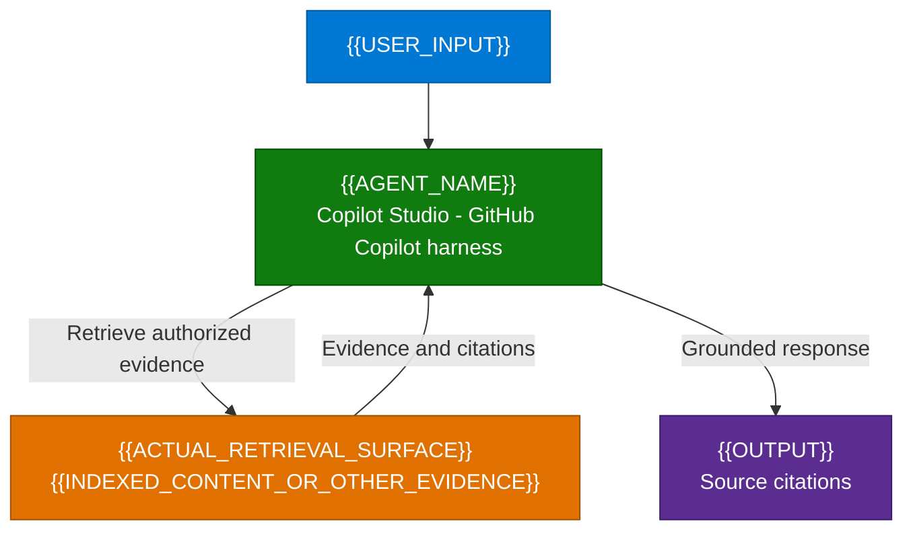

**1. Overview** > [2. Architecture](2.Architecture.md) > [3. Runbook](3.Runbook.md) > [4. Sample Prompts](4.Sample-prompts.md)

# {{AGENT_NAME}} - Overview

> Authoring template: for an existing scenario, retain its exact section structure
> and style; this is the default sample-scenario layout, not a replacement outline.
> Replace tokens and remove authoring guidance before delivery.
> Write an independent scenario with no opening metadata block or references to
> its source scenario. Keep runtime and implementation status in normal sections.

## Scenario Overview

**Scenario Type**: {{BUSINESS_DOMAIN}} 
**Harness**: GitHub Copilot 
**Agent Type**: {{INTERACTIVE_AND_REQUESTED_AUTONOMOUS_CAPABILITIES}} 
**Primary Tools**: {{ACTUAL_PRODUCTS_AND_CONNECTIONS}} 
**Complexity**: {{COMPLEXITY}} 
**Status**: 📝 Draft

{{BUSINESS_CONTEXT_AND_COPILOT_STUDIO_GHCP_RUNTIME}}

---

## Problem Statement

{{USER_PROBLEM_AND_CURRENT_PAIN_POINTS}}

---

## Solution Summary

{{GHCP_APPROACH_AND_CAPABILITY_BOUNDARIES}}

### Key Capabilities

| Capability | Description |
|---|---|
| {{CAPABILITY_ID}} | {{SUPPORTED_BEHAVIOR_AND_BOUNDARY}} |

### How It Works

Adapt this short diagram to the standard capability configuration. Include requested
action paths with solid flowchart edges, not optional/OFF labels merely because
setup is required. Show actual indexed retrieval instead of a direct source-system
connection when using a synced connector. Do not invent knowledge or tools for a
supplied-text-only design. Keep detailed controls in the matrix/runbook.

---

## Business Outcomes

| Outcome | Description |
|---|---|
| {{OUTCOME}} | {{MEASURE_AND_BASELINE_NOT_AN_UNPROVEN_BENEFIT}} |

---

## In Scope / Out of Scope

### ✅ In Scope

- {{STANDARD_CAPABILITIES_AND_EVIDENCE_BOUNDARIES}}
- {{REQUESTED_AUTONOMY_AND_AUTHORIZATION_POLICY_IF_APPLICABLE}}

### ❌ Out of Scope

- {{EXCLUDED_ACTIONS_DATA_AND_CHANNELS}}
- {{EXPLICITLY_EXCLUDED_BEHAVIOR}}

State what happens when required evidence or an integration is unavailable.
Document required setup separately; do not put included behavior out of scope
just because this is a documentation deliverable rather than a deployed agent.

---

## Target Users

| Persona | Role in This Scenario |
|---|---|
| {{PERSONA}} | {{ROLE_AND_NEED}} |

---

## Knowledge Sources Used

| Source | Content | Category |
|---|---|---|
| {{SOURCE_OR_NO_KNOWLEDGE_REQUIRED}} | {{VALIDATED_DATA_PATH}} | {{CATEGORY}} |

Distinguish supplied sample text, indexed knowledge and live records. Put detailed
knowledge requirements, official-source checks and owner-assigned gates in
[Resources](0.Resources/README.md), not instead of the business sections above.

---

## Related Resources

| Resource | Link |
| --- | --- |
| Architecture | [Architecture](2.Architecture.md) |
| Step-by-Step Runbook | [Runbook](3.Runbook.md) |
| Sample Prompts | [Prompts](4.Sample-prompts.md) |
| Capability and Integration Contracts | [Capability matrix](0.Resources/Capability-matrix.md) |
