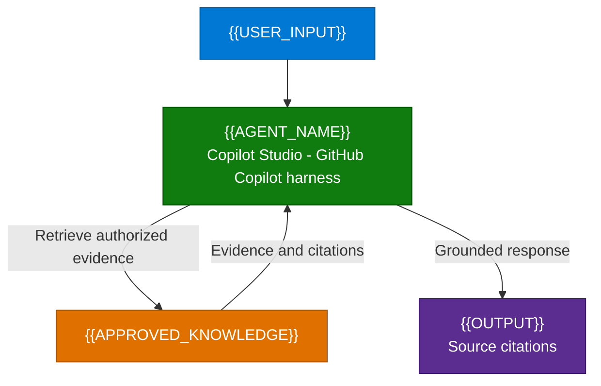

**1. Overview** > [2. Architecture](2.Architecture.md) > [3. Runbook](3.Runbook.md) > [4. Sample Prompts](4.Sample-prompts.md)

# {{SCENARIO_TITLE}} (GHCP) - Overview

> Authoring template: for an existing scenario, retain its exact section structure
> and style; this is the default sample-scenario layout, not a replacement outline.
> Replace tokens and remove authoring guidance before delivery.
> Write an independent scenario with no opening metadata block or references to
> its source scenario. Keep runtime and implementation status in normal sections.

## Scenario Overview

**Scenario Type**: {{BUSINESS_DOMAIN}}  
**Agent Type**: {{INTERACTIVE_OR_GATED_AUTONOMY}}  
**Primary Tools**: {{ACTUAL_PRODUCTS_AND_CONNECTIONS}}  
**Complexity**: {{COMPLEXITY}}  
**Status**: {{AUTHORING_STATUS_NOT_DEPLOYMENT_CLAIM}}

{{BUSINESS_CONTEXT_AND_COPILOT_STUDIO_GHCP_RUNTIME}}

---

## Problem Statement

{{USER_PROBLEM_AND_CURRENT_PAIN_POINTS}}

---

## Solution Summary

{{GHCP_APPROACH_AND_CAPABILITY_BOUNDARIES}}

### Key Capabilities

| Capability | Description |
|---|---|
| {{CAPABILITY_ID}} | {{SUPPORTED_BEHAVIOR_AND_BOUNDARY}} |

### How It Works

Adapt the diagram to the actual capability matrix. Include optional actions only
when in scope, with dashed edges and explicit OFF/proposed labels. Do not invent
knowledge or tools for a supplied-text-only design.

---

## Business Outcomes

| Outcome | Description |
|---|---|
| {{OUTCOME}} | {{MEASURE_AND_BASELINE_NOT_AN_UNPROVEN_BENEFIT}} |

---

## In Scope / Out of Scope

### ✅ In Scope

- {{ENABLED_CAPABILITIES_AND_EVIDENCE_BOUNDARIES}}
- {{OPTIONAL_CAPABILITIES_WITH_EXPLICIT_OFF_STATUS_AND_APPROVALS}}

### ❌ Out of Scope

- {{EXCLUDED_ACTIONS_DATA_AND_CHANNELS}}
- {{UNIMPLEMENTED_AUTONOMY_OR_INTEGRATIONS}}

State what happens when required evidence or an integration is unavailable.

---

## Target Users

| Persona | Role in This Scenario |
|---|---|
| {{PERSONA}} | {{ROLE_AND_NEED}} |

---

## Knowledge Sources Used

| Source | Content | Category |
|---|---|---|
| {{SOURCE_OR_NO_KNOWLEDGE_REQUIRED}} | {{VALIDATED_DATA_PATH}} | {{CATEGORY}} |

Distinguish supplied sample text, indexed knowledge and live records. Put detailed
knowledge requirements, official-source checks and owner-assigned gates in
[Resources](0.Resources/README.md), not instead of the business sections above.

---

## Related Resources

| Resource | Link |
| --- | --- |
| Architecture | [Architecture](2.Architecture.md) |
| Step-by-Step Runbook | [Runbook](3.Runbook.md) |
| Sample Prompts | [Prompts](4.Sample-prompts.md) |
| Capability and Integration Contracts | [Capability matrix](0.Resources/Capability-matrix.md) |
