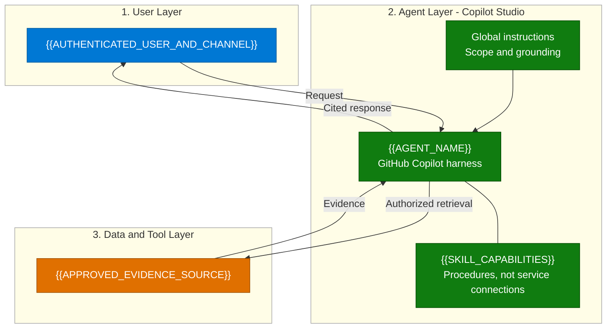
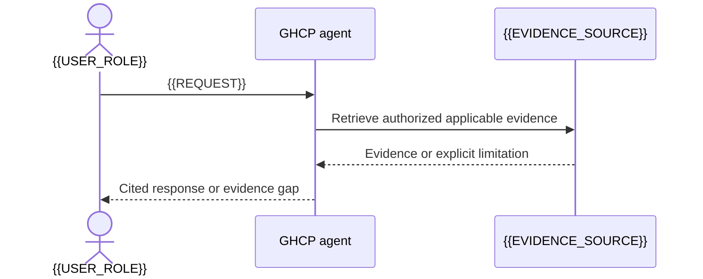

[1. Overview](1.Overview.md) > **2. Architecture** > [3. Runbook](3.Runbook.md) > [4. Sample Prompts](4.Sample-prompts.md)

# {{SCENARIO_TITLE}} (GHCP) - Architecture

> Authoring template: preserve the source's section names, numbering and diagram
> locations. Replace tokens and remove guidance before delivery.
> Host: Microsoft Copilot Studio, GitHub Copilot harness.
> Documentation reviewed: {{DATE}}. Status: {{IMPLEMENTATION_STATUS}}.

## 1. Logical Architecture

{{USER_AGENT_AND_DATA_TOOL_LAYER_DESCRIPTION}}

### How It Works

Adapt components to actual knowledge, tools, backend and approval boundaries.
Any proposed integration must be visibly OFF and use dashed edges. Do not imply
that a skill imports a tool or connects to a service.

---

## 2. Key Components

| Component | Technology | Role |
|---|---|---|
| {{COMPONENT}} | {{ACTUAL_TECHNOLOGY_OR_PROPOSED_CONTRACT}} | {{ROLE_AND_BOUNDARY}} |

### Source-to-GHCP Mapping

| Source asset / behavior | Target component | Disposition / preserved guarantees |
|---|---|---|
| {{SOURCE_ASSET}} | {{COMPONENT}} | {{RETAINED_REEXPRESSED_DEFERRED_EXCLUDED}} |

State the actual source harness and whether topic exports exist; do not invent
topics. Link the [capability matrix](0.Resources/Capability-matrix.md) for operation
IDs or proposed contracts, schemas, profiles, dependencies and connection ownership.

---

## 3. Data Flow

### Scenario A - {{PRIMARY_FLOW_NAME}}

### Scenario B - {{DISTINCT_SOURCE_FLOW_NAME}}

Include a second inline sequence diagram for each materially distinct source flow.
For a proposed action flow, mark it proposed/OFF in the heading and diagram Note;
show authoritative identity, evidence, approval, operation and status tracking.
Do not invent a second flow for a source with only one; mark not applicable instead.
Distinguish indexed evidence, supplied text and live reads.

---

## 4. Security & Governance Considerations

| Area | Consideration |
|---|---|
| Identity | {{INGESTION_VS_CALLER_VS_TOOL_IDENTITY}} |
| Access control | {{BACKEND_ACLS_NOT_PROMPT_ONLY_CONTROLS}} |
| Grounding | {{CITATIONS_FRESHNESS_CONFLICTS_AND_MISSING_EVIDENCE}} |
| Approval and writes | {{APPROVAL_PAYLOAD_BINDING_OR_NO_WRITES}} |
| Reliability | {{CONCURRENCY_IDEMPOTENCY_PENDING_UNKNOWN_AND_RECONCILIATION}} |
| Data handling | {{RETENTION_LOGGING_MEMORY_MINIMIZATION}} |
| Deployment | {{TENANT_MODEL_CHANNEL_COST_GATES}} |
| Disablement | {{TOOLS_BACKENDS_ALTERNATE_PATHS_AND_STALE_SESSIONS}} |

Keep detailed identity/reliability subsections here if needed. Do not promise
general-knowledge toggles or feature availability without current evidence.

---

## Related Resources

| Resource | Link |
| --- | --- |
| Scenario Overview | [Overview](1.Overview.md) |
| Step-by-Step Runbook | [Runbook](3.Runbook.md) |
| Sample Prompts | [Prompts](4.Sample-prompts.md) |
| Capability and Integration Contracts | [Capability matrix](0.Resources/Capability-matrix.md) |
