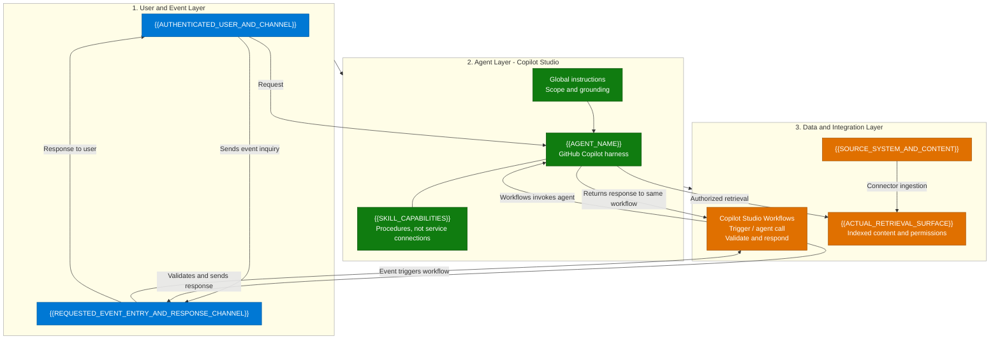
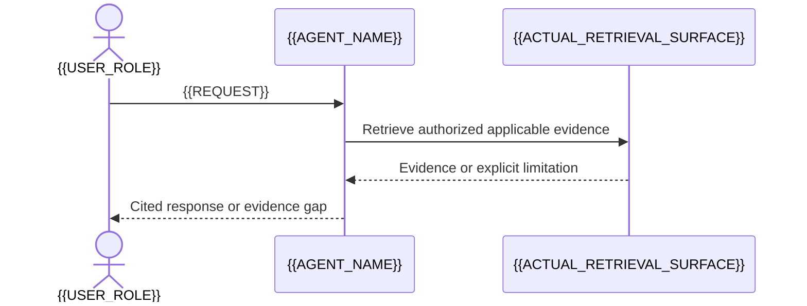
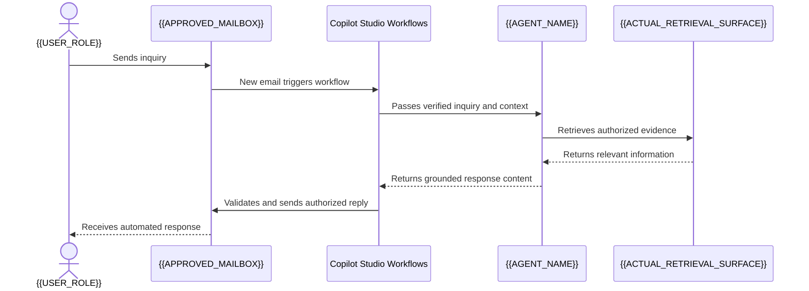

[1. Overview](1.Overview.md) > **2. Architecture** > [3. Runbook](3.Runbook.md) > [4. Sample Prompts](4.Sample-prompts.md)

# {{AGENT_NAME}} - Architecture

> Authoring template: preserve the source's section names, numbering and diagram
> locations. Replace tokens and remove guidance before delivery.
> Write an independent design, without a metadata banner or source-scenario mapping.

## 1. Logical Architecture

{{USER_EVENT_AGENT_AND_DATA_INTEGRATION_LAYER_DESCRIPTION}}

### How It Works

This eight-node scaffold illustrates indexed knowledge plus requested event-driven
action. Remove event/integration nodes for read-only chat designs and replace the
ingestion path for non-indexed evidence. Do not inherit Workflows or any source
system unless in scope. For ServiceNow Copilot connector ingestion, K is Microsoft
365 Search / Semantic Index and SRC is ServiceNow KB; the agent never queries SRC.

Keep three stacked layers and short labels. Use one Workflows node: event enters
Workflows first, Workflows calls the agent, the agent returns to the same node,
and Workflows validates and responds through the channel. Keep these return edges
explicit even in a simplified chart. Do not merge the mailbox with Workflows or
split invocation and delivery into apparently different workflows. State setup status in prose,
not repeated proposed/OFF banners. Link detailed contracts below.

---

## 2. Key Components

| Component | Technology | Role |
|---|---|---|
| {{COMPONENT}} | {{ACTUAL_TECHNOLOGY_OR_SCENARIO_DEFINED_CONTRACT}} | {{ROLE_AND_BOUNDARY}} |

### Capability Design

| Capability | Component | Behavior and controls |
|---|---|---|
| {{CAPABILITY}} | {{COMPONENT}} | {{SUPPORTED_BEHAVIOR_AND_CONTROLS}} |

Describe this scenario's runtime and implementation status, not another agent or
migration history. Link the [capability matrix](0.Resources/Capability-matrix.md) for operation
IDs or scenario-defined contracts, schemas, entry paths, dependencies and connection ownership.

---

## 3. Data Flow

### Scenario A - {{PRIMARY_FLOW_NAME}}

### Scenario B - {{DISTINCT_FLOW_NAME}}

For requested autonomous email use this five-participant, eight-message example.
Adapt to the actual business flow; remove it when event-driven action is not in
scope. Do not add email to an otherwise read-only scenario.

Show the routine successful path without nested validation/retry trees. Summarize
holds and failures in a short paragraph linking the matrix/runbook. Preserve
approved per-action review only if required by the scenario's authorization policy;
do not add human approval to routine autonomous replies by default. Use commas,
not literal semicolons, in message/note text (or escape a semicolon as `#59;`).

---

## 4. Security & Governance Considerations

| Area | Consideration |
|---|---|
| Identity | {{INGESTION_VS_CALLER_VS_TOOL_IDENTITY}} |
| Access control | {{BACKEND_ACLS_NOT_PROMPT_ONLY_CONTROLS}} |
| Grounding | {{CITATIONS_FRESHNESS_CONFLICTS_AND_MISSING_EVIDENCE}} |
| Authorization and writes | {{POLICY_OR_REQUIRED_APPROVAL_PAYLOAD_BINDING_OR_NO_WRITES}} |
| Reliability | {{CONCURRENCY_IDEMPOTENCY_PENDING_UNKNOWN_AND_RECONCILIATION}} |
| Data handling | {{RETENTION_LOGGING_MEMORY_MINIMIZATION}} |
| Deployment | {{TENANT_MODEL_CHANNEL_COST_GATES}} |
| Disablement | {{TOOLS_BACKENDS_ALTERNATE_PATHS_AND_STALE_SESSIONS}} |

Keep detailed identity/reliability subsections here if needed. Do not promise
general-knowledge toggles or feature availability without current evidence.

---

## Related Resources

| Resource | Link |
| --- | --- |
| Scenario Overview | [Overview](1.Overview.md) |
| Step-by-Step Runbook | [Runbook](3.Runbook.md) |
| Sample Prompts | [Prompts](4.Sample-prompts.md) |
| Capability and Integration Contracts | [Capability matrix](0.Resources/Capability-matrix.md) |
