# Build Prompt 1 — Plans: Solution and Dataverse Tables

Use this single prompt in **Plans** in [make.powerapps.com](https://make.powerapps.com/). Power Platform solution with name **Copilot License Lifecycle** will be created in the plan execution for Dataverse tables plan creates. This solution will be used also for agent and workflows in the upcoming steps

For manual solution creation and preferred-solution setup, follow
[Power Platform Solution](../Power%20Platform%20Solution.md).

## Create Plan and run it

1. Open [https://make.powerapps.com](https://make.powerapps.com) and verify that you have correct environment selected where you want to create this solution. Then select **Plans** from the left menu

       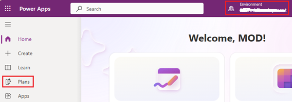

2. Select **Create a plan**

       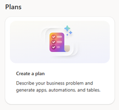
   
3. Copy-paste the prompt from [Copy-ready Plans prompt](#copy-ready-plans-prompt) to the plan and click **Generate**

        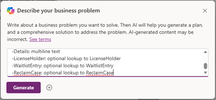

4. You should see similar initial plan to to be confirmed, so click **Looks good** to proceed

        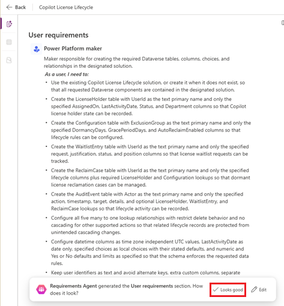
   
6. Next Process Agent should ask to confirm to create **Copilot License Lifecycle** solution and create tables into its. Click **Looks good** to proceed

        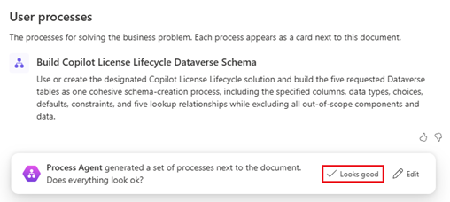
7. Data model is defined by Data Agent. Select **Change solution** to create new solution 

        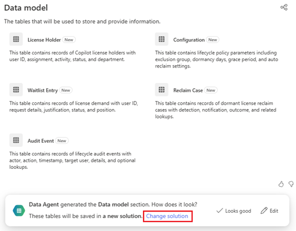

8. Verify that solution name is **Copilot License Lifecycle** and that Preferred solution is checked and click **Save**

        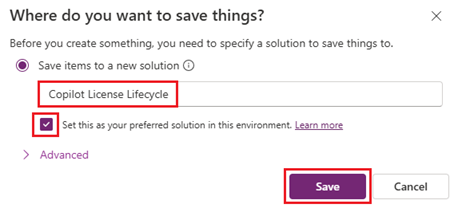

9. Click **Looks good** to proceed

        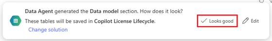

10. Open **Tables** view to see and verify that everything is OK

        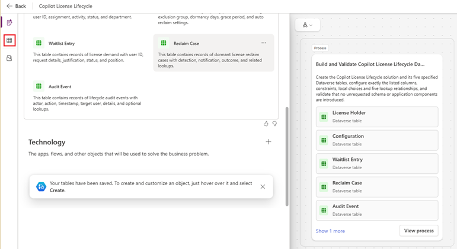

11. You should have these tables, columns and relationships now created. Click **Save** icon in top right corner

        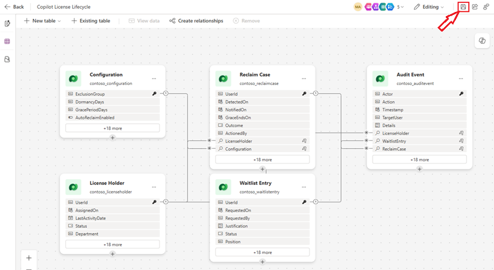

12. Click **Save** and plan will saved to same solution

        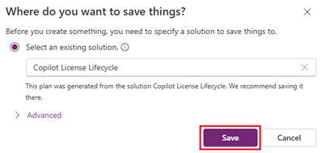

## Copy-ready Plans prompt

```text
Use 'Copilot License Lifecycle' solution or if not exist then ask to create. If setting the preference requires a maker action, identify that action rather than reporting it as completed.

Create only the following five Dataverse tables and their specified columns and relationships in that solution. You do not need to add sample data to any table. Do not create a model-driven application nor other components like canvas apps, flows, sites or agents in this stage. Across all five tables, add only the listed custom columns and five lookup relationships; no alternate keys or separate Name columns. User identifiers remain text, not Dataverse user lookups

Generic guidance for table creation:
-text(n) is single-line text
-datetime is Date and Time, Time Zone Independent for UTC values. Use a local Choice.
-Do not add a separate Name columns or any custom columns beyond those listed.

LicenseHolder:
-UserId: text(36), primary name.
-AssignedOn: datetime, optional.
-LastActivityDate: Date Only, optional.
-Status: Choice Active, Dormant, Excluded, Unknown; default Unknown.
-Department: text(200).

Configuration:
-ExclusionGroup: text(36), primary name.
-DormancyDays: whole number, minimum 1.
-GracePeriodDays: whole number, minimum 1.
-AutoReclaimEnabled: Yes/No, default No.

WaitlistEntry:
-UserId: text(36), primary name.
-RequestedOn: datetime.
-RequestedBy: text(36).
-Justification: multiline text(4000).
-Status: Choice PendingApproval, Approved, Rejected, Fulfilled, Cancelled; default PendingApproval.
-Position: whole number, minimum 1, optional.

ReclaimCase:
-UserId: text(36), primary name.
-DetectedOn: datetime.
-NotifiedOn: datetime, optional.
-GraceEndsOn: datetime, optional.
-Outcome: Choice Detected, NotificationPending, Notified, Disputed, Cancelled, ReclaimPending, Reclaimed; default Detected.
-ActionedBy: text(36), optional.
-LicenseHolder: required lookup to the existing LicenseHolder table.
-Configuration: required lookup to the existing Configuration table.

Each lookup is many-to-one from ReclaimCase to its target.
Delete behavior: Restrict. Other supported cascading actions: Cascade None.

AuditEvent:
-Actor: text, primary name
-Action: text
-Timestamp: datetime
-TargetUser: text
-Details: multiline text
-LicenseHolder: optional lookup to LicenseHolder
-WaitlistEntry: optional lookup to WaitlistEntry
-ReclaimCase: optional lookup to ReclaimCase
```

## Review the saved solution and schema

Confirm all five tables and their columns/relationships are included in
**Copilot License Lifecycle**. Verify actual saved objects, not just the plan
diagram. Complete unsupported column or relationship settings in the designer.
If tables already exist, compare their metadata rather than creating duplicates.

The preferred-solution setting is maker-specific and does not automatically
bind every product or component type. Agent solution selection and connection
configuration still require explicit checks in stage 2.

Dataverse automatically supplies system columns, including the native record ID.
These are separate from the **26 base columns and five lookup columns**. Use the listed
primary name columns rather than introducing an additional `Name` field.
Do not add other custom columns, alternate keys or many-to-many relationships.
WaitlistEntry has no holder lookup, so an unlicensed requester can join the queue.

Each holder/configuration row can relate to many reclaim cases. Each holder,
waitlist entry or reclaim case can relate to many audit events. The three audit
lookups are optional so request-only and job-level events remain possible.
These are separate named lookups, not one polymorphic field.

## Schema handoff for stage 2

After saving, record the actual table/column logical names, entity set names,
native primary keys, primary name mappings, date behaviors and choice values.
Record the environment ID/URL, solution display and unique names, publisher/prefix,
and verified preferred-solution status for the current maker. Record the actual
text lengths selected where AuditEvent does not specify a length.
Confirm no app, flow, site or agent was created in this stage.
For each lookup, include its logical and relationship names, target, requiredness,
cardinality and cascade behavior.
Confirm that the custom columns match the [architecture](../../2.Architecture.md#data-model-dataverse)
including its relationship table. If existing reclaim rows lack a verified holder
or configuration reference, record the backfill gap before dependent use; do not
guess historical associations. Do not delete existing fields automatically.

Supply this metadata to [Build Prompt 2](2.Agent-and-workflows.md). The
[integration contracts](../Capability-matrix.md#five-table-storage-contract)
separately identify backend requirements that this minimal schema does not supply.

## Official guidance

- [Create a plan, review its data model and save tables into a solution](https://learn.microsoft.com/en-us/power-apps/maker/plan-designer/create-plan).
- [Plans prerequisites and environment behavior](https://learn.microsoft.com/en-us/power-apps/maker/plan-designer/plan-designer).
- [Solution display name, unique name and publisher](https://learn.microsoft.com/en-us/power-apps/maker/data-platform/create-solution).
- [Set and verify the maker's preferred solution](https://learn.microsoft.com/en-us/power-apps/maker/data-platform/preferred-solution).
- [Dataverse relationships, lookup columns and cascade behavior](https://learn.microsoft.com/en-us/power-apps/maker/data-platform/create-edit-entity-relationships).
