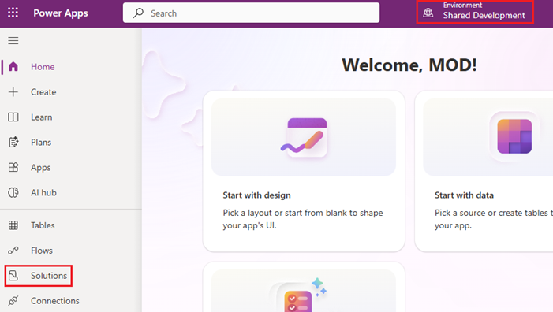
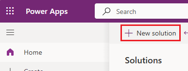
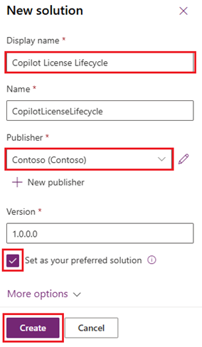

# Power Platform Solution

Create the **Copilot License Lifecycle** solution and set it as your preferred
solution before creating the Dataverse tables in Plans. This guide covers solution
setup only, not tables, sample data, applications, flows, sites or agents.

## Before you start

Use the intended development environment with Dataverse and an account permitted
to create solutions. Have your organization's custom publisher available, or
approved publisher details if you need to create one.

If **Copilot License Lifecycle** already exists, confirm it is the intended
unmanaged solution and skip to [Set or verify the preferred solution](#set-or-verify-the-preferred-solution).
If it is missing, obtain the maker's approval before creating it.

The screenshots illustrate the controls with example values. Enter
**Copilot License Lifecycle** and your approved publisher details, not the
example names shown in the images.

## Create a new solution

1. Open [Power Apps](https://make.powerapps.com/), select the intended environment,
   and open **Solutions** from the left navigation, as shown below. If it is hidden, select
   **More > Solutions**. Alternatively, in
   [Copilot Studio](https://copilotstudio.microsoft.com/), select the same
   environment, open the three-dot menu and select **Solutions**.

> 

2. Select **+ New solution**.

> 

4. In **New solution**, provide name **Copilot License Lifecycle** and   select   **Publisher**. If you do not have custom publisher yet created  then it is recommended to create one and **not use Dataverse default publishers.**  Select **Set as your preferred solution**, then select **Create**
   

> 

5. Confirm **Copilot License Lifecycle** appears in **Solutions** in the intended
   environment as an unmanaged solution. Open it and record its actual unique
   name and publisher. Do not continue into agent or application creation.

## Set or verify the preferred solution

1. In [Power Apps](https://make.powerapps.com/), select the intended environment
   and open **Solutions**.
2. Select the **Copilot License Lifecycle** unmanaged solution. If it is not
   already preferred, select **Set preferred solution** on the command bar.
3. Verify the **preferred solution** indicator in the **Solutions** area or by
   hovering over the **Environment** switcher. Confirm it identifies
   **Copilot License Lifecycle**. Do not report completion based only on a prompt
   request or an unchecked assumption.

This preference applies to the current maker in the selected environment.
Other makers must verify their own preference. It does not automatically
configure a Copilot Studio agent, connections or every component type; stage 2
must explicitly select the verified solution where supported.

If the solution or command is unavailable, confirm the environment and that the
solution is unmanaged, then ask the environment administrator to resolve access.
Do not create a duplicate or use a system default solution as a workaround.

## Continue with table creation

Use
[Build Prompt 1](Build-prompts/1.Dataverse.md#copy-ready-plans-prompt) in Plans to create Dataverse tables.

## Related resources

| Resource | Link |
| --- | --- |
| Scenario setup and release steps | [Runbook](../3.Runbook.md) |
| Solution and table prompt | [Build Prompt 1](Build-prompts/1.Dataverse.md) |
| Agent and workflow prompt | [Build Prompt 2](Build-prompts/2.Agent-and-workflows.md) |
| Resource index | [Resources](README.md) |
| Official solution creation guidance | [Create a solution in Power Apps](https://learn.microsoft.com/en-us/power-apps/maker/data-platform/create-solution) |
| Official preferred-solution guidance and limitations | [Set a preferred solution](https://learn.microsoft.com/en-us/power-apps/maker/data-platform/preferred-solution) |
