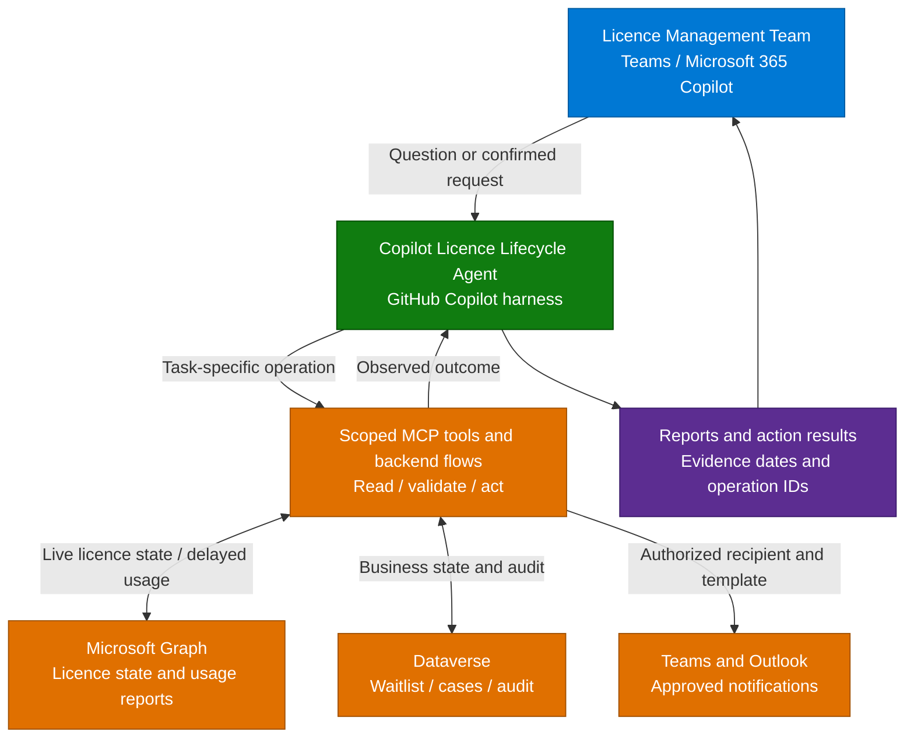

**1. Overview** > [2. Architecture](2.Architecture.md) > [3. Runbook](3.Runbook.md) > [4. Sample Prompts](4.Sample-prompts.md)

# Copilot Licence Lifecycle Agent — Overview

## Scenario Overview

**Scenario Type**: IT Operations / FinOps for Copilot 
**Harness**: GitHub Copilot 
**Agent Type**: Copilot Studio agent with focused skills and controlled backend operations 
**Primary Tools**: Microsoft Copilot Studio, scoped MCP tools, Power Automate, Microsoft Graph, Dataverse 
**Complexity**: Intermediate 
**Status**: 📝 Draft

The **Copilot Licence Lifecycle Agent** helps the licence management team understand
the Microsoft 365 Copilot estate, maintain an approved waitlist, notify dormant
holders, and reclaim and reassign licences with explicit human authorization.
It runs on the GitHub Copilot harness in Microsoft Copilot Studio.

This scenario supplies documentation and ten standalone runtime skill definitions.
The scoped MCP service, backend flows, Dataverse tables, approval integration and
tenant configuration must be implemented and validated before use. Skills are
procedures, not executable Graph integrations or authorization controls.

---

## Problem Statement

Organizations buy Copilot licences in blocks but often manage allocation by hand:

- **Idle capacity and unmet demand:** potentially dormant holders coexist with a waitlist.
- **Single-operator dependency:** reporting and reassignment depend on one spreadsheet owner.
- **Weak renewal evidence:** leadership cannot easily distinguish assigned, active, dormant and unknown usage.
- **Unstructured requests:** email and Teams requests lose their approval and queue history.
- **Disruptive mistakes:** delayed usage, approved leave and group-based licensing can make a plausible reclaim unsafe.

---

## Solution Summary

One standard configuration includes reporting, waitlist management, notifications,
approved reclaim and assignment, cancellation, and dispute recording. Scheduled
backend jobs synchronize evidence and detect candidates; the agent explains
results and helps administrators carry out explicitly confirmed actions.

| Capability | Description |
|---|---|
| 📋 Licence inventory | Assigned and available capacity, department breakdowns, assignment provenance and known assignment dates |
| 📈 Usage insight | Active, dormant, excluded and unknown classifications with report freshness and observation windows |
| 🔁 Reclaim & reassign | Notify, observe the grace period, revalidate, approve removal, then separately approve the next eligible assignment |
| 🎟️ Waitlist management | Intake, approval decisions, ordered status and policy-authorized position changes in Dataverse |
| 🛑 Cancellation and disputes | Cancel an open reclaim or record and route a dispute without silently restoring a licence |

Agent-wide instructions set privacy and confirmation rules. Skills guide individual
tasks. Narrow tools invoke deterministic backend handlers that enforce the SKU
allowlist, administrator role, exact approval payload, 25-user limit, concurrency
and durable audit. No general Graph write or arbitrary Dataverse update tool is
exposed to the agent.

The data model uses five tables: `LicenseHolder`, `WaitlistEntry`, `ReclaimCase`,
`Configuration` and `AuditEvent`, with the 26 base columns and five lookup
columns in the [architecture](2.Architecture.md#data-model-dataverse). Historical evidence,
trusted approvals and recoverable execution still require approved backend
integrations; the minimal tables alone do not implement them.

### How It Works

This is structured API retrieval, not indexed knowledge search. Daily synchronization
and weekly detection run in Power Automate independently of chat; neither requires
an autonomous agent invocation. Notification schedules may resume only a previously
approved, bounded campaign. Reclaim and assignment remain separately approved.
See the [capability matrix](0.Resources/Capability-matrix.md) for the operation contracts.

---

## Business Outcomes

| Outcome | Description |
|---|---|
| 💰 Reusable capacity | Measure licences actually released and reassigned; do not equate release with contract savings |
| ⏱️ Less manual work | Compare reporting and administration effort with the pre-pilot baseline |
| 📊 Defensible renewal position | Report usage coverage, exclusions and unknowns alongside potential reclaim counts |
| 🧑‍🤝‍🧑 Fair allocation | Apply documented approval and queue rules, with reasons for every override |
| 🎓 Practical enablement | Teach skills, tool boundaries, authentication and operational recovery through a concrete scenario |

These are target outcomes, not measured deployment results.

---

## In Scope / Out of Scope

### ✅ In Scope

- Licence inventory, usage and reclaim-history reporting for approved Microsoft 365 Copilot SKUs.
- Configurable dormancy detection, exclusions, grace periods and scheduled evidence refresh.
- Confirmed Teams and Outlook notifications, approved reclaim and separately approved reassignment.
- Waitlist intake, approval/rejection and policy-controlled queue management in Dataverse.
- Cancellation of open reclaim cases and recording/routing disputes to the configured owner.
- Human approver and executing identity attribution, operation tracking and partial-failure recovery.

### ❌ Out of Scope

- Purchasing licences, amending agreements or managing non-Copilot licences.
- Unapproved automatic reclaim, arbitrary bulk actions or bypassing the 25-user request limit.
- Changing group memberships or group licence assignments to remove inherited entitlements.
- Tenant user deletion, licence-policy changes through chat or unsupervised reversal of completed actions.
- General employee access to individual activity data, unrestricted mail sending or replacement of an existing ITSM process.
- Copilot Credits / pay-as-you-go consumption administration; this agent only measures its own operating costs during delivery.

Missing or stale evidence is a hold, not proof of inactivity. Group-inherited or
mixed assignments remain visible in reports but require the licensing owner to
resolve them outside the direct-assignment operation. Unavailable integrations
block the dependent action rather than quietly reducing its controls.

---

## Target Users

| Persona | Role in This Scenario |
|---|---|
| **Licence Manager / IT Ops** | Direct agent user; runs reports, maintains the queue and confirms authorized actions |
| **Department Manager** | Requests licences and receives scoped queue updates through the licence team or existing request channel |
| **Employee** | Requests a licence, receives warnings and confirmations, and raises disputes through the published contact route |
| **M365 Admin** | Owns permissions, SKU mapping, service identities, privacy and approval policy |
| **Delivery Engineer** | Builds integrations, imports skills, validates channels and hands over operational ownership |

The privileged agent is restricted to the licence management group. Department
managers and employees are business participants, not implicitly authorized readers
of estate-wide usage. An administrator records their requests on their behalf;
a pasted name or email does not authenticate a requester.

---

## Design Decisions That Matter

| Decision | Guidance |
|---|---|
| **What counts as dormant?** | Agree a versioned policy, for example 45 complete days without observed activity, with adequate report coverage; unknown is a separate state |
| **Automatic or approved reclaim?** | Require explicit, payload-bound approval. Keep `AutoReclaimEnabled=false`; changing this is a separate governance decision, not a skill setting |
| **Grace period length** | Example policy: 14 days, initial warning and day-10 reminder. Start the grace clock only after the required initial notifications succeed |
| **Who can invoke the agent?** | Licence management group only; backend authorization must still reject denied or revoked users |
| **Identity for actions** | Dedicated owned backend identity, with independently verified human requester and approver recorded in audit |
| **Credits consumption** | Measure build, Preview, Evaluate and operating consumption using current GHCP billing guidance, not assumed per-topic rates |

### Knowledge Sources Used

| Source | Content | Category |
|---|---|---|
| Microsoft Graph directory and subscriptions | Users, departments, subscribed SKUs, current direct/inherited assignments | Live structured data through backend tools |
| Microsoft 365 Copilot usage API | Licensed-user activity, report refresh date and report period | Delayed report evidence, not real-time telemetry |
| Dataverse | Holder state, threshold settings, ordered waitlist, reclaim attempts and action audit | Minimal business state |
| Controlled fixtures | Synthetic records and action outcomes defined in Sample Prompts | Isolated tests only |

No indexed knowledge source is required. Policy parameters come from the authorized
configuration record, not model memory or an uploaded document. Usage identity
mapping, freshness and assignment-date provenance are release gates.

---

## What Actually Goes Wrong

| Symptom | Root cause | Mitigation |
|---|---|---|
| Active or excluded users receive warnings | Report lag, gaps or outdated exclusion membership | Check coverage and exclusions at preparation and execution; never infer absence of use from a missing row |
| A plausible request causes an unsafe write | Prompt-only controls or a generic write tool | Enforce approvals, bounds and allowlisted transitions in the backend |
| Audit names only the maker | Connection identity confused with human authority | Capture caller and approver from trusted authentication and approval records, plus the executor separately |
| Removal leaves the licence effective | Group inheritance or concurrent assignment | Detect provenance, hold mixed/inherited cases and verify effective state after writes |
| Duplicate notifications or assignments | Timeout retried without reconciliation | Durable operation keys, per-step status and status lookup before any retry |
| Test costs exceed expectations | Build and evaluation consumption omitted | Bound pilot volume and monitor current environment/agent usage |
| Deployment loses configuration | Connections or component transport not validated | Use solution-aware backend components and prove GHCP transport in Dev/Test before release |

---

## Related Patterns

- [Copilot Credits & Cost Control](../../02-patterns/Copilot-Credits-Cost-Control/Copilot-Credits-Cost-Control.md)
- [Agent Governance & Rollout Control Plane](../../02-patterns/Agent-Governance-and-Rollout-Control-Plane/Agent-Governance-and-Rollout-Control-Plane.md)
- [Agent Publishing & Channel Deployment](../../02-patterns/Agent-Publishing-and-Channel-Deployment/Agent-Publishing-and-Channel-Deployment.md)

---

## Related Resources

| Resource | Link |
| --- | --- |
| Architecture | [Architecture](2.Architecture.md) |
| Step-by-Step Runbook | [Runbook](3.Runbook.md) |
| Sample Prompts | [Prompts](4.Sample-prompts.md) |
| Capability and Integration Contracts | [Capability matrix](0.Resources/Capability-matrix.md) |
