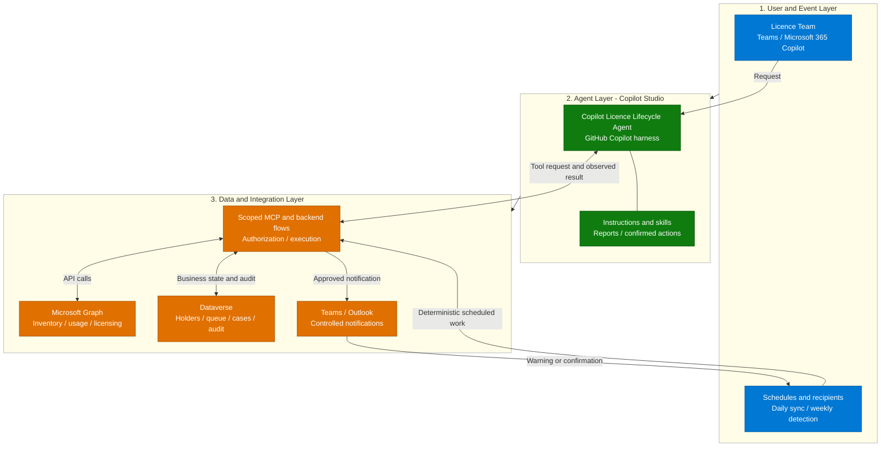
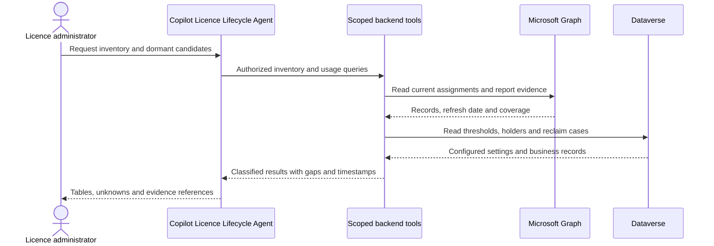
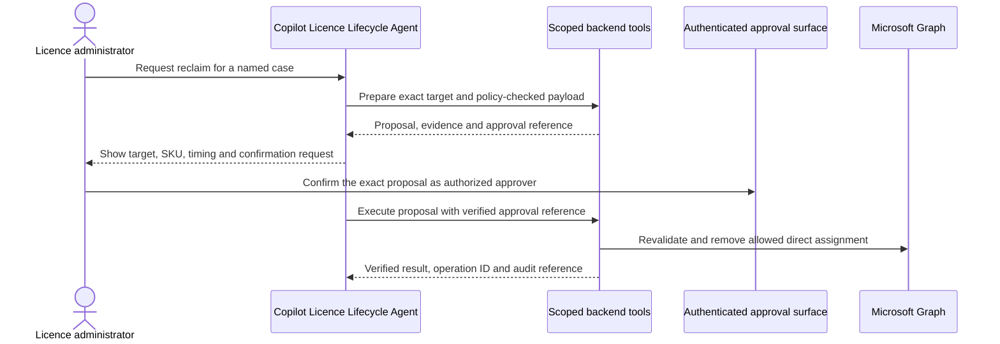
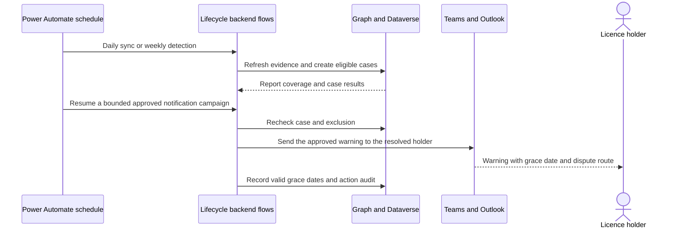
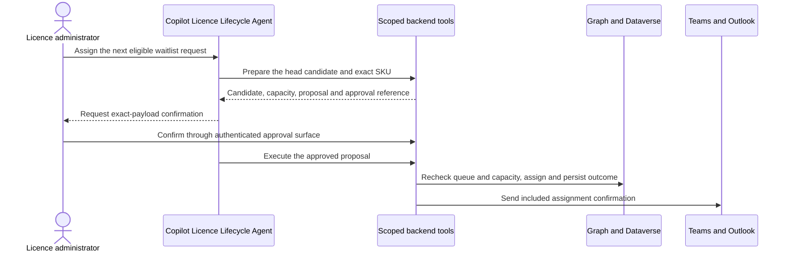

[1. Overview](1.Overview.md) > **2. Architecture** > [3. Runbook](3.Runbook.md) > [4. Sample Prompts](4.Sample-prompts.md)

# Architecture — Copilot Licence Lifecycle Agent

## Solution Architecture

The **Copilot Licence Lifecycle Agent** uses instructions and ten focused skills
in the Copilot Studio GitHub Copilot harness. A narrow, authenticated MCP facade
exposes scenario-defined operations backed by deterministic Power Automate flows
and services. Graph and Dataverse remain behind that authorization boundary.

### How It Works

Schedules do not invoke the agent: they refresh evidence, create detection cases
and process already approved notification campaigns. No inbound Workflows Agent
node or native email channel is needed. The agent calls tools during administrator
conversations; skills are procedures, not separate services.

### Data Flow

#### Scenario A — Inventory and Usage Reporting

#### Scenario B — Confirmed Reclaim

The agent reports the backend result to the administrator. Conversation confirmation
must be captured by a trusted approval adapter, or the linked authenticated approval
surface must capture it. An LLM-generated `approved=true` is never authority.
Graph and Dataverse are not one atomic transaction.

#### Scenario C — Scheduled Evidence and Notifications

#### Scenario D — Approved Waitlist Assignment

The assignment result distinguishes licence completion from notification status.
Waitlist intake/review and case cancellation/dispute follow the same
prepare-confirm-execute pattern without a Graph licence write. Detailed schemas,
holds, retries and result tracking are in the
[capability matrix](0.Resources/Capability-matrix.md).

---

## Technology Stack

| Layer | Component | Purpose |
|---|---|---|
| Interface | Teams and Microsoft 365 Copilot | Authenticated licence-team conversations; each channel tested separately |
| Agent | Copilot Studio GitHub Copilot harness | Instructions, scoped task skills and tool orchestration |
| Automation | Scoped MCP facade, deterministic Power Automate flows and backend services | Enforce contracts, schedules, approvals, transaction boundaries and recovery |
| Data | Microsoft Graph v1.0 | Users, subscribed SKUs, assignment provenance and Copilot usage CSV |
| State | Five Dataverse tables | Holder state, ordered waitlist, reclaim attempts, thresholds and action audit |
| Notification | Teams / Office 365 Outlook connectors | Approved warnings, reminders, assignment confirmations and dispute routing |
| Governance | Entra ID, Power Platform administration and release controls | Caller authorization, connection ownership, data policies, retention and costs |

The MCP facade is a **scenario-defined integration to implement**, not a bundled
server or a Microsoft connector operation. The
[MCP guidance](https://learn.microsoft.com/en-us/microsoft-copilot-studio/agents-experience/tools-add-mcp-server)
states that all tools exposed by a server become available; expose only this
scenario's allowlisted surface, never an unrestricted administrative server.

---

## Data Model (Dataverse)

Create the following five tables with 26 base columns and five approved lookup
columns, for a total of 31 custom columns. Dataverse's
automatically supplied system columns are additional platform metadata, not
custom schema extensions.

The [Plans build prompt](0.Resources/Build-prompts/1.Dataverse.md) uses
**Copilot License Lifecycle** and asks before creating the solution if missing.
It specifies concrete types, choices, relationships and a metadata handoff.
Run it in Power Apps Plans, without building
a model-driven app, before
the [agent/workflow build prompt](0.Resources/Build-prompts/2.Agent-and-workflows.md).
Use the resulting actual logical names in integrations, not these business aliases.

| Table | Key columns | Purpose |
|---|---|---|
| `LicenseHolder` | UserId, AssignedOn, LastActivityDate, Status, Department | Current state per licence |
| `WaitlistEntry` | UserId, RequestedOn, RequestedBy, Justification, Status, Position | Ordered queue |
| `ReclaimCase` | UserId, DetectedOn, NotifiedOn, GraceEndsOn, Outcome, ActionedBy | One record per reclaim attempt |
| `Configuration` | DormancyDays, GracePeriodDays, AutoReclaimEnabled, ExclusionGroup | Thresholds, so changes do not require a rebuild |
| `AuditEvent` | Timestamp, Actor, Action, TargetUser, Details | Every assignment, reclaim, and override |

Reuse `UserId` as the primary name column in the first three tables,
`ExclusionGroup` in `Configuration`, and `Actor` in `AuditEvent`; no additional
custom name column is needed. User/group identifiers are text, not lookups.
Do not create alternate keys.

### Relationships

Add only these five lookup columns. Each parent can have many related records;
each lookup references one parent. Keep the 26 base columns unchanged.

| Lookup column | Parent table | Related table | Cardinality | Required |
|---|---|---|---|---|
| `ReclaimCase.LicenseHolder` | LicenseHolder | ReclaimCase | 1:N | Yes |
| `ReclaimCase.Configuration` | Configuration | ReclaimCase | 1:N | Yes |
| `AuditEvent.LicenseHolder` | LicenseHolder | AuditEvent | 1:N | No |
| `AuditEvent.WaitlistEntry` | WaitlistEntry | AuditEvent | 1:N | No |
| `AuditEvent.ReclaimCase` | ReclaimCase | AuditEvent | 1:N | No |

Use **Restrict Delete** and **Cascade None** for other supported cascading actions.
Preserve referenced holders, configurations, requests and cases rather than
deleting their audit history or removing links.

A waitlist entry does not require a holder record. Audit lookups may be empty
for job-level events or populated for the affected holder/request/case. When
multiple links are present, the backend verifies that they describe the same
target and operation. A reclaim's holder must match its text `UserId`.

A configuration lookup identifies the selected settings row, not a historical
snapshot. Keep rows referenced by cases unchanged; new settings use a new row
selected through the approved deployment configuration. Required lookups on
existing cases need verified backfill, not guessed historical associations.

`EntryId` and `CaseId` in tool responses map to native record IDs.
`WaitlistEntry.Position` records approved queue order; changes need authorized
validation, not an invented priority column. `ReclaimCase.Outcome` contains the
last confirmed case state. Audit details describe the action; their existence
is not a trusted approval receipt.

`AssignedOn` is nullable. Populate it from a verified assignment event, not
an observation time or Graph's assignment-state `lastUpdatedDateTime`. Existing
holders without historical proof have an unknown assignment date.

The model assumes one configured tenant/Copilot SKU per deployment. Resolve
that scope from authenticated integration configuration, not extra row columns.
Retain historical requests and reclaim attempts. The
[five-table storage contract](0.Resources/Capability-matrix.md#five-table-storage-contract)
distinguishes these fields from integration-only evidence and control data.

This minimal schema alone does not implement durable approvals, idempotency,
reservations, notification receipts or historical usage snapshots. Existing
approved backend components must demonstrate those requirements before live
actions. Otherwise report the dependency as blocked; do not silently extend the
schema or claim that an audit text field supplies those controls.

---

## Environment and ALM

| Decision | Recommendation |
|---|---|
| Environment | Dedicated non-default Dev, Test and Prod environments with Dataverse |
| Solution | Use Copilot License Lifecycle, unmanaged in development; ask before creating it if missing and record its actual unique name. Stage 1 in Plans creates only tables and, if approved, the solution; stage 2 adds the agent/workflows |
| Preferred solution | Set and verify Copilot License Lifecycle as preferred for the current maker; this does not replace explicit agent solution and connection configuration |
| Environments | Prove import and rebinding in Test before approving managed promotion of supported components |
| Connection references | Backend connector references plus separately recorded MCP endpoint/auth configuration |
| Environment variables | Deployment-specific group IDs, allowed SKU IDs, endpoint and notification templates; no credentials in documents |

The GHCP creation guide documents an agent solution setting before the first save.
It does not establish transport parity for every skill, connection or external
MCP service. The delivery owner must demonstrate versioned skill import,
instruction/tool configuration, backend deployment and rollback as one release
package. Gate G8 in [Resources](0.Resources/README.md#release-gates) blocks release
until that path is proven.

---

## Identity and Permissions

| Aspect | Guidance |
|---|---|
| Graph permissions | `User.Read.All` for application-based directory reads, `LicenseAssignment.Read.All` for SKUs, `Reports.Read.All` for usage and `LicenseAssignment.ReadWrite.All` for approved licence writes; consent only to required identities |
| Identity used for actions | Dedicated backend write principal with named owner; separate read and write credentials where feasible |
| Who can trigger actions | Trusted caller in the licence management group and an authorized approver for the exact operation |
| End-user attribution | Record authenticated requester and approver separately from MCP, flow and Graph executor identities |
| Approval gate | Explicit target/SKU/effective-time confirmation captured as an immutable, expiring approval receipt |

Graph application permissions are broader than this scenario's approved estate.
The backend must enforce tenant, SKU and record scope on every request. Derive
the actor from validated authentication, never a model-supplied `actorId`.
If MCP cannot deliver a verifiable caller binding, do not expose privileged tools.

Notification connectors have their own supported identities and ownership;
do not assume an app-only Graph identity can authenticate an Outlook connector.
Verify sender, Teams poster, recipient resolution and connection rotation.
Keep credentials out of prompts, documents and audit details.

Returned records, request text and disputes are untrusted data, not instructions.
Minimize activity details, restrict operational histories and keep cross-user
memory out of the initial design. Backend access checks apply even when a skill
is bypassed, removed or invoked from a stale session.

---

## Cost Model

Use current [capacity and consumption guidance](https://learn.microsoft.com/en-us/power-platform/admin/manage-copilot-studio-copilot-credits-capacity);
do not assume a fixed rate per topic or skill.

| Activity | Credit rate |
|---|---|
| GHCP building, conversations, Preview and Evaluate | Usage-based; record current tenant/model consumption and applicable billing terms |
| Backend flows and connectors | Confirm applicable flow/connector licensing and metering separately |
| Dataverse and external MCP hosting | Estimate storage, request volume, retention and hosting costs outside agent response costs |

Measure one full test cycle, scheduled refresh/detection, normal monthly volume
and retries. Record limits and observed enforcement rather than promising a
per-agent cap or claiming environment allocation is a universal hard stop.
Use the [cost-control pattern](../../02-patterns/Copilot-Credits-Cost-Control/Copilot-Credits-Cost-Control.md)
as context, with current GHCP guidance taking precedence for rates.

---

## Deployment Surfaces

| Surface | Notes |
|---|---|
| Microsoft Teams | Restricted licence-team pilot first; validate identity, confirmation and result rendering |
| Microsoft 365 Copilot | Included intended channel; validate independently before enabling access |
| Standalone web | Not part of this privileged scenario |

The [GHCP channel table](https://learn.microsoft.com/en-us/microsoft-copilot-studio/agents-experience/publication-channels-overview)
documents Teams and Microsoft 365 Copilot availability. Tenant policy, licensing,
authentication and approval integration still need evidence. Outlook sends are
backend notifications, not native Email-channel publishing.

---

## Related Resources

| Resource | Link |
| --- | --- |
| Scenario Overview | [Overview](1.Overview.md) |
| Step-by-Step Runbook | [Runbook](3.Runbook.md) |
| Sample Prompts | [Prompts](4.Sample-prompts.md) |
| Capability and Integration Contracts | [Capability matrix](0.Resources/Capability-matrix.md) |
