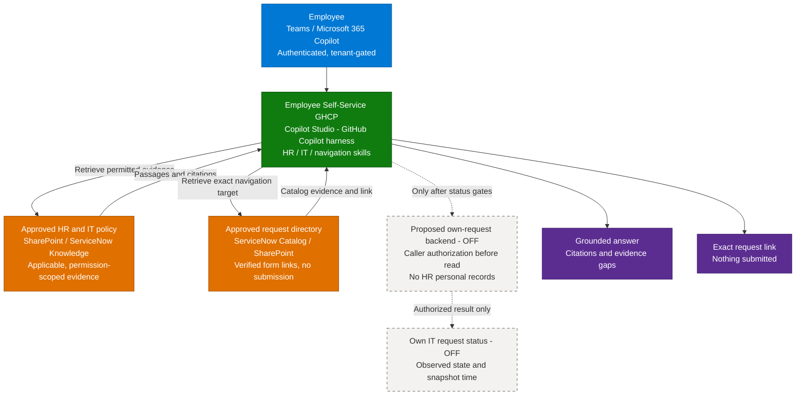

**1. Overview** > [2. Architecture](2.Architecture.md) > [3. Runbook](3.Runbook.md) > [4. Sample Prompts](4.Sample-prompts.md)

# Employee Self-Service (GHCP) — Overview

## Scenario Overview

**Scenario Type**: Employee Experience (HR + IT front door)  
**Agent Type**: Knowledge-grounded agent, Microsoft Copilot Studio GitHub Copilot harness  
**Primary Tools**: Microsoft Copilot Studio, SharePoint knowledge, ServiceNow Knowledge and Catalog Copilot connectors  
**Complexity**: Intermediate — content, identity and tenant readiness dominate delivery  
**Status**: 📝 Draft

A conversational front door for published HR policies, IT how-to guidance and the correct request form. The agent uses the **GitHub Copilot harness in Microsoft Copilot Studio**. Focused runtime skills guide its work, configured knowledge supplies evidence, and agent-wide instructions establish scope.

The deliverable is documentation and four skill definitions, not a configured or published agent. The read-only baseline requires approved knowledge and tenant validation. An optional authenticated **own IT request status** capability is proposed and **OFF**, with no backend implementation supplied.

---

## Problem Statement

Employees navigate HR and IT portals to find a benefit, understand leave policy, troubleshoot a device or locate a request form. Repeated searches and uncertain answers create:

- **Repetitive load on HR and IT.** Support teams answer questions already covered in approved content.
- **Poor findability.** Policies and catalog entries span SharePoint and service-management systems.
- **Inconsistent guidance.** Duplicate policies can disagree about country, employee category or effective period.
- **Unclear expectations.** Finding a form is easily mistaken for submitting a request, and published policy for a personal entitlement.

The delivery problem is both discovery and evidence quality. Connecting more content does not resolve contradictions or establish permission to access personal records.

---

## Solution Summary

The agent:

- Answers published HR questions with applicable evidence and citations.
- Provides IT troubleshooting instructions from approved knowledge without operating on devices or accounts.
- Returns the exact verified catalog item or process link, leaving submission to the employee.
- Explains that live status is unavailable in the baseline. An optional backend may return only the authenticated caller's own allowlisted IT service requests after separate authorization and release tests.

| Build | When to use |
|---|---|
| **Read-only baseline** | Start with three independently enabled skills for HR guidance, IT guidance and request navigation, using approved knowledge only |
| **Own-request status extension — proposed / OFF** | Add the fourth skill only with an implemented caller-scoped read backend, real tool binding and separate release approval |

These are profiles of the same Studio design. Neither includes request creation, HR writes, mailbox actions or live individual HR records. A skill upload does not create a connector, tool or access-control rule.

---

### How It Works

Solid paths describe the intended baseline after setup, not observed runtime success. Dashed paths are proposed and OFF. The [channel documentation](https://learn.microsoft.com/en-us/microsoft-copilot-studio/agents-experience/publication-channels-overview) lists Teams and Microsoft 365 Copilot; actual audience, authentication and availability remain tenant gates.

---

## Business Outcomes

| Outcome | Description |
|---|---|
| 📉 HR and IT ticket deflection | Compare avoidable question volumes with a pre-pilot baseline, without counting unanswered questions as deflection |
| 🎯 Demonstrable value | Measure source-supported task completion and credit consumption, not only conversation counts |
| ⏱️ Faster time to answer | Measure time to find an applicable answer or correct form |
| 🧑‍💼 Consistent policy answers | Track citation accuracy, applicability errors and unresolved conflicts across populations |
| 🛡️ Controlled adoption | Require zero observed unauthorized disclosures or writes, with a tested rollback path |

These are proposed measures, not achieved results or product guarantees.

---

## In Scope / Out of Scope

### ✅ In Scope

- Read-only HR policy, benefits and published payroll/expense process guidance, not individual values.
- IT how-to and support routes based on approved KB passages.
- Catalog navigation for equipment, access and HR process forms, with actual verified links.
- Knowledge curation, connector readiness, permission tests and a representative pilot.
- Four standalone runtime definitions, including a proposed/OFF own IT request status skill.
- Preview/Evaluate test cases, controlled publishing, operating ownership and rollback.

### ❌ Out of Scope

- Request submission, equipment ordering, account resets, provisioning, approvals, cancellations or updates.
- Personal leave balances, salary, payslips, medical data, employee profiles, HR case content or other people's requests.
- Legal, tax or medical advice, individual eligibility determinations and grievance case analysis.
- Unattended actions, event subscriptions, email sending or connected-agent delegation.
- Assumed HRIS integration, automatic country lookup, unvalidated languages or guaranteed licensing/cloud availability.
- A working tenant deployment or implemented status API.

Insufficient evidence produces a clear limitation and a trusted HR/IT contact route where available, not an invented answer or a claimed escalation.

---

## Target Users

| Persona | Role in This Scenario |
|---|---|
| **Employee** | Asks HR and IT questions, finds forms, optionally checks own permitted IT requests |
| **HR Operations** | Approves policy authority, applicability, sensitive-topic routing and deflection measures |
| **IT Service Desk** | Owns KB safety, catalog destinations and optional request-status field scope |
| **M365 / Workplace Admin** | Validates connector identities, employee access, channels and rollout audience |
| **Delivery Engineer** | Configures the Studio agent and skills, tests evidence paths and maintains versions |
| **Integration / Privacy / Release Owner** | Owns the optional backend, data minimization, release decisions and rollback |

---

## Knowledge Sources Used

| Source | Content | Category |
|---|---|---|
| Approved SharePoint libraries | HR policies, handbooks, country-specific guidance and verified process directory | HR / IT policy and navigation |
| ServiceNow Knowledge Copilot connector | Approved IT troubleshooting and, if separately permission-qualified, published HR articles | Indexed knowledge, not request records |
| ServiceNow Catalog Copilot connector | Approved service descriptions and exact request destinations, subject to Studio retrieval validation | Indexed navigation, not ordering |
| Isolated synthetic fixtures | Policy, KB, catalog and failure examples in Sample Prompts | Tests only, never production policy |

HRIS-hosted published policy can be evaluated separately, but no HRIS data route is assumed or required for the baseline. Approved SharePoint policy content and verified portal links can support a smaller pilot. The [Resources](0.Resources/README.md) define evidence requirements and current official guidance; the [skill index](0.Resources/Skills/README.md) lists the runtime imports.

---

## Qualification Checklist

| Question | Why it matters |
|---|---|
| Is GitHub Copilot harness authoring available in the intended Studio environment? | Creation, model, region, maker roles and data policy must be verified before scheduling release |
| Who will consume the agent, including frontline users? | Test actual license, billing, authentication and channel combinations, not assumed entitlement |
| Where is each authoritative policy held? | Published guidance is distinct from individual HRIS records |
| Which ITSM and catalog route is available? | A configured index does not prove Studio retrieval or a live status tool |
| Which countries, categories and effective periods are in scope? | Applicability and permission checks are both required |
| Which languages are approved for the pilot? | Translation must preserve meaning and citations, with owner-reviewed tests |
| Are HR, IT, privacy, cost and release owners named? | Content conflicts and access failures need accountable decisions |
| Which cloud, region and retention constraints apply? | Official documentation is not proof of feature availability or compliance in a tenant |
| Is live own-request status required? | Keep it OFF unless the narrow backend can enforce ownership independently of prompts |

---

## What Actually Goes Wrong

| Symptom | Root cause | Mitigation |
|---|---|---|
| A connector returns malformed or failed responses | Identity, schema or integration-path error requires diagnosis, not a guessed cause | Capture sanitized errors in a sandbox, stop affected evidence paths and keep approved SharePoint coverage |
| Makers see answers that employees cannot | Maker access does not represent caller permissions | Test permitted, denied and revoked non-maker accounts end to end |
| A shared agent cannot be opened | Audience, data policy, licensing or channel setup can differ | Validate the exact intended audience before announcing access |
| Conflicting answers grow with the corpus | Multiple policy versions lack a clear authority decision | Curate and retire superseded content, with HR sign-off |
| A form link is treated as a completed request | Knowledge discovery and transactional execution are confused | State “nothing submitted”, expose no write tools |
| Status appears current but is indexed text | Knowledge ingestion is mistaken for live request access | Baseline status is OFF, only backend-authorized snapshots may support the extension |
| Pilot passes but wider rollout fails | New countries, identities or languages were not represented | Re-test each added population before expanding |

---

## Related Patterns

- [Copilot Connector Knowledge Onboarding](../../02-patterns/Copilot-Connector-Knowledge-Onboarding/Copilot-Connector-Knowledge-Onboarding.md)
- [Grounding & Response Quality Remediation](../../02-patterns/Grounding-and-Response-Quality-Remediation/Grounding-and-Response-Quality-Remediation.md)
- [Agent Governance & Rollout Control Plane](../../02-patterns/Agent-Governance-and-Rollout-Control-Plane/Agent-Governance-and-Rollout-Control-Plane.md)
- [Copilot Credits & Cost Control](../../02-patterns/Copilot-Credits-Cost-Control/Copilot-Credits-Cost-Control.md)

---

## Related Resources

| Resource | Link |
| --- | --- |
| Architecture | [Architecture](2.Architecture.md) |
| Step-by-Step Runbook | [Runbook](3.Runbook.md) |
| Sample Prompts | [Prompts](4.Sample-prompts.md) |
| Capability and Integration Contracts | [Capability matrix](0.Resources/Capability-matrix.md) |
