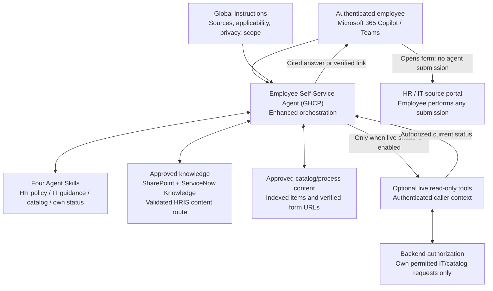

# Employee Self-Service Agent (GHCP) - Architecture

## 1. Separate Knowledge, Routing, and Live Data

The baseline needs no write tools, autonomous triggers, connected agents, or file-generation capability. Those broader GHCP capabilities do not need to be enabled simply because they exist.

## 2. Component Boundaries

| Component | Responsibility | Must not be mistaken for |
|---|---|---|
| Main instructions | Scope, source authority, language limits, portal/contact routes, enabled tool mapping | Enforced backend authorization |
| Skill name/description | Help runtime select the appropriate specialized procedure | An exact topic trigger or guaranteed fixed sequence |
| Skill instructions | Grounding, response format, clarification, edge cases, safe tool-use procedure | A connector installation, API definition, or permission grant |
| Knowledge | Retrieve indexed/permitted policy or catalog evidence | Live personal data, current request state, or an approval |
| Catalog result | Identify the actual request item/form | Submission, eligibility decision, or evidence that a request exists |
| Live read-only tool | Retrieve current authorized own-request status | A broad record-search tool with a prompt-only ownership filter |
| Source portal | Final eligibility checks and any employee submission | A process the agent has already completed |

For compound questions, the runtime can use more than one skill. Each skill is independently usable and must not assume another skill has already authenticated the user, retrieved evidence, or approved an action.

## 3. Source Integration

SharePoint is a native GHCP knowledge source. ServiceNow Knowledge uses the tenant-configured Microsoft Copilot Connector; article text, user criteria, identity mapping, and crawl readiness must be validated before agent testing.

ServiceNow Catalog is a separate indexed connector. Configure its portal `AccessUrl` using the actual employee portal, so retrieved results contain usable form links. Verify that the configured connection can be selected and queried in the target GHCP agent. Do not fabricate a form URL in the skill when a result is absent.

Workday and SAP SuccessFactors integrations described for Microsoft ESS are not automatically GHCP knowledge connections. Qualify the actual tenant-supported route, operations, licensing, and identity flow. A supported read/write ESS accelerator does not imply a transferable GHCP tool or indexed knowledge source.

Knowledge is asynchronous. Catalog content and permissions can update on different schedules; the Catalog deployment documentation distinguishes incremental content crawls from full-crawl permission/identity updates. Establish a freshness and revocation process with source owners.

## 4. Content Architecture and Applicability

Retain a source-authority register:

| Domain | Authoritative source | Applies to | Effective period | Duplicates | Owner | Access rules |
|---|---|---|---|---|---|---|
| Benefits | To configure | Country/entity/category | To configure | To review | HR | Source ACLs |
| Leave | To configure | Country/entity/category | To configure | To review | HR | Source ACLs |
| Payroll process / expenses | To configure | Entity/category | To configure | To review | HR/Finance | Source ACLs |
| Onboarding / conduct | To configure | Employee population | To configure | To review | HR | Source ACLs |
| IT how-to | To configure | Device/service/version | To configure | To review | IT | Source ACLs |
| IT catalog | To configure | Location/service eligibility | To configure | To review | ITSM | User criteria |

Choose one authoritative source **per domain and applicable scope**, not one global policy where local laws or employment categories differ. Retire or clearly separate superseded versions before broad rollout.

**Authorization and applicability are different.** ACLs control whether a user may read a document. Effective dates, legal entity, country, and employment category determine whether it applies. A user may be allowed to read several countries' policies; access alone cannot select their personal policy.

An optional verified profile lookup can supply applicable context if approved and available, but it must have its own validated identity/access boundary. Without it, ask only the necessary question. Neither a filename nor a user-typed country grants access.

Assess extraction using real scanned documents and tables. Do not assume all scans are unreadable or all table formats are reliable: test the chosen source pipeline and provide accessible text/structured content where extraction fails.

## 5. Optional Own-Request Status

Use the [proposed tool contracts](./0.Resources/README.md) for `ListMyRequests` and `GetMyRequest`. These are logical labels to map to real configured operations, not built-in API names.

1. The employee signs in to the agent and completes any required external connection authentication.
2. The runtime selects the status skill and the configured read-only operation.
3. The integration derives the caller from trusted authentication and enforces ownership and permitted request types in the backend.
4. It returns only display-safe status fields and actual retrieval/update timestamps, with explicit errors and pagination.
5. The agent renders the results or explains the limitation. No write, approval, cancellation, or HR case lookup occurs.

Microsoft authentication to the agent does not prove user-delegated authorization to ServiceNow. Never expose a broadly privileged account and rely on "only show my requests" in a skill. If a chosen workflow/tool route cannot preserve and validate caller identity, do not enable live status.

Microsoft ESS's own user-delegated integration policy is a useful reference, not a claim that all custom GHCP integration modes are identical. This scenario requires an enforceable caller-specific boundary regardless of implementation.

## 6. GHCP Tool Routes and Non-Goals

The documented custom-tool routes are MCP servers and workflows, alongside existing connector actions. A workflow tool must include its agent-call trigger and response node, and be saved/published before use. Use only read operations required by the status contract.

Do not copy the standard-harness REST/OpenAPI-upload procedure into this runbook as a verified GHCP feature. If an underlying API needs a wrapper, use a documented supported route and validate that wrapper.

Connected-agent delegation is not required. If introduced later, the GHCP connected-agent procedure requires a published GHCP agent in the same environment, owned by or shared with the maker. Do not describe an installed standard ESS template as an automatically connectable GHCP specialist.

## 7. Governance and Operation

| Concern | Design |
|---|---|
| Memory | Off initially; not a personal HR store or live-status cache. Turning it off does not delete prior stored memories |
| Data minimization | No personal HR cases, pay, medical details, internal work notes, or attachments in status outputs |
| Agent tools | No create/update/delete/send tools in either tier |
| Language | Validate actual source/response languages and cohorts; model translation is not a product-scope guarantee |
| Audience | Test normal employees, licensed and Copilot Chat users, frontline cohorts, and each relevant country/cloud |
| Cost | GHCP uses Copilot Credits separately from Microsoft 365 Copilot user licensing; budget authoring and evaluation as well as runtime |
| Publishing | Teams and Microsoft 365 Copilot; SharePoint knowledge support does not imply a SharePoint publishing channel |
| Observability | Preview/Evaluate/Monitor, connector health, live-tool telemetry, and source-system parity checks |
| Rollback | Keep HR/IT portals and the original agent available; disable the optional live tool first if authorization regresses |

## References

- [GHCP knowledge sources](https://learn.microsoft.com/en-us/microsoft-copilot-studio/agents-experience/knowledge-sources-overview)
- [ServiceNow Knowledge deployment](https://learn.microsoft.com/en-us/microsoft-365/copilot/connectors/servicenow-knowledge-deployment)
- [ServiceNow Catalog deployment](https://learn.microsoft.com/en-us/microsoft-365/copilot/connectors/servicenow-catalog-deployment)
- [GHCP tools](https://learn.microsoft.com/en-us/microsoft-copilot-studio/agents-experience/tools-available)
- [ESS integration security](https://learn.microsoft.com/en-us/microsoft-365/copilot/employee-self-service/securely-integrating-with-external-systems)
- [GHCP connected-agent prerequisites](https://learn.microsoft.com/en-us/microsoft-copilot-studio/agents-experience/add-agent-connected)
- [GHCP channels](https://learn.microsoft.com/en-us/microsoft-copilot-studio/agents-experience/publication-channels-overview)

[Overview](./1.Overview.md) | [Runbook](./3.Runbook.md) | [Sample prompts](./4.Sample-prompts.md)
