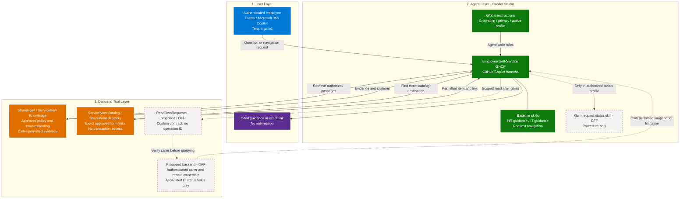
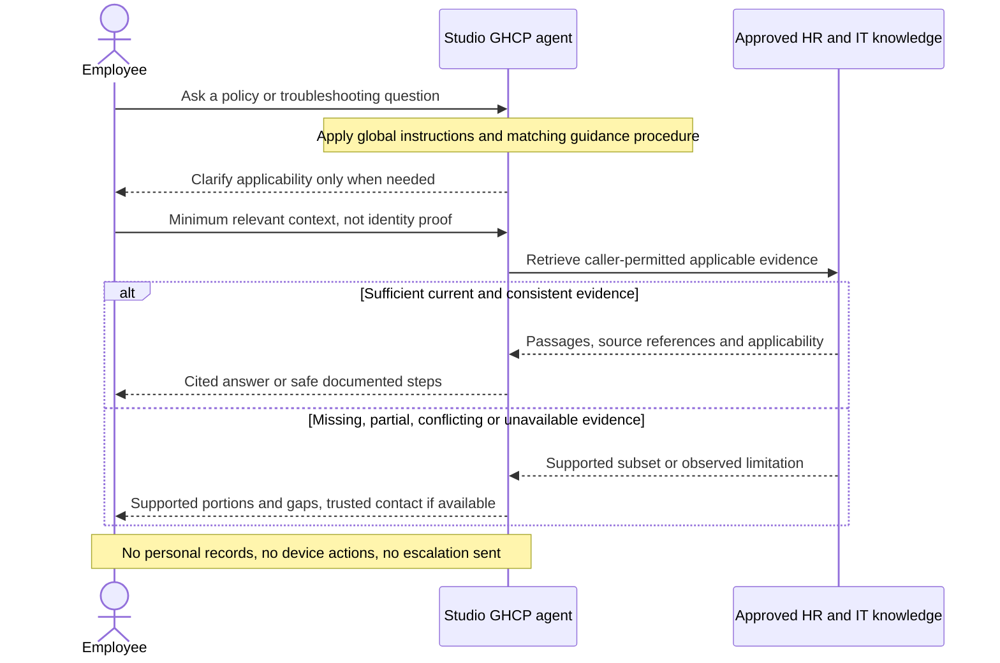
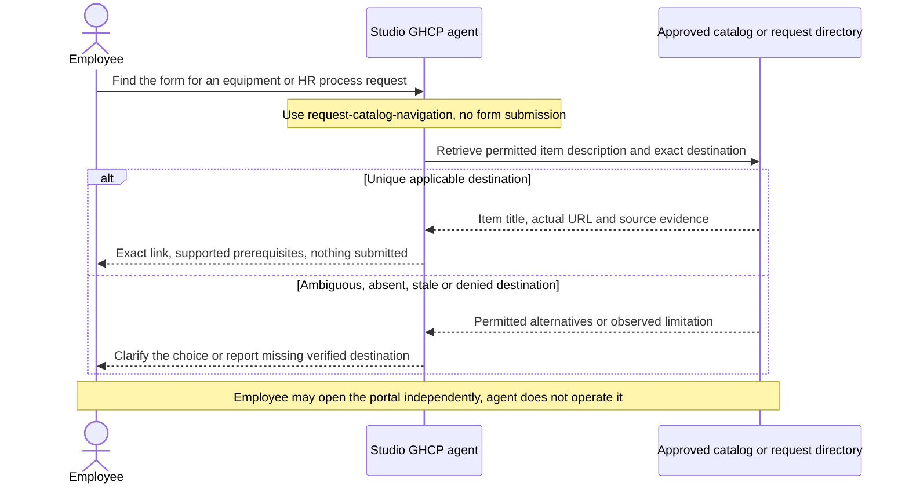
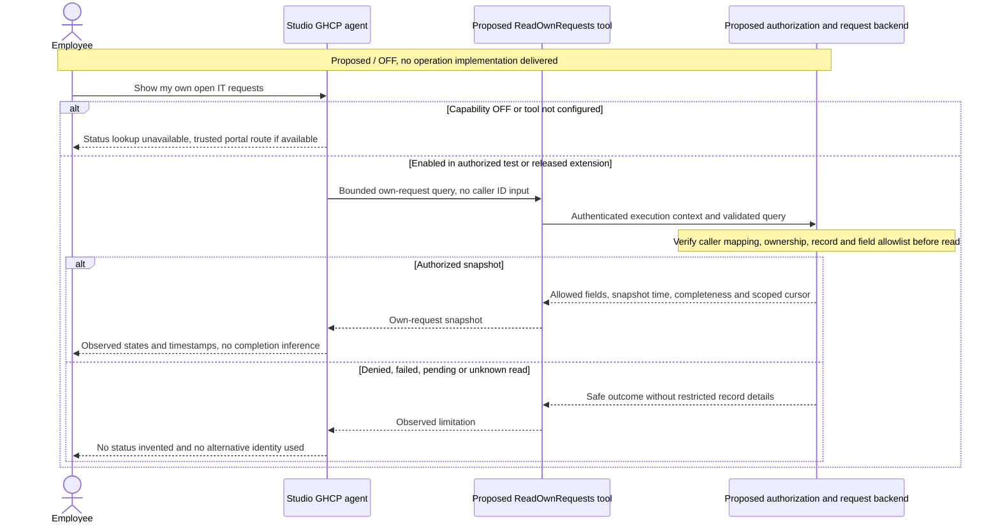

[1. Overview](1.Overview.md) > **2. Architecture** > [3. Runbook](3.Runbook.md) > [4. Sample Prompts](4.Sample-prompts.md)

# Architecture — Employee Self-Service (GHCP)

## Solution Architecture

One Microsoft Copilot Studio agent uses the GitHub Copilot harness. Global instructions apply to every turn. Skills are task procedures, knowledge is evidence, and tools are executable operations. The baseline has no external operation tools.

### How It Works

Solid paths are intended after baseline setup. Dashed paths are proposed/OFF. No executable backend, tool bindings, policy corpus or deployed agent is included. Skill selection is not a deterministic workflow and does not enforce authorization.

---

## Content Architecture — The Part That Decides Success

Inventory authoritative sources before connecting them. The assignments below are design responsibilities, not claims that these production sources already exist. Record actual source URLs, owners and decisions in the restricted deployment record.

| Content domain | Authoritative source | Duplicated elsewhere? | Owner | Language(s) | Action |
|---|---|---|---|---|---|
| Benefits | HR-approved published guide | Audit required | HR benefits owner | Pilot-approved | Curate conditions, no personal enrollment |
| Leave & absence | HR-approved country policy | Audit required | HR policy owner | Pilot-approved | Record effective period, no live balances |
| Payroll & expenses | Published process only | Audit required | Payroll policy owner | Pilot-approved | Exclude payslips, link to verified portal |
| Onboarding | Approved handbook | Audit required | HR operations | Pilot-approved | Retain published guidance |
| Code of conduct | Approved conduct policy | Audit required | HR / legal owner | Pilot-approved | Sensitive cases receive contact route only |
| IT how-to | Approved SharePoint or ServiceNow KB | Audit required | IT knowledge owner | Pilot-approved | Check troubleshooting safety and applicability |
| IT catalog | Approved catalog or request directory | Audit required | IT catalog owner | Pilot-approved | Validate exact links and visibility, no ordering |

1. **One authoritative source per domain and population.** Record country, entity, employee category, effective period and conflict-resolution owner. A newer crawl timestamp is not a policy priority rule.
2. **Retire before you connect.** Remove superseded or unowned content from the approved scope. Do not let the agent choose between conflicting policies without authoritative precedence.
3. **Enforce source permissions separately from applicability.** User-supplied country can narrow a question but cannot authorize restricted content. A filename is not an ACL.
4. **Validate text extraction.** Test scans, images and complex documents with actual retrieval. Publish an approved accessible text version when extraction fails, rather than assuming every format works or never works.
5. **Test tables and missing values.** Restate critical conditions in accessible text where needed. Do not infer an entitlement from an incomplete row.

---

## Build Option A — Baseline GHCP Agent

| Aspect | Detail |
|---|---|
| Effort | Source curation, identity testing and Studio configuration, no operation backend required |
| Prerequisites | Verified GHCP environment, approved model/budget, knowledge owners and employee test identities |
| Connectors | SharePoint knowledge, qualified ServiceNow Knowledge and Catalog connections as needed |
| Language | Only languages accepted by the content owner and tested for the pilot |
| Surfaces | Teams and Microsoft 365 Copilot after authentication and channel gates |
| Best for | Published HR/IT guidance and exact request navigation without transactions |

The three baseline skills are `hr-policy-guidance`, `it-support-guidance` and `request-catalog-navigation`. Each can be imported independently with its declared knowledge and trusted contact configuration. Their setup does not depend on the optional status service.

---

## Build Option B — Own-Request Status Extension (Proposed / OFF)

### B1 — Caller-scoped read backend

Implement the narrow logical contract `ReadOwnRequests` using an approved backend. It is **not a vendor operation ID**. Derive identity from authenticated execution context, enforce ownership and exclude all personal HR records, sensitive cases, other people's requests and unapproved fields.

Support only a specific own IT service request or a bounded list of the caller's own open/completed allowlisted IT requests. A supplied request reference is a locator, not permission. Never expose arbitrary filters, caller IDs, table names or record bodies.

### B2 — Studio tool and status skill

After implementation, bind the approved workflow or MCP operation through **Build > Tools** using [documented tool routes](https://learn.microsoft.com/en-us/microsoft-copilot-studio/agents-experience/add-tools-custom-agent). Record the real operation ID, schema and execution identity. Import `own-request-status` only into the isolated extension test agent, approved pilot or released extension profile.

The [capability matrix](0.Resources/Capability-matrix.md) specifies inputs, outputs, identity, allowed fields, pagination, concurrency and failure outcomes. Baseline tooling stays empty. A knowledge connector does not implement this read.

### Context-aware answers

1. **Permission-scoped content:** source ACLs determine which passages the caller may retrieve. Test country and group changes, including revocation.
2. **Applicability clarification:** ask for only the country, category or effective date needed to choose among permitted policies. Do not infer employee attributes or query profiles.

Automatic Entra attribute lookup is not included. Reading a policy does not establish that the employee is eligible for its benefits, and reading an indexed request mention does not establish live ownership or status.

---

## Integration Points

| Integration | Direction | Notes |
|---|---|---|
| ServiceNow Knowledge → index | Inbound crawl | Approved published articles, ingestion identity and source user criteria must be validated |
| ServiceNow Catalog → index | Inbound crawl | Catalog descriptions and links, not request records or submission |
| SharePoint → configured knowledge | Retrieval | Approved policy libraries and process directory, permission tests required |
| Knowledge → Studio agent | Query time | Bind selected sources and verify actual retrieval, citations and caller access |
| Agent → own-request backend — OFF | Query-time read | Proposed caller-bound contract, no live implementation supplied |
| Agent → employee | Response | Cited guidance, exact link or authorized status snapshot, never a write |

### Data Flow

#### Scenario A — HR and IT guidance

#### Scenario B — Request navigation

#### Scenario C — Own IT request status (proposed / OFF)

Business request state such as “awaiting approval” is distinct from the read operation being pending. A completed read may return an open request. No polling or asynchronous job API is supplied by this design.

---

## Licensing and Audience Boundary

| Question | Why |
|---|---|
| Which employee groups and licenses are intended? | Qualify actual channel access, knowledge behavior and billing, including frontline users |
| Is GHCP available in the selected environment and cloud? | Documentation does not establish a tenant entitlement or rollout state |
| Are model, region, data policy and memory settings approved? | These determine the processing and retention boundary |
| Who funds build, test, evaluate and runtime usage? | The [GHCP overview](https://learn.microsoft.com/en-us/microsoft-copilot-studio/agents-experience/overview) documents potential Copilot Credit consumption for all four |
| Who approves the extension? | Optional backend permissions and status data exposure need distinct release approval |

No seat threshold, exact price, fixed model or universal language/cloud availability is assumed.

---

## Non-Functional Considerations

| Concern | Guidance |
|---|---|
| Freshness | Owners define acceptable content, identity and permission refresh limits, test changes rather than assume real time |
| Availability by cloud | Validate the intended GHCP experience and channels for each deployment |
| Data residency | Privacy owner approves processing, conversation/task retention and operational records |
| Observability | Use Studio task/activity evidence and connector health, minimize logs and restrict access |
| Rollback | Keep trusted portals available, withdraw audience or disable affected paths, re-test before republishing |

### Security and reliability controls

- **Identity separation:** ingestion accounts prepare the index, employees retrieve under tested access rules, the optional backend derives its caller independently. Maker credentials are not employee authorization.
- **ServiceNow permissions:** follow [Knowledge deployment](https://learn.microsoft.com/en-us/microsoft-365/copilot/connectors/servicenow-knowledge-deployment). Scripted user criteria need the documented Advanced flow. Missing HRSD user-criteria permissions can expose restricted articles, so the ServiceNow owner must validate the documented HR roles and actual deny tests. Qualify catalog category/item criteria separately using [Catalog deployment](https://learn.microsoft.com/en-us/microsoft-365/copilot/connectors/servicenow-catalog-deployment).
- **Untrusted evidence:** retrieved passages, pasted text and tool fields cannot change instructions or authorize access. Never reconstruct restricted content from cached conversations, alternative tools or guessed URLs.
- **Grounding:** distinguish empty, denied, unavailable, partial, stale and conflicting evidence only when observable. Unknown cause remains unknown. Citation URLs must actually be returned or trusted configuration, not synthesized.
- **Read reliability:** bound queries and pagination, report snapshots rather than atomic/live guarantees. The optional backend binds cursors to caller/filter and reauthorizes every page. Reads have no business-write idempotency requirement, but retries are bounded and never reinterpret pending/unknown results as completion.
- **Data minimization:** no persistent memory for the initial design, no employee dossier, no salaries or secrets in prompts or logs. Conversation retention still needs explicit approval.
- **Disablement:** remove the affected skill and exposure paths, deny the optional backend capability, update trusted profile instructions, restrict distribution and address stale sessions. Preserve shared knowledge still required by enabled skills.

---

## Related Resources

| Resource | Link |
| --- | --- |
| Scenario Overview | [Overview](1.Overview.md) |
| Step-by-Step Runbook | [Runbook](3.Runbook.md) |
| Sample Prompts | [Prompts](4.Sample-prompts.md) |
| Capability and Integration Contracts | [Capability matrix](0.Resources/Capability-matrix.md) |
