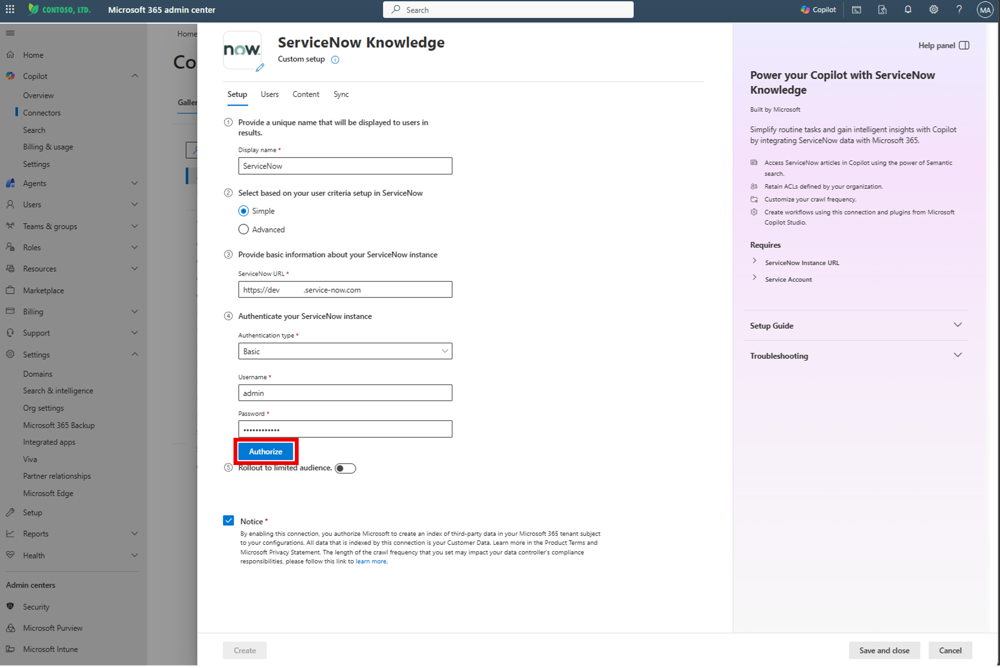
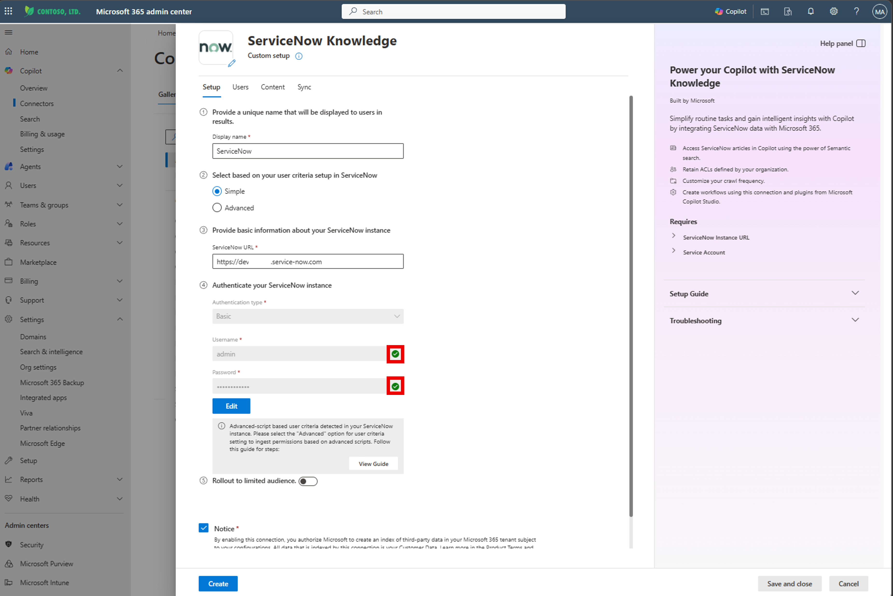

# ServiceNow Tenant & Copilot Connector Setup Guide

## Overview

This guide walks through two main tasks:

1. **Create a free ServiceNow Developer Instance** — required as the external
   knowledge source for the HR Onboarding Agent
2. **Install and configure the ServiceNow Knowledge Copilot Connector** — indexes
   ServiceNow knowledge base articles into M365 so they can be used as agent knowledge

> **Before You Start**
> - Use an approved isolated developer instance for sample articles; production needs HR-approved content and a supported governed environment.
> - Verify tenant connector availability, licensing, admin roles and data policies rather than assuming defaults.
> - Follow [ServiceNow prerequisites](https://learn.microsoft.com/en-us/microsoft-365/copilot/connectors/servicenow-knowledge-admin-setup) and [connector deployment](https://learn.microsoft.com/en-us/microsoft-365/copilot/connectors/servicenow-knowledge-deployment), including source permissions and identity mapping.
> - Screenshots are editing placeholders, not revalidated UI. Verify current screens; follow the secure configuration steps, not superseded screenshot selections.

---

## Prerequisites

| Requirement | Details |
|---|---|
| Email address | Required to sign up for a ServiceNow Developer account |
| M365 Admin access | Required to install and configure the Copilot Connector |
| Microsoft 365 Copilot license | Required for the tenant where the connector will be installed |

---

## Part 1: Create a Free ServiceNow Developer Instance

### Step 1-1. Sign Up for a ServiceNow Developer Account

1. Open your browser and go to https://developer.servicenow.com

> 

2. Click **"Sign In"** in the top right corner
3. Click **"New user? Get a ServiceNow ID"**

> 

4. Fill out the registration form with the following details:
   - Email
   - First Name
   - Last Name
   - Country
   - Password
   - Confirm Password
   - Check the reCAPTCHA box
   - Accept the Terms of Use

5. Click **Sign Up**

> 
>

---

### Step 1-2. Verify Your Email

1. Check your inbox for a verification email from `signon@service-now.com`
2. Click **"Verify Email"** in the email

> 

> **Screenshot to replace:** verification-link token redacted. Verify through your own account's email; never reuse or publish verification links.

3. After verification, log in to your ServiceNow account
4. On first login, MFA setup will appear on the next screen.

> 
>

   > **Security requirement:** complete the organization's required MFA enrollment; do not skip MFA for convenience.
   > **Screenshot to replace:** show completed MFA enrollment, not the Skip path.

---

### Step 1-3. Complete Initial Setup

1. In the **"Getting Started"** dialog, click **"No"** (I need a guided experience)

> 
>

2. In the next window, select your preferred options, check the **Terms of Use** checkbox, and click **"Finish Setup"**

> 
>


---

### Step 1-4. Request a ServiceNow Instance

1. You should now be in your **ServiceNow Developer Dashboard**
2. Click **"Request Instance"** in the top right corner

> 
>

3. Select the latest available instance version, such as **Australia** shown in this example, and click **Setup Australia instance**.

> 
>

4. Click **Run in background** and wait until the instance is ready. This usually takes a short time, but provisioning time can vary.

> 
>

5. When the instance is ready, click **Manage my instance**.

> 
>

6. The **Manage my instance** screen shows your instance details:
   - **Instance URL**: `https://dev[XXXXXX].service-now.com`
   - **Username**: `admin`
   - **Current password**: *(auto-generated)*

> 
>

7. Click the **instance link** to open the instance.

> 

> Use admin access only for authorized instance setup. Keep credentials in an approved secret manager, never in documentation or screenshots. The connector must use its own scoped integration identity. Developer instances can hibernate; confirm the instance is awake before connector testing.

---

## Part 2: Install the HR Plugin and Verify Knowledge Bases

### Step 2-1. Install HR plugin

1. Select the **All** tab in the top navigation.
2. Search for **plugin** and select **Plugins**.

> 

3. Search for **Human resources**.

> 

4. Select **Human Resources Scoped App: Core** and click **Install**.

> 

5. Scroll all the way down in the installation dialog, select **Load demo data**, and then click **Install**.

> 

> Load demo data only in this isolated developer instance, not a production environment. Wait for installation to complete before continuing.

---

### Step 2-2. Verify Knowledge Bases are Available

1. Click the **"All"** tab in the top navigation
2. Type **"knowledge bases"** in the search field
3. Select **"Knowledge Bases"** under **Knowledge > Administration**

> 

4. Confirm the following four default Knowledge Bases are listed:

   | Knowledge Base | Description |
   |---|---|
   | KCS Knowledge Base (demo data) | KCS Demo KB |
   | Known Error | Default knowledge base for Known Errors |
   | IT | The ACME North America IT Service Desk Knowledge Base |
   | Knowledge | Knowledge Base for general Knowledge users |

> 

   > These are example default bases. Restrict connector ingestion to the approved HR test corpus rather than indexing all demo content. Confirm the actual base inventory, article/base user criteria and required REST/table ACLs.

---

## Part 3: Install the ServiceNow Knowledge Copilot Connector

> Use a separate **scoped integration identity** for ingestion, with privileges required by the selected supported authentication method. Setup admin credentials are not the runtime connector identity. Follow the official prerequisite/authentication sections before creating the connection.

### Step 3-1. Add a New Connection in M365 Admin Center

1. Log in to **M365 Admin Center** → https://admin.microsoft.com
2. Navigate to **Copilot** → **Connectors** → **Connectors** → **Gallery**
3. Browse the connector gallery

> 

4. Select **ServiceNow Knowledge**
5. Open its connection setup

> 

---

### Step 3-2. Configure the Connection Settings

1. Click **"Custom setup"** in the upper right of the screen

> 

2. Fill in the following fields in the **Setup** tab:

   | Required Field | Value |
   |---|---|
   | Display name | `ServiceNow` *(or a unique name, e.g., `ServiceNowKB5`)* |
   | ServiceNow URL | `https://dev[XXXXXX].service-now.com` *(your instance URL from Step 1-4)* |
   | Authentication type | Security-approved method from the current deployment guide; **Federated Auth** is recommended there |
   | Integration identity | Dedicated identity with only the required connector roles and approved corpus access |
   | Authentication material | Configure through the approved connection/secret mechanism; never use shared admin credentials or copy values into this guide |
   | Notice | Review and acknowledge the actual notice after verifying permissions |

   > Complete the selected method's prerequisites in [connector deployment](https://learn.microsoft.com/en-us/microsoft-365/copilot/connectors/servicenow-knowledge-deployment#choose-authentication-type). Federated Auth, OAuth 2.0 and Microsoft Entra ID OpenID Connect have distinct setup requirements. Do not infer authentication from the Basic/admin screenshot.

> **Screenshot to replace:** approved authentication method and scoped integration identity.
> 

---

### Step 3-3. Authenticate the Connection

1. Complete the selected method's authorization/sign-in process and wait for authentication to complete

> **Screenshot to replace:** the selected authentication method, not shared admin Basic authentication.
> 

2. Confirm the connection's successful authentication state. For methods with field validation, inspect its check marks; success alone does not prove correctly scoped data access.

> **Screenshot to replace:** authentication success for the scoped identity.
> 


---

### Step 3-4. Configure User Access Permissions

1. Click the **"Users"** tab at the top of the setup panel

2. Under **Access Permissions**, select **Only people with access to this data source**. Preserve source permissions, not Everyone.

> **Screenshot to replace:** select source-based permissions instead of Everyone.
> 

3. Configure employee identity mapping and verify knowledge-base and article user criteria. If any advanced scripts are present, configure **Advanced** flow and its required ServiceNow REST setup; Simple flow does not evaluate them correctly. Validate HRSD criteria where applicable and restrict the corpus before ingestion.
4. Test source access as permitted, denied and revoked employees after identity/content synchronization. Broad ingestion identity access must not become employee access.

---

### Step 3-5. Create the Connection

1. Go back to the **"Setup"** tab
2. Check all required values, scoped authentication, corpus filters, mapping and source-permission settings
3. Click **"Create"**

> **Screenshot to replace:** approved authentication and source-permission configuration before Create.
> 
>

4. The button will display **"Creating connection"** while the process runs

---

### Step 3-6. Add a Connector Description

1. Once the connection is created, a success screen will appear:
   **"Created connection — ServiceNow (ServiceNowKB[X])"**

> 

2. Click **"Auto suggestion"** to have Copilot generate a description automatically

> 

   > 💡 **If "Auto suggestion" does not work**, you can add the description later:
   > - Wait until the connection status shows **"Ready"**
   > - Click the connection in the list → Click **"Edit description"**
   > - Paste the following sample description:

   ```
   Approved HR policy, benefits, wellness, workplace and onboarding articles
   for employees. Use applicable current articles with source citations.
   This index does not provide personal HR records or live transactions.
   ```

3. Click **"Save"** and **"Done"**

   > Wait until the connection is **Ready** and both content and identity processing have completed. Inspect actual status and errors; a fixed wait does not establish readiness.

> 

---

## Part 4: Verify the Connection

### Step 4-1. Verify Indexed Content via Microsoft Search

1. Navigate to https://microsoft365.com and log in as a permitted **non-maker employee** in the test group
2. After clicking **`Search*`** on the navigation, type **`KB0*`** in the search, and press **Enter**

> 

3. Click **"All Sources"** filter → Select your ServiceNow connector (e.g., `ServiceNow-KB`)
4. Confirm that KB articles from ServiceNow are listed in the results

>

5. Verify known HR article IDs, source URLs, applicability and versions. Repeat as denied and revoked employees, including parent-base changes. For workflow use, prove recipient-safe filtering before retrieval and current entitlement before send; the workflow connection owner's rights do not establish the email sender's rights.

---

### Step 4-2. Verify via M365 Copilot Prompts

Use the following prompts in **M365 Copilot (Teams)** to verify the connector is working:

> Restrict the test to the configured HR source and inspect citations and access. Do not treat a web-content switch as proof of grounding; GHCP has no general-knowledge toggle.

| Scenario | Prompt |
|---|---|
| Test basic retrieval | `Find the approved employee handbook and wellness articles. List their titles, source links and applicable populations.` |
| Test thematic analysis | `What do the approved HR articles say about onboarding? Cite each supported step and mark missing details.` |
| Test content drafting | `Draft a reply about the published wellness benefit. Cite the applicable source; do not send or save an email.` |

---

## Summary Checklist

| Step | Task | Status |
|---|---|---|
| 1-1 | ServiceNow Developer account created | ☐ |
| 1-2 | Email verified and account activated | ☐ |
| 1-3 | Initial setup completed | ☐ |
| 1-4 | ServiceNow Dev instance requested, ready and opened | ☐ |
| 2-1 | Human Resources Scoped App: Core installed with demo data in the developer instance | ☐ |
| 2-2 | Four default Knowledge Bases confirmed | ☐ |
| 3-1 | New connection added in M365 Admin Center | ☐ |
| 3-2 | Scoped connection identity, authentication and corpus configured | ☐ |
| 3-3 | Authentication completed and scoped access verified | ☐ |
| 3-4 | Source permissions, identity mapping and advanced criteria validated | ☐ |
| 3-5 | Connection created successfully | ☐ |
| 3-6 | Connector description added | ☐ |
| 4-1 | Indexed content verified via Microsoft Search | ☐ |
| 4-2 | M365 Copilot prompts and permitted/denied/revoked identities tested | ☐ |

---

## Troubleshooting

| Issue | Solution |
|---|---|
| "Sign in" button not appearing | Check the current authentication flow, browser/session state and service status; report a persistent issue to the administrator. |
| "Create" button remains disabled | Review required fields, authentication, permission configuration and validation errors. |
| "Auto suggestion" does nothing | Add description manually after connection reaches "Ready" state. |
| Connector returns errors when querying | Verify the ServiceNow instance is not hibernating — log in directly first. |
| Instance reclaimed by ServiceNow | Re-request a new instance and reconfigure the connector. |
| Items indexed count is 0 after sync | Inspect content and identity processing status, corpus filters and errors; run an authorized full crawl after fixing configuration. |

For additional troubleshooting, refer to:
[Troubleshooting the ServiceNow Knowledge Microsoft Copilot connector — Microsoft Learn](https://learn.microsoft.com/en-us/microsoftsearch/troubleshoot-servicenow-knowledge-connector)

---

## Related Resources

- [Step-by-step runbook](../../3.Runbook.md)
- [Add HR documents to ServiceNow](../../3.Runbook.md#step-1-2-add-hr-documents-to-servicenow-knowledge-base)
- [Release readiness](../Release-readiness.md)
- [ServiceNow Developer Program](https://developer.servicenow.com)
- [Microsoft 365 Admin Center](https://admin.microsoft.com)
- [ServiceNow Knowledge connector deployment](https://learn.microsoft.com/en-us/microsoft-365/copilot/connectors/servicenow-knowledge-deployment)
