# ServiceNow Tenant & Copilot Connector Setup Guide

## Overview

This guide walks through two main tasks:

1. **Create a free ServiceNow Developer Instance** — required as the external
   knowledge source for the HR Onboarding Agent
2. **Install and configure the ServiceNow Knowledge Copilot Connector** — indexes
   ServiceNow knowledge base articles into M365 so they can be used as agent knowledge

> **Before You Start**
> - Use an approved isolated developer instance for sample articles; production needs HR-approved content and a supported governed environment.
> - Verify tenant connector availability, licensing, admin roles and data policies rather than assuming defaults.
> - Follow [ServiceNow prerequisites](https://learn.microsoft.com/en-us/microsoft-365/copilot/connectors/servicenow-knowledge-admin-setup) and [connector deployment](https://learn.microsoft.com/en-us/microsoft-365/copilot/connectors/servicenow-knowledge-deployment), including source permissions and identity mapping.
> - Screenshots are editing placeholders, not revalidated UI. Verify current screens; follow the secure configuration steps, not superseded screenshot selections.

---

## Prerequisites

| Requirement | Details |
|---|---|
| Email address | Required to sign up for a ServiceNow Developer account |
| M365 Admin access | Required to install and configure the Copilot Connector |
| Microsoft 365 Copilot license | Required for the tenant where the connector will be installed |

---

## Part 1: Create a Free ServiceNow Developer Instance

### Step 1-1. Sign Up for a ServiceNow Developer Account

1. Open your browser and go to https://developer.servicenow.com

> 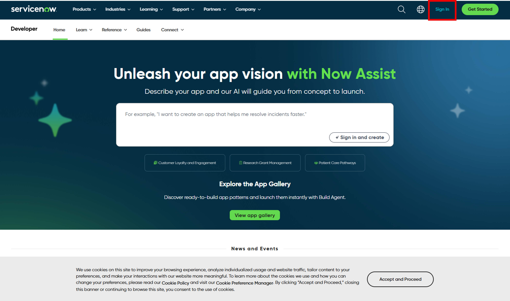

2. Click **"Sign In"** in the top right corner
3. Click **"New user? Get a ServiceNow ID"**

> 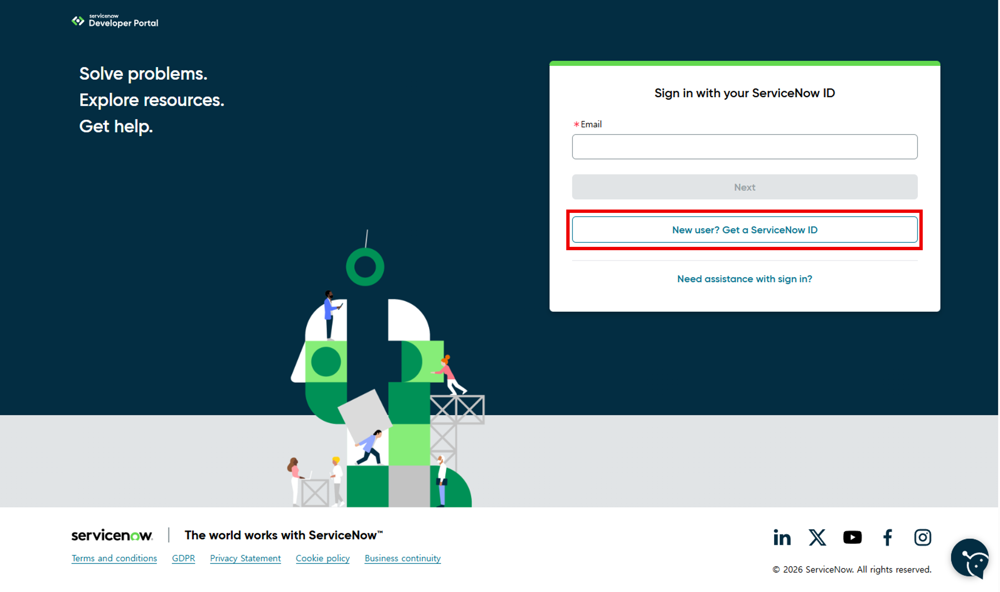

4. Fill out the registration form with the following details:
   - Email
   - First Name
   - Last Name
   - Country
   - Password
   - Confirm Password
   - Check the reCAPTCHA box
   - Accept the Terms of Use

5. Click **Sign Up**

> 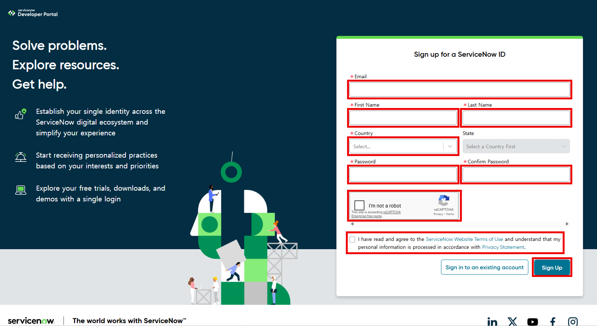
>

---

### Step 1-2. Verify Your Email

1. Check your inbox for a verification email from `signon@service-now.com`
2. Click **"Verify Email"** in the email

> 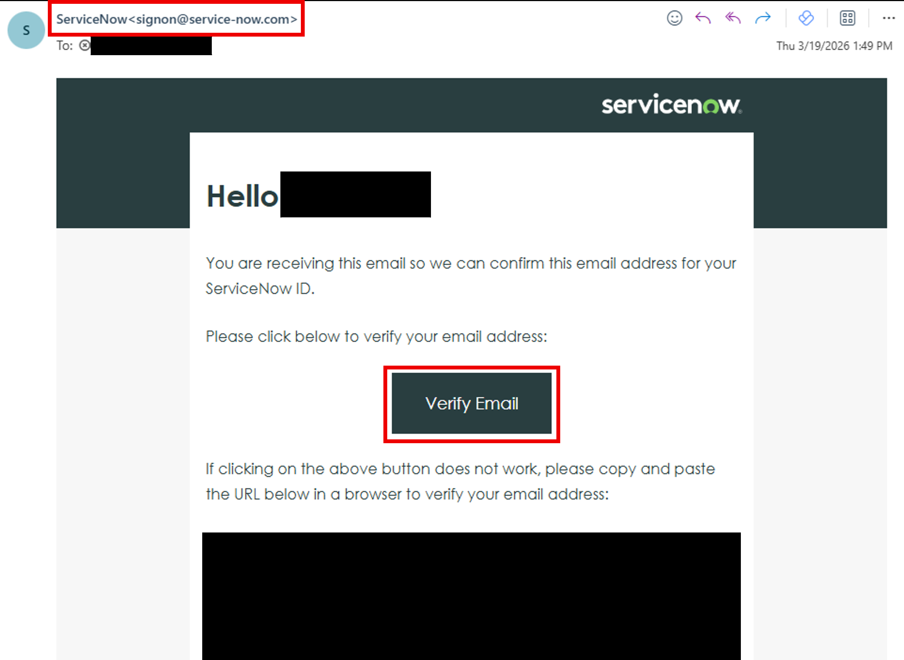

> **Screenshot to replace:** verification-link token redacted. Verify through your own account's email; never reuse or publish verification links.

3. After verification, log in to your ServiceNow account
4. On first login, MFA setup will appear on the next screen.

> 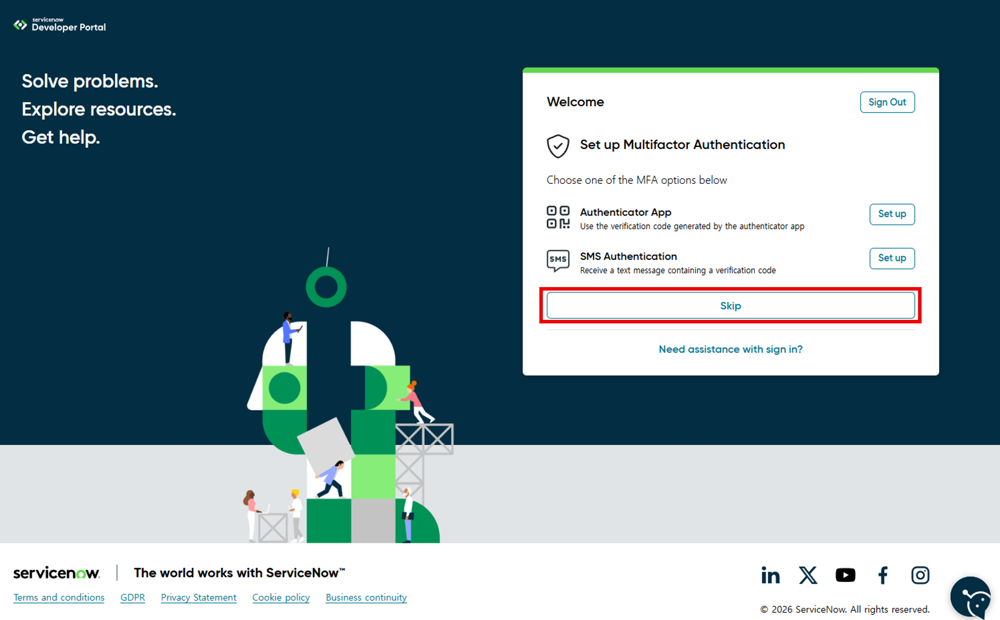
>

   > **Security requirement:** complete the organization's required MFA enrollment; do not skip MFA for convenience.
   > **Screenshot to replace:** show completed MFA enrollment, not the Skip path.

---

### Step 1-3. Complete Initial Setup

1. In the **"Getting Started"** dialog, click **"No"** (I need a guided experience)

> 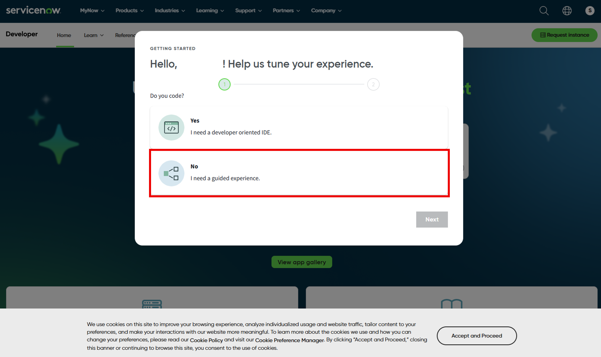
>

2. In the next window, select your preferred options, check the **Terms of Use** checkbox, and click **"Finish Setup"**

> 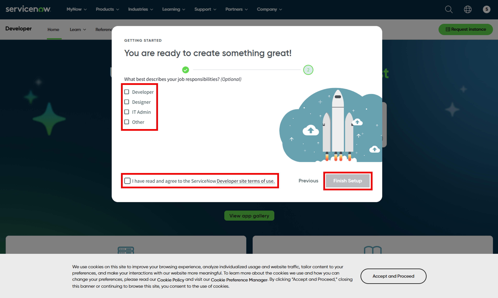
>


---

### Step 1-4. Request a ServiceNow Instance

1. You should now be in your **ServiceNow Developer Dashboard**
2. Click **"Request Instance"** in the top right corner

> 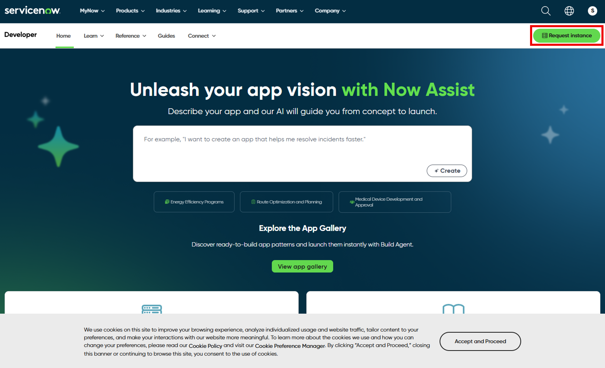
>

3. Select the latest available instance version, such as **Australia** shown in this example, and click **Setup Australia instance**.

> 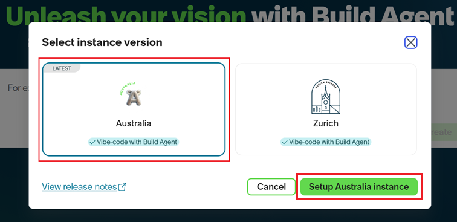
>

4. Click **Run in background** and wait until the instance is ready. This usually takes a short time, but provisioning time can vary.

> 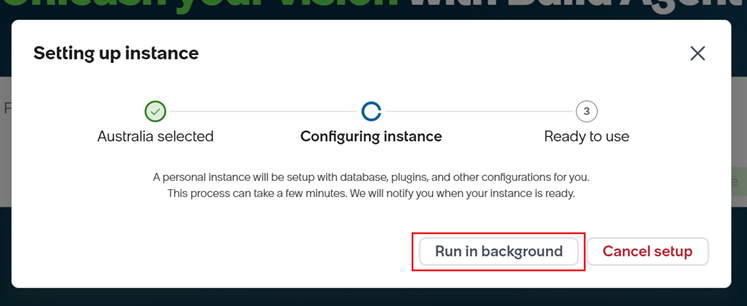
>

5. When the instance is ready, click **Manage my instance**.

> 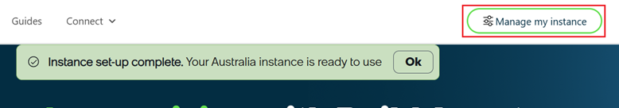
>

6. The **Manage my instance** screen shows your instance details:
   - **Instance URL**: `https://dev[XXXXXX].service-now.com`
   - **Username**: `admin`
   - **Current password**: *(auto-generated)*

> 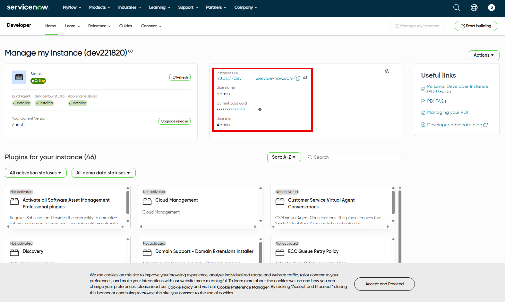
>

7. Click the **instance link** to open the instance.

> 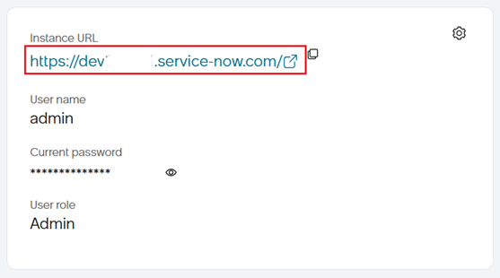

> Use admin access only for authorized instance setup. Keep credentials in an approved secret manager, never in documentation or screenshots. The connector must use its own scoped integration identity. Developer instances can hibernate; confirm the instance is awake before connector testing.

---

## Part 2: Install the HR Plugin and Verify Knowledge Bases

### Step 2-1. Install HR plugin

1. Select the **All** tab in the top navigation.
2. Search for **plugin** and select **Plugins**.

> 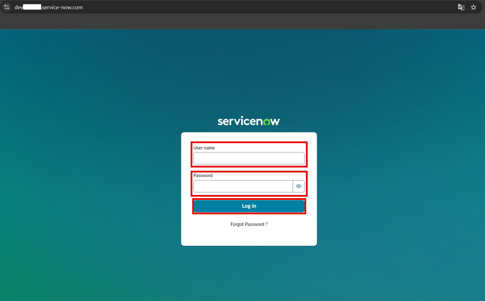

3. Search for **Human resources**.

> 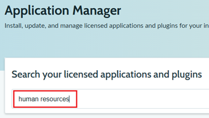

4. Select **Human Resources Scoped App: Core** and click **Install**.

> 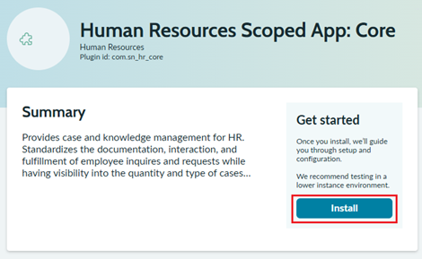

5. Scroll all the way down in the installation dialog, select **Load demo data**, and then click **Install**.

> 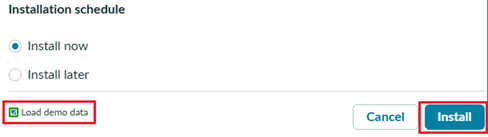

> Load demo data only in this isolated developer instance, not a production environment.

6. Installation can take approximately **15–30 minutes**. Leave it running and jump to the [next step](#step-2-2-configure-federated-credentials-for-servicenow-copilot-connector).

> 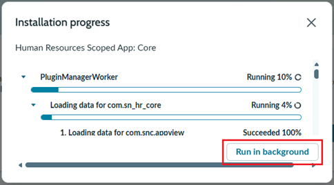

---

### Step 2-2. Configure Federated Credentials for ServiceNow Copilot Connector

Configure **Federated Auth** so the connector can authenticate to ServiceNow without storing or rotating a client secret. These steps follow [Microsoft's Federated Auth setup instructions](https://learn.microsoft.com/en-gb/microsoft-365/copilot/connectors/servicenow-knowledge-deployment#federated-auth-federated-identity-credentials) and use the **New Inbound Integration Experience** available in Zurich and later releases, including Australia.

> Use a ServiceNow admin account authorized to create OIDC providers and users. Have your Microsoft Entra **Directory (tenant) ID** ready; find it under **Microsoft Entra ID > Overview** in the Azure portal. Use your own tenant values, not the example GUIDs in screenshots.

1. Open [Microsoft Graph Explorer](https://aka.ms/ge).
2. Sign in with your tenant's admin account.

> 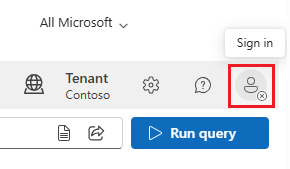

3. Select **GET**, paste the following URL into the query text box, and click **Run query**. In the response, copy the **id** GUID from the matching entry in the **value** array.

```text
https://graph.microsoft.com/v1.0/servicePrincipals?$filter=appId eq '933838e2-bec1-440f-a634-9363c82e5b6d'
```

> 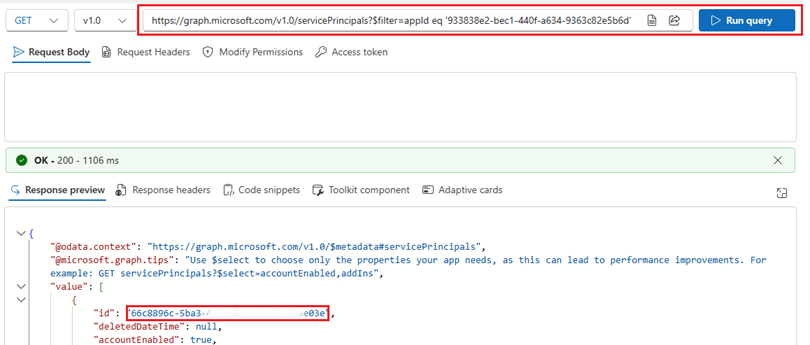

> **Keep the two IDs distinct:** `933838e2-bec1-440f-a634-9363c82e5b6d` is Microsoft's fixed **application (client) ID**. The response's **id** is the **service principal object ID in your tenant**; save that value for the ServiceNow integration user's **User ID**. Do not create a new app registration for this flow. If Graph Explorer reports a permissions error, use **Modify permissions** and obtain authorized consent for the required permissions. If the query returns no matching entry, resolve the missing service principal before continuing; do not substitute another GUID.

4. In the ServiceNow portal, open **All**, search for **oauth**, and select **System OAuth > Application Registry**.

> 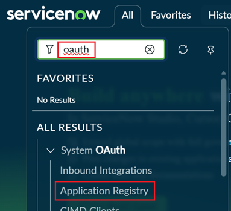

5. Select **New**.

> 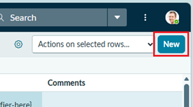

6. Select **New Inbound Integration Experience**.

> 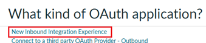

7. Click **New integration**.

> 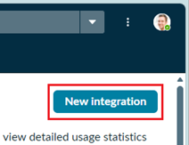

8. Select **Third party ID token issued by OIDC supporting identity provider**.

> 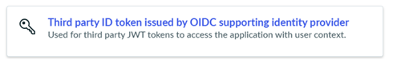

9. Configure the integration as shown in the screenshots below. For **OIDC Metadata URL**, use `https://login.microsoftonline.com/<tenantId>/v2.0/.well-known/openid-configuration`, replacing `<tenantId>` with your own **Directory (tenant) ID**, then save the provider configuration and integration.

> 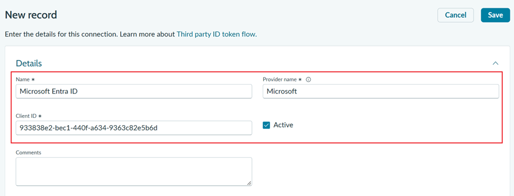

> 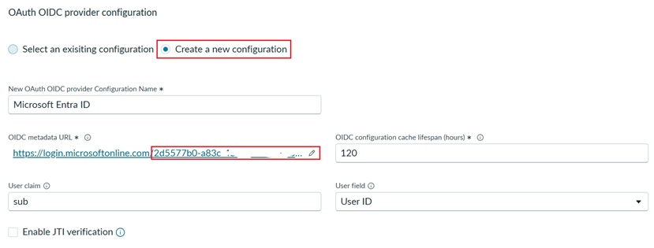

> 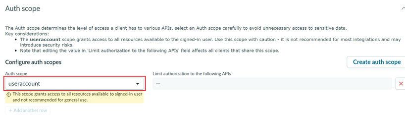

> **User mapping:** this walkthrough uses `oid` to match the service principal object ID saved in the ServiceNow user's **User ID**. Microsoft also documents `sub` for subject-based matching. Do not leave **User Claim** empty; if user resolution fails, verify the claim-to-user mapping against the official guide rather than substituting the application/client ID.

10. Open **All**, search for **users**, and select **System Security > Users and Groups > Users**. Depending on the ServiceNow release, this can appear under **User Administration > Users**.

> 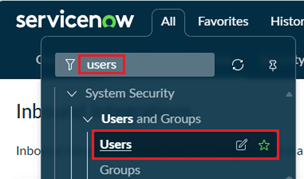

11. Click **New** to create an integration user.

> 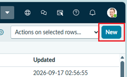

12. Set the values as shown in the screenshot below and click **Submit**. For **User ID**, paste the **service principal object ID** copied from the Graph Explorer response in item 3.

> 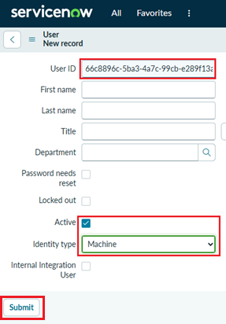

13. Find and select the new user.

> 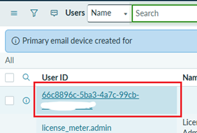

14. In the **Roles** related list, click **Edit...**.

> 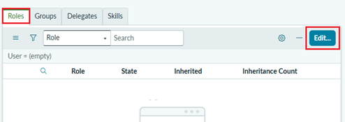

15. Add **knowledge_admin**, **user_criteria_admin**, **user_admin**, and **sn_hr_core.admin**, then click **Save**.

> The **sn_hr_core.admin** role may take some time to appear after the **Human Resources Scoped App: Core** plugin is installed. If it is not visible, confirm that installation has completed, wait a little longer, and refresh the role list before adding it.

> 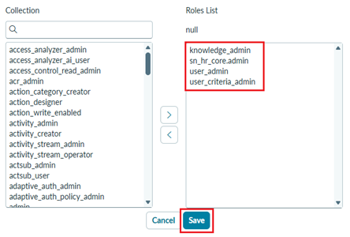

> The first three roles are specified in Microsoft's Federated Auth instructions; **sn_hr_core.admin** is added for this HR scenario. If your approved connector setup uses a custom crawling role, assign that role to this integration user as well. Do not assign the general **admin** role to the integration user. Roles do not replace required REST/table ACLs, approved corpus filters or source-permission configuration.

Before continuing, confirm that the OIDC integration is **Active**, the client ID and tenant metadata URL are correct, and the integration user's **User ID** and roles match the settings above. In Part 3, select **Federated Auth** for this configuration.

---

### Step 2-3. Verify Knowledge Bases are Available

1. Confirm that the **Human Resources Scoped App: Core** plugin installation started in **Step 2-1** has completed successfully before continuing. If it is still running, wait until installation finishes.
2. Click the **"All"** tab in the top navigation
3. Type **"knowledge bases"** in the search field
4. Select **"Knowledge Bases"** under **Knowledge > Administration**

> 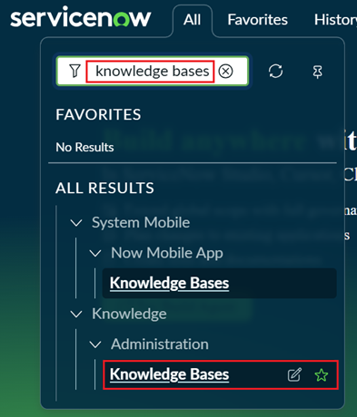

5. Confirm that the **four default knowledge bases**, including **IT**, and **three HR knowledge bases** are listed.

> 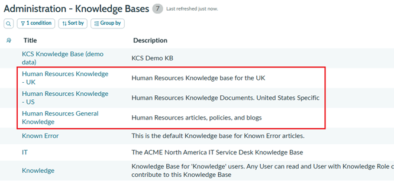

   > These are example default bases. Restrict connector ingestion to the approved HR test corpus rather than indexing all demo content. Confirm the actual base inventory, article/base user criteria and required REST/table ACLs.

---

## Part 3: Install the ServiceNow Knowledge Copilot Connector

> Use a separate **scoped integration identity** for ingestion, with privileges required by the selected supported authentication method. Setup admin credentials are not the runtime connector identity. Follow the official prerequisite/authentication sections before creating the connection.

### Step 3-1. Add a New Connection in M365 Admin Center

1. Log in to **M365 Admin Center** → https://admin.microsoft.com
2. Navigate to **Copilot** → **Connectors** → **Connectors** → **Gallery**
3. Browse the connector gallery

> 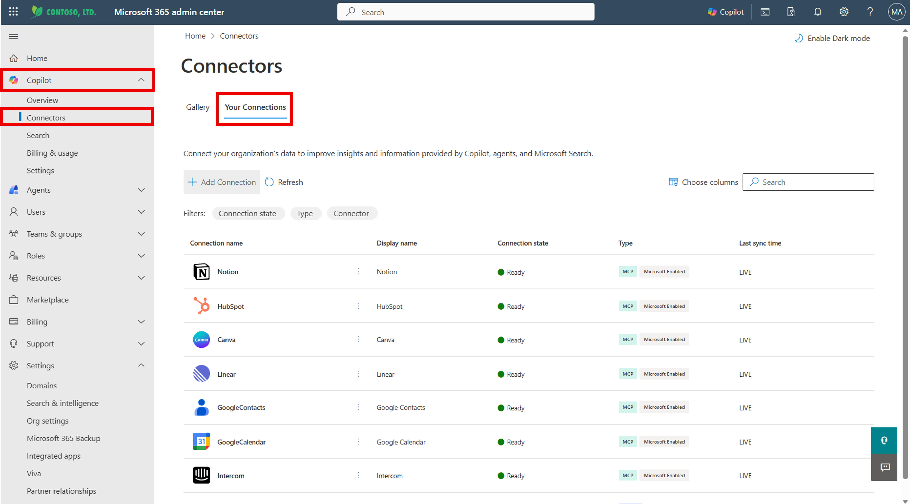

4. Select **ServiceNow Knowledge**
5. Open its connection setup

> 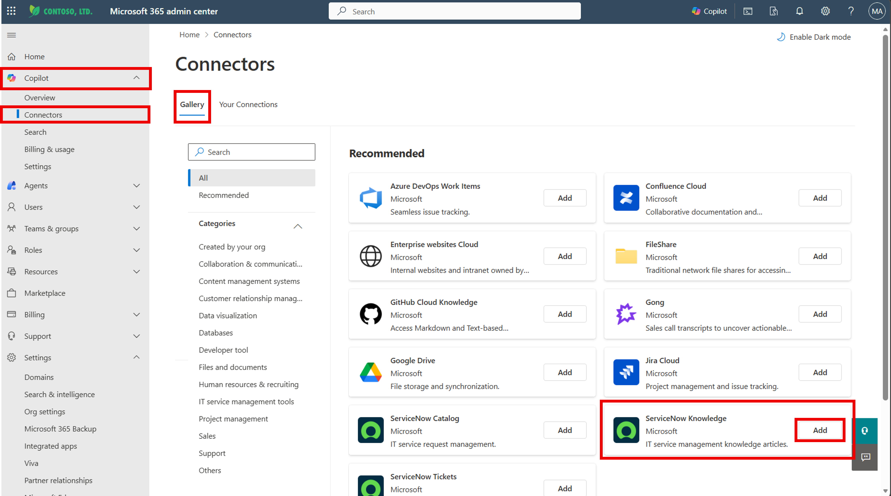

---

### Step 3-2. Configure the Connection Settings

1. Click **"Custom setup"** in the upper right of the screen

> 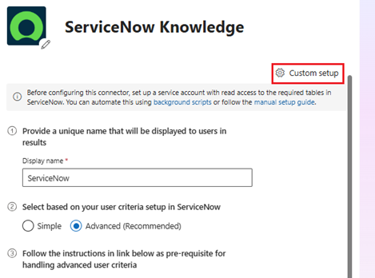

2. Fill in the following fields in the **Setup** tab and then click **Authorize**:

   | Required Field | Value |
   |---|---|
   | Display name | `ServiceNow` *(or a unique name, e.g., `ServiceNowKB5`)* |
   | User criteria | **Simple** |
   | ServiceNow URL | `https://dev[XXXXXX].service-now.com` *(your instance URL from Step 1-4)* |
   | Authentication type | **Federated Credentials (Recommended)**, using the configuration from [Step 2-2](#step-2-2-configure-federated-credentials-for-servicenow-copilot-connector) |
   | Notice | Review and acknowledge the actual notice after verifying permissions |

   > Complete the federated credentials setup in Step 2-2 before authenticating. Use **Simple** only when the knowledge-base and article user criteria do not use advanced scripts; otherwise configure **Advanced** and its required REST API setup. If organizational policy requires a different authentication method, follow its distinct prerequisites in [connector deployment](https://learn.microsoft.com/en-us/microsoft-365/copilot/connectors/servicenow-knowledge-deployment#choose-authentication-type).

> 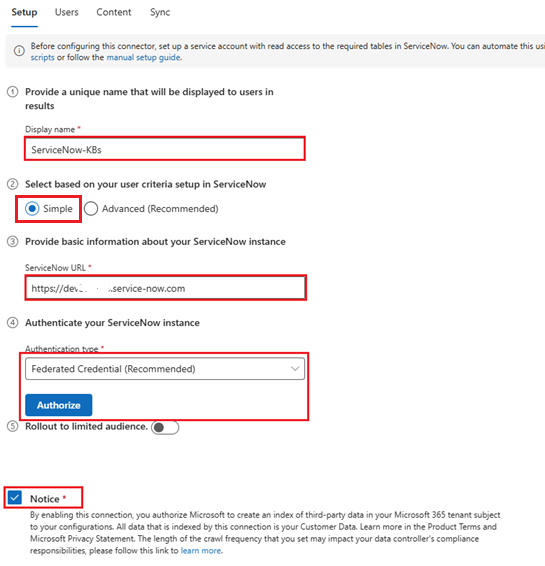

---

### Step 3-3. Configure User Access Permissions

1. Click the **"Users"** tab at the top of the setup panel

2. Under **Access Permissions**, select **Only people with access to this data source**. Preserve source permissions, not Everyone.

> 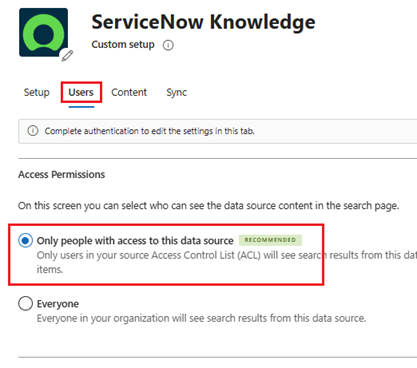


---

### Step 3-4. Create the Connection

1. If the **Create** button is disabled, verify that the connector is authorized in the **Setup** tab. Sometimes the button remains disabled even when everything is configured correctly. If that happens, click **Save and close**, then follow the next two steps. If **Create** is already enabled, click it and continue to item 4.

> 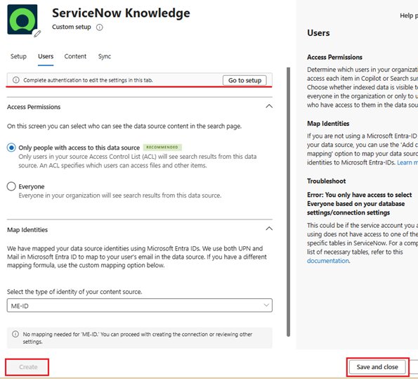

2. Click **Your connections**, select the connection, and click **Edit**.

> 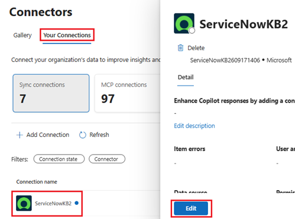

3. Review and select **Notice**. You should now be able to click **Create** to create the connection. If the button is still disabled, resolve any authorization or required-field errors before continuing.

> 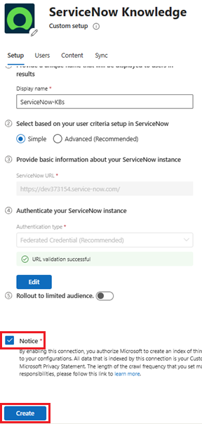

4. The button will display **"Creating connection"** while the process runs

---

### Step 3-5. Add a Connector Description

1. Once the connection is created, a success screen will appear:
   **"Created connection — ServiceNow (ServiceNowKB[X])"**

> 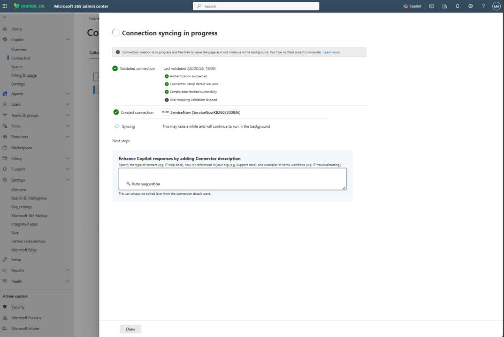

2. Click **"Auto suggestion"** to have Copilot generate a description automatically

> 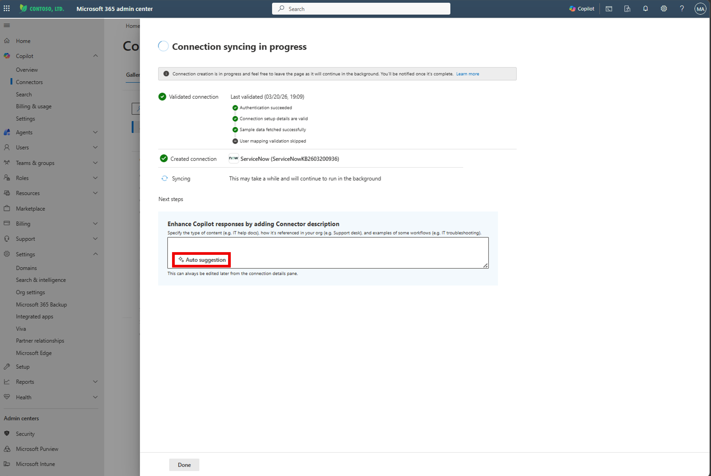

   > 💡 **If "Auto suggestion" does not work**, you can add the description later:
   > - Wait until the connection status shows **"Ready"**
   > - Click the connection in the list → Click **"Edit description"**
   > - Paste the following sample description:

   ```
   Approved HR policy, benefits, wellness, workplace and onboarding articles
   for employees. Use applicable current articles with source citations.
   This index does not provide personal HR records or live transactions.
   ```

3. Click **"Save"** and **"Done"**

   > Wait until the connection is **Ready** and both content and identity processing have completed. Inspect actual status and errors; a fixed wait does not establish readiness.

> 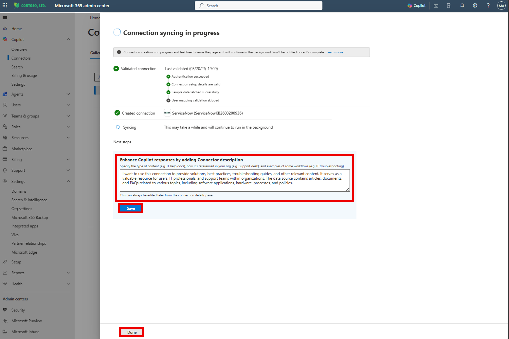

---

## Part 4: Verify the Connection

### Step 4-1. Verify Indexed Content via Microsoft Search

1. Open the connector to see the indexing progress, which normally takes a few minutes to complete. Refresh to see items being crawled and indexed. Wait for indexing to complete before checking the search results.

> 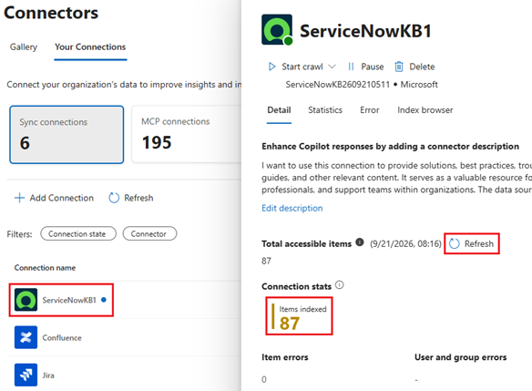

2. Navigate to https://copilot.cloud.microsoft/search.
3. Type **KB000013\*** in the search, press **Enter** and from the sources on the right side, select **ServiceNow**.

> 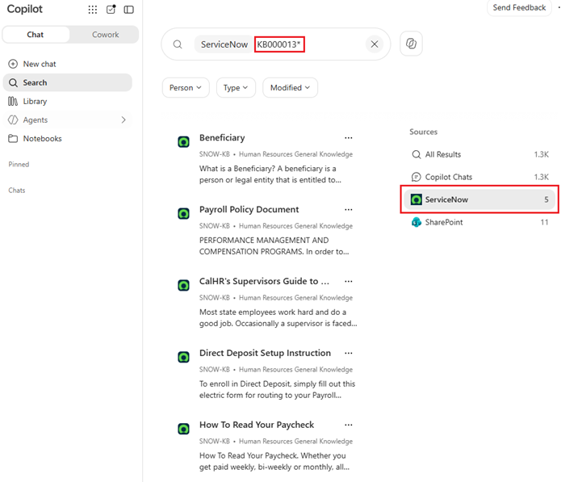

4. Confirm that KB articles from ServiceNow are listed in the results

---

### Step 4-2. Verify via M365 Copilot Prompts

1. Select **New chat** and click **+** to change data sources.

> 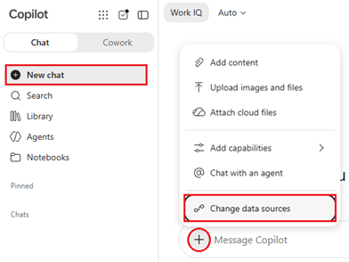

2. Click **Disable all** and select only **ServiceNow**.

> 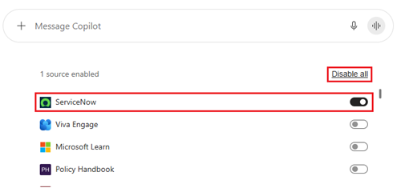

3. Use the following prompts to verify the connector is working:

> Restrict the test to the configured HR source and inspect citations and access. Do not treat a web-content switch as proof of grounding; GHCP has no general-knowledge toggle.

| Scenario | Prompt |
|---|---|
| Test basic retrieval | `Find the approved employee handbook and wellness articles. List their titles, source links and applicable populations.` |
| Test thematic analysis | `What do the approved HR articles say about onboarding? Cite each supported step and mark missing details.` |
| Test content drafting | `Draft a reply about the published wellness benefit. Cite the applicable source; do not send or save an email.` |

> 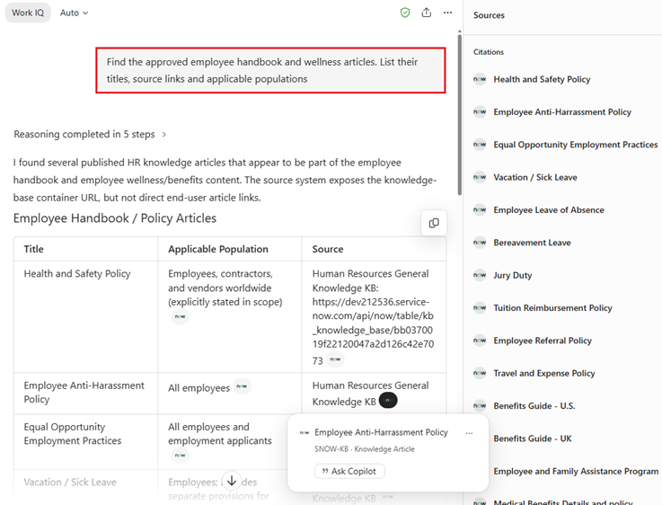

---

## Summary Checklist

| Step | Task | Status |
|---|---|---|
| 1-1 | ServiceNow Developer account created | ☐ |
| 1-2 | Email verified and account activated | ☐ |
| 1-3 | Initial setup completed | ☐ |
| 1-4 | ServiceNow Dev instance requested, ready and opened | ☐ |
| 2-1 | Human Resources Scoped App: Core installed with demo data in the developer instance | ☐ |
| 2-2 | Federated Auth OIDC provider and integration user configured | ☐ |
| 2-3 | HR plugin installation complete; four default knowledge bases, including IT, and three HR knowledge bases confirmed | ☐ |
| 3-1 | New connection added in M365 Admin Center | ☐ |
| 3-2 | Scoped connection identity, authentication and corpus configured | ☐ |
| 3-3 | Source permissions, identity mapping and advanced criteria validated | ☐ |
| 3-4 | Connection created successfully | ☐ |
| 3-5 | Connector description added | ☐ |
| 4-1 | Indexed content verified via Microsoft Search | ☐ |
| 4-2 | M365 Copilot prompts and permitted/denied/revoked identities tested | ☐ |

---

## Troubleshooting

| Issue | Solution |
|---|---|
| "Sign in" button not appearing | Check the current authentication flow, browser/session state and service status; report a persistent issue to the administrator. |
| "Create" button remains disabled | Review required fields, authentication, permission configuration and validation errors. |
| "Auto suggestion" does nothing | Add description manually after connection reaches "Ready" state. |
| Connector returns errors when querying | Verify the ServiceNow instance is not hibernating — log in directly first. |
| Instance reclaimed by ServiceNow | Re-request a new instance and reconfigure the connector. |
| Items indexed count is 0 after sync | Inspect content and identity processing status, corpus filters and errors; run an authorized full crawl after fixing configuration. |

For additional troubleshooting, refer to:
[Troubleshooting the ServiceNow Knowledge Microsoft Copilot connector — Microsoft Learn](https://learn.microsoft.com/en-us/microsoftsearch/troubleshoot-servicenow-knowledge-connector)

---

## Related Resources

- [Step-by-step runbook](../../3.Runbook.md)
- [Run a full crawl on the ServiceNow connector](../../3.Runbook.md#step-1-2-run-a-full-crawl-on-the-servicenow-copilot-connector)
- [Release readiness](../Release-readiness.md)
- [ServiceNow Developer Program](https://developer.servicenow.com)
- [Microsoft 365 Admin Center](https://admin.microsoft.com)
- [ServiceNow Knowledge connector deployment](https://learn.microsoft.com/en-us/microsoft-365/copilot/connectors/servicenow-knowledge-deployment)
