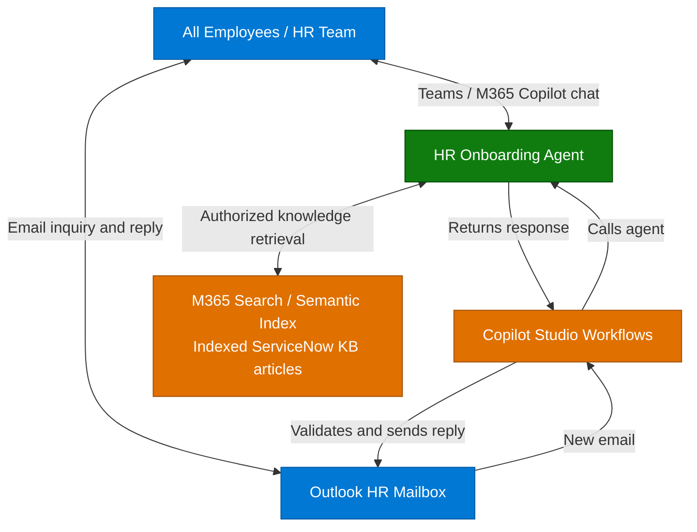

**1. Overview** > [2. Architecture](2.Architecture.md) > [3. Runbook](3.Runbook.md) > [4. Sample Prompts](4.Sample-prompts.md)

# HR Onboarding Agent — Overview

## Scenario Overview

**Scenario Type**: Employee Self-Service (HR)  
**Harness**: GitHub Copilot 
**Agent Type**: Knowledge-grounded agent with autonomous capability using a Workflows email trigger 
**Primary Tools**: Microsoft Copilot Studio, Workflows, ServiceNow Knowledge Copilot Connector 
**Complexity**: Intermediate 
**Status**: 📝 Draft

This scenario describes an HR Onboarding Agent for **all employees**, throughout their employment: company policies, ongoing benefits and wellness, leave processes, workplace guidance and onboarding as one subset. It uses authoritative HR knowledge grounded in a ServiceNow Knowledge Base. Its autonomous email capability responds to routine, in-scope inquiries received by the HR team **without per-message human intervention**, under a release-approved, server-enforced policy.

The standard scenario includes **both interactive chat and autonomous shared-mailbox replies by default**, with all four skills. The supplied artifacts are documentation and runtime skill definitions, not a deployed agent. During setup, operators configure and test knowledge, Workflows and backend dependencies. Current Microsoft documentation describes a GHCP Workflows Agent node that calls an existing published agent; setup verifies the exact HR GHCP target, execution identity and end-to-end invocation. See [invocation evidence](0.Resources/README.md#workflow-invocation-finding).

---

## Problem Statement

Employees need reliable HR guidance when policies change, annual benefits renew, they plan leave or travel, move roles, or first join the organization. HR teams repeatedly answer similar questions, and employees can struggle to distinguish current, applicable guidance from examples or outdated documents.

Without clear evidence and action boundaries, an assistant can:

- Give inconsistent policy answers or omit regional and employment-category conditions.
- Turn incomplete source material into an apparently definitive onboarding checklist.
- Treat a drafted email as sent, or disclose HR content to a recipient whose access was not verified.
- Repeat conflicting sample policies as if they were authoritative employee entitlements.

---

## Solution Summary

The **HR Onboarding Agent** uses approved ServiceNow HR knowledge and four independently scoped runtime skills in one standard configuration. The interactive entry path produces cited answers for all employees, onboarding checklists and draft-only email reply text in chat. The workflow entry path receives HR mailbox events, validates trusted intake, invokes the same GHCP agent for a grounded reply candidate, validates that result, and sends through deterministic workflow/backend logic.

Agent-wide instructions guide scope and grounding; backend controls enforce consequential boundaries. Skills supply task-specific procedures, not connections or event subscriptions. Routine authorized replies do not wait for an HR approval click. Exceptions go to a restricted HR handling queue only when the integration confirms receipt; the agent never invents a successful handoff.

### Key Capabilities

| Capability | Description |
|---|---|
| Knowledge-grounded HR answers | `hr-policy-answer` explains approved policy and benefits evidence, with applicability and conflict checks |
| Onboarding checklists | `hr-onboarding-checklist` organizes source-supported first-day/week steps without creating or completing tasks |
| Email reply drafting | `hr-email-draft` returns subject/body and citations in chat; no Outlook draft is saved or sent |
| Autonomous email reply | `hr-email-reply` prepares a structured grounded result for a calling workflow; backend policy authorization, recipient-safe evidence, exact payload binding and reconciliation govern sending, not an LLM eligibility flag |
| Teams / M365 Copilot access | Intended authenticated channels, subject to tenant validation and a restricted pilot |
| Scoped responses | Unsupported, conflicting, denied or unavailable evidence produces an explicit limitation and a verified HR contact route |

### How It Works

Employees can ask questions in chat or email the HR mailbox. Workflows receives the email, calls the agent, receives its response, and validates and sends the reply through Outlook. Chat drafts remain unsent. The agent retrieves indexed articles from Microsoft 365, populated by the ServiceNow Knowledge Copilot connector, not directly from ServiceNow.

This is the main flow of the documented design, not a deployed integration. Authorization, exceptions and delivery handling are detailed in [Architecture](2.Architecture.md) and the [capability matrix](0.Resources/Capability-matrix.md).

---

## Business Outcomes

| Outcome | Description |
|---|---|
| Reduce repetitive HR support work | Measure time to find correct guidance and HR handling effort against a pre-pilot baseline |
| Improve onboarding clarity | Measure whether first-week tasks are source-supported, understandable and correctly ordered |
| Support employees throughout employment | Measure correct guidance for recurring benefits, workplace-policy and leave-process inquiries across employee groups |
| Make policy answers traceable | Track usable citations, unsupported claims, unresolved conflicts and applicability errors |
| Reduce routine mailbox handling | Measure policy-authorized autonomous replies, exception rate and response latency; require zero unauthorized disclosures or duplicate replies in the restricted pilot |
| Enable controlled adoption | Track channel access, source health and credits per completed task before wider distribution |

These are target outcomes and measures, not observed improvements or a guarantee of hallucination-free responses.

---

## In Scope / Out of Scope

### ✅ In Scope

- Authenticated, read-only HR policy and benefits guidance from approved ServiceNow knowledge.
- First-day and first-week checklists containing only supported tasks, timing and contacts.
- Reply drafting in the conversation, with citations and explicit evidence gaps.
- Autonomous Workflows replies for routine low-risk employee inquiries as a standard entry path, without per-message approval, with trusted intake, backend policy authorization, verified recipient access and duplicate-send prevention.
- Deterministic exception routing for unsafe, ambiguous, unsupported or sensitive inquiries; queue implementation and confirmed handoff are release requirements.
- Teams and Microsoft 365 Copilot delivery guidance, Preview/Evaluate acceptance cases and controlled publishing.
- Explicit handling of missing, denied, unavailable, stale and conflicting evidence, including verified HR contact guidance.

### ❌ Out of Scope

- Autonomous replies outside the release-approved policy, native Email-channel publishing, or a claim that a mailbox workflow is already delivered.
- Arbitrary recipients, Reply All, attachments, forwarding, mailbox draft storage and general mailbox search.
- Payroll or bank-detail changes, benefit enrollment, leave submissions, HR cases and personal eligibility decisions.
- Live employee records, leave balances, individual pay dates, medical histories or real-time organization charts.
- Account provisioning, calendar scheduling, training enrollment or task completion.
- A production-ready tenant deployment.

When evidence is insufficient, the agent preserves supported portions, labels the gap and uses the HR route from trusted configuration or authorized knowledge. It does not invent a policy, contact address or successful handoff.

---

## Target Users

| Persona | Role in This Scenario |
|---|---|
| **Every Employee** | Finds ongoing benefits, leave-process, conduct, remote-work and expense-policy guidance |
| **New Hire / Employee Changing Roles** | Uses applicable onboarding guidance as a subset of employee support |
| **HR Team / Content Owner** | Maintains source authority, applicability, contact routes and conflict resolution |
| **HR Mailbox / Policy Owner** | Maintains the routine-reply authorization policy and handles exceptions, rather than approving every routine reply |
| **IT / M365 / ServiceNow Admin** | Validates connections, identities, source permissions and channel access |
| **Delivery / Integration Engineer** | Configures the agent and skills, qualifies the Workflows invocation and implements the deterministic email backend |
| **Release / Privacy / Cost Owner** | Approves audience, retention, release evidence, rollback and credit budget |

---

## Knowledge Sources Used

| Source | Content | Category |
|---|---|---|
| Approved employee handbook articles | Conduct, remote work, leave and expense processes, onboarding and applicable company policies | Employee policy / onboarding |
| Approved benefits and wellness articles | Benefits information and documented reimbursement processes | Benefits |
| HR-approved email policy and knowledge | Audience-safe sources and routine request rules for AI-written email answers with a references table and agent sign-off; workflow validation must be implemented and governed | Email policy / validation |
| Controlled test fixtures | Self-contained ongoing-employee, onboarding, wellness and conflicting leave examples in Sample Prompts; isolated testing only | Synthetic demonstration |

Production articles must be HR-approved and ingested into Microsoft 365 by the ServiceNow Knowledge Copilot connector. The agent retrieves article information through its configured knowledge source from M365 search/semantic index, not through a direct ServiceNow connection. Indexed knowledge is not a live employee-data feed. The [controlled fixtures](4.Sample-prompts.md#controlled-fixtures) are not company policy.

Included deliverables are the four scenario documents, capability matrix, knowledge requirements, official-documentation evidence and four standalone runtime skills. Studio configuration, production HR content, answer-validation rules, workflow/backend implementations, live evaluation results and deployment are not included. See the [Resources](0.Resources/README.md) for knowledge quality requirements and the official-source verification record; owner-assigned release gates are in the [Runbook](3.Runbook.md#release-gates).

Runtime definitions: [Skill index](0.Resources/Skills/README.md).

---

## Related Resources

| Resource | Link |
| --- | --- |
| Architecture | [Architecture](2.Architecture.md) |
| Step-by-Step Runbook | [Runbook](3.Runbook.md) |
| Sample Prompts | [Prompts](4.Sample-prompts.md) |
| Capability and Integration Contracts | [Capability matrix](0.Resources/Capability-matrix.md) |
