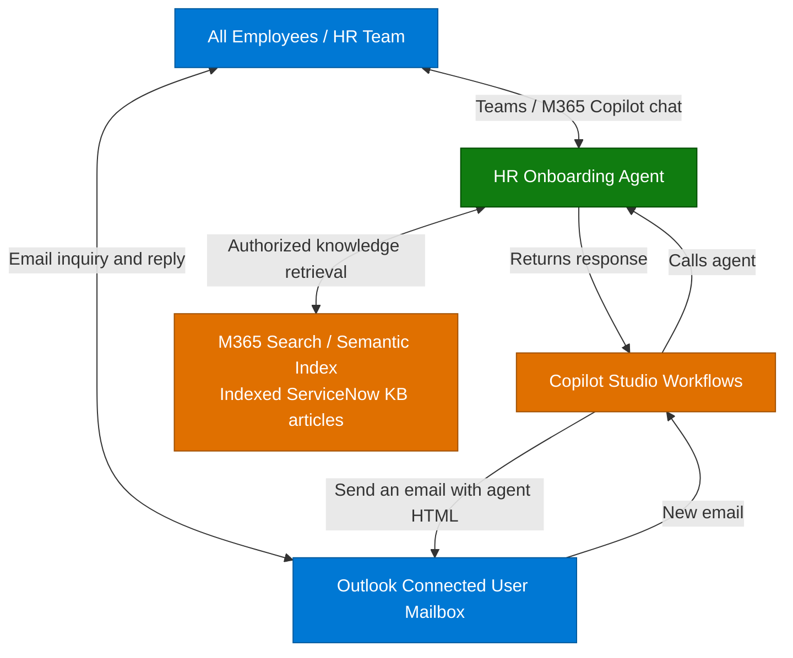

**1. Overview** > [2. Architecture](2.Architecture.md) > [3. Runbook](3.Runbook.md) > [4. Sample Prompts](4.Sample-prompts.md)

# HR Onboarding Agent — Overview

## Scenario Overview

**Scenario Type**: Employee Self-Service (HR)  
**Harness**: GitHub Copilot 
**Agent Type**: Knowledge-grounded agent with autonomous capability using a Workflows email trigger 
**Primary Tools**: Microsoft Copilot Studio, Workflows, ServiceNow Knowledge Copilot Connector 
**Complexity**: Intermediate 
**Status**: 📝 Draft

This scenario describes an HR Onboarding Agent for **all employees**, throughout their employment: company policies, ongoing benefits and wellness, leave processes, workplace guidance and onboarding as one subset. It uses approved HR knowledge grounded in a ServiceNow Knowledge Base. Its Outlook workflow responds to matching email inquiries **without per-message human intervention**. This development walkthrough does not implement a server-enforced HR reply policy.

The standard scenario includes **both interactive chat and autonomous user-mailbox replies**, with both skills. The supplied artifacts are documentation and runtime skill definitions, not a deployed agent. During setup, operators configure and test knowledge and Workflows, keeping email unpublished until the agent is ready. Microsoft documentation describes a GHCP Workflows Agent node that calls an existing published agent; setup verifies the exact HR GHCP target, execution identity and end-to-end invocation. See [invocation evidence](0.Resources/README.md#workflow-invocation-finding).

---

## Problem Statement

Employees need reliable HR guidance when policies change, annual benefits renew, they plan leave or travel, move roles, or first join the organization. HR teams repeatedly answer similar questions, and employees can struggle to distinguish current, applicable guidance from examples or outdated documents.

Without clear evidence and action boundaries, an assistant can:

- Give inconsistent policy answers or omit regional and employment-category conditions.
- Present generic onboarding suggestions as mandatory company requirements.
- Confuse a chat answer with a sent email, or disclose HR content to a recipient whose access was not verified.
- Repeat conflicting sample policies as if they were authoritative employee entitlements.

---

## Solution Summary

The **HR Onboarding Agent** uses approved ServiceNow HR knowledge and two scoped runtime skills in one standard configuration. Chat produces cited answers, onboarding checklists and natural follow-ups. The workflow receives email in the connected user's mailbox with **HR question** in the subject, invokes the same published agent with the email body, and passes its HTML result to Outlook **Send an email**.

Agent-wide instructions guide scope and grounding. Skills supply procedures, not connections or event subscriptions. Replies do not wait for an HR approval click. The simple workflow has no custom validator, hold branch or HR exception queue; mailbox owners monitor failures and follow up manually. Restrict testing to approved recipients and knowledge safe for the entire recipient audience.

### Key Capabilities

| Capability | Description |
|---|---|
| Knowledge-grounded HR answers | Global instructions and configured knowledge guide approved policy and benefits answers, with applicability and conflict checks; no separate skill |
| Onboarding checklists | `hr-onboarding-checklist` turns supplied new-hire details into chat-only numbered planning suggestions grouped by phase, with placeholders for unknown specifics |
| Natural HR conversation | Direct answers and follow-ups using global instructions and configured knowledge, without email subjects, sign-offs or workflow JSON |
| Autonomous email reply | `hr-email-reply` prepares an HTML body with source references; the workflow maps its result to Outlook Send an email |
| Teams / M365 Copilot access | Intended authenticated channels, subject to tenant validation and a restricted pilot |
| Scoped responses | Unsupported, conflicting, denied or unavailable evidence produces an explicit limitation and a verified HR contact route |

### How It Works

Employees can ask questions in chat or email the connected user mailbox. Workflows receives matching email, calls the agent and sends its response through Outlook. Direct chat remains a normal conversation and never sends mail. The agent retrieves indexed articles from Microsoft 365, populated by the ServiceNow Knowledge Copilot connector, not directly from ServiceNow.

This is the documented flow, not a deployed integration. Identity, delivery and operational limitations are detailed in [Architecture](2.Architecture.md) and the [capability matrix](0.Resources/Capability-matrix.md).

---

## Business Outcomes

| Outcome | Description |
|---|---|
| Reduce repetitive HR support work | Measure time to find correct guidance and HR handling effort against a pre-pilot baseline |
| Improve onboarding clarity | Measure whether suggested tasks fit the supplied details, are clearly grouped and distinguish unknown specifics from company requirements |
| Support employees throughout employment | Measure correct guidance for recurring benefits, workplace-policy and leave-process inquiries across employee groups |
| Make policy answers traceable | Track usable citations, unsupported claims, unresolved conflicts and applicability errors |
| Reduce routine mailbox handling | Measure answer quality, manual follow-up, response latency and duplicate/failed sends in the restricted pilot; do not assume built-in duplicate prevention |
| Enable controlled adoption | Track channel access, source health and credits per completed task before wider distribution |

These are target outcomes and measures, not observed improvements or a guarantee of hallucination-free responses.

---

## In Scope / Out of Scope

### ✅ In Scope

- Authenticated, read-only HR policy and benefits guidance from approved ServiceNow knowledge.
- Chat-only onboarding plans grouped into Before Day 1, Day 1, First Week and First Month, with generic suggestions and placeholders rather than invented company details.
- Normal HR conversation with follow-up questions, citations and explicit evidence gaps.
- Autonomous Workflows replies for synthetic or approved low-risk inquiries, with a subject filter and configured recipient mapping, without per-message approval.
- Manual monitoring and follow-up for failed or unsupported inquiries; transparent documentation of the simple workflow's limitations.
- Teams and Microsoft 365 Copilot delivery guidance, Preview/Evaluate acceptance cases and controlled publishing.
- Explicit handling of missing, denied, unavailable, stale and conflicting evidence, including verified HR contact guidance.

### ❌ Out of Scope

- Native Email-channel publishing or a claim that a mailbox workflow is already delivered.
- Custom intake/validation services, per-recipient entitlement enforcement, exception queues, durable deduplication and exactly-once delivery.
- Arbitrary recipients, Reply All, attachments, forwarding, mailbox draft storage and general mailbox search.
- Payroll or bank-detail changes, benefit enrollment, leave submissions, HR cases and personal eligibility decisions.
- Live employee records, leave balances, individual pay dates, medical histories or real-time organization charts.
- Account provisioning, calendar scheduling, training enrollment or task completion.
- A production-ready tenant deployment.

When evidence is insufficient, the agent preserves supported portions, labels the gap and uses the HR route from trusted configuration or authorized knowledge. It does not invent a policy, contact address or successful handoff.

---

## Target Users

| Persona | Role in This Scenario |
|---|---|
| **Every Employee** | Finds ongoing benefits, leave-process, conduct, remote-work and expense-policy guidance |
| **New Hire / Employee Changing Roles** | Uses applicable onboarding guidance as a subset of employee support |
| **HR Team / Content Owner** | Maintains source authority, applicability, contact routes and conflict resolution |
| **Mailbox / HR Policy Owner** | Approves the pilot scope, monitors the mailbox and handles follow-up rather than approving every reply |
| **IT / M365 / ServiceNow Admin** | Validates connections, identities, source permissions and channel access |
| **Delivery / Integration Engineer** | Configures the agent, skills and Outlook workflow; verifies invocation, output and observed sending |
| **Release / Privacy / Cost Owner** | Approves audience, retention, release evidence, rollback and credit budget |

---

## Knowledge Sources Used

| Source | Content | Category |
|---|---|---|
| Approved employee handbook articles | Conduct, remote work, leave and expense processes, onboarding and applicable company policies | Employee policy / onboarding |
| Approved benefits and wellness articles | Benefits information and documented reimbursement processes | Benefits |
| HR-approved email knowledge | Audience-safe sources for HTML answers with a source table and agent sign-off; no personal HR records | Email knowledge |
| Controlled test fixtures | Self-contained ongoing-employee, onboarding, wellness and conflicting leave examples in Sample Prompts; isolated testing only | Synthetic demonstration |

Production articles must be HR-approved and ingested into Microsoft 365 by the ServiceNow Knowledge Copilot connector. The agent retrieves article information through its configured knowledge source from M365 search/semantic index, not through a direct ServiceNow connection. Indexed knowledge is not a live employee-data feed. The [controlled fixtures](4.Sample-prompts.md#controlled-fixtures) are not company policy.

Included deliverables are the four scenario documents, capability matrix, knowledge requirements, official-documentation references and two standalone runtime skills. Studio configuration, production HR content, an executable workflow, live evaluation results and deployment are not included. See the [Resources](0.Resources/README.md) for knowledge requirements and product references; owner-assigned checks are in the [Runbook](3.Runbook.md#release-gates).

Runtime definitions: [Skill index](0.Resources/Skills/README.md).

---

## Related Resources

| Resource | Link |
| --- | --- |
| Architecture | [Architecture](2.Architecture.md) |
| Step-by-Step Runbook | [Runbook](3.Runbook.md) |
| Sample Prompts | [Prompts](4.Sample-prompts.md) |
| Capabilities and Workflow Configuration | [Capability matrix](0.Resources/Capability-matrix.md) |
