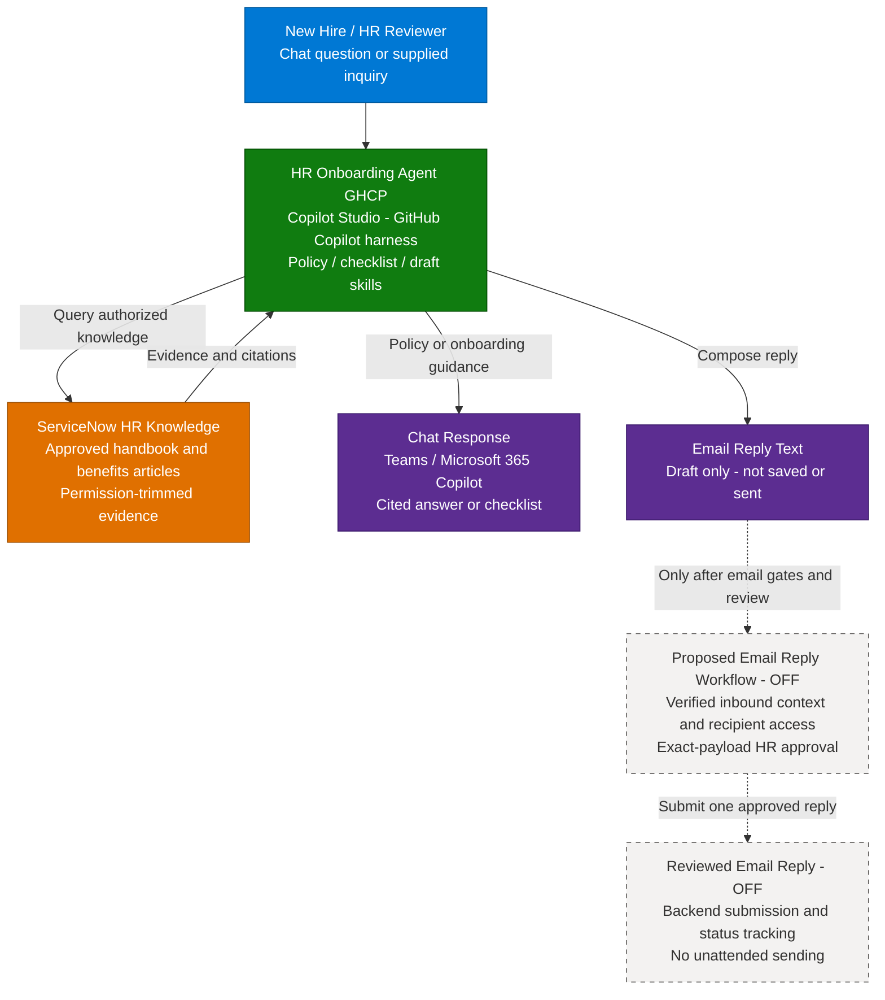

**1. Overview** > [2. Architecture](2.Architecture.md) > [3. Runbook](3.Runbook.md) > [4. Sample Prompts](4.Sample-prompts.md)

# HR Onboarding Agent (GHCP) — Overview

> **Target host:** Microsoft Copilot Studio, GitHub Copilot harness.
> **Source:** [HR-Onboarding-Agent](../HR-Onboarding-Agent/1.Overview.md), read at repository revision `697593082501641fd9adf31381c328533d6989ce`.
> **Authored / documentation retrieved:** 2026-09-16.
> **Scope changes:** Separate capability profiles and email drafting/sending; email integration OFF pending implementation; conflicting sample policies require HR resolution.
> The original scenario and its resources remain unchanged.

## Scenario Overview

**Scenario Type**: Employee Self-Service (HR)  
**Agent Type**: Knowledge-grounded GitHub Copilot harness agent; optional reviewed-email extension  
**Primary Tools**: Microsoft Copilot Studio, ServiceNow Knowledge Copilot connector; proposed mailbox workflow  
**Complexity**: Intermediate for knowledge guidance; additional integration work for email  
**Status**: Authored documentation and runtime skills; not deployed or tenant-tested

This runbook describes a new HR onboarding agent that helps employees find applicable company policies, benefits information and first-week guidance. It packages the source scenario's behaviors into focused skills for the **GitHub Copilot harness in Microsoft Copilot Studio**, not Copilot CLI or a coding agent.

The source describes a custom Copilot Studio agent with knowledge, an Outlook tool and an email event trigger: a standard-harness-style build, not a declarative Copilot chat agent. No topic definitions, agent export or executable flow are supplied. Its live configuration has not been inspected. This is a separate implementation, not an in-place conversion; the original remains a useful delivery reference.

---

## Problem Statement

New hires face a large amount of policy and process information while trying to get started. HR teams repeatedly answer similar questions, and employees can struggle to distinguish current, applicable guidance from examples or outdated documents.

Without clear evidence and action boundaries, an assistant can:

- Give inconsistent policy answers or omit regional and employment-category conditions.
- Turn incomplete source material into an apparently definitive onboarding checklist.
- Treat a drafted email as sent, or disclose HR content to a recipient whose access was not verified.
- Repeat conflicting sample policies as if they were authoritative employee entitlements.

---

## Solution Summary

The **HR Onboarding Agent GHCP** uses approved ServiceNow HR knowledge and four independently scoped runtime skills. Its baseline produces cited answers, onboarding checklists and email reply text in chat. An optional reviewed-email extension has a separate backend contract and remains **OFF** until implemented, authorized and tested.

Agent-wide instructions enforce scope and grounding. Skills supply task-specific procedures; they do not create tools, connections, permissions or event subscriptions.

### Key Capabilities

| Capability | Description |
|---|---|
| Knowledge-grounded HR answers | `hr-policy-answer` explains approved policy and benefits evidence, with applicability and conflict checks |
| Onboarding checklists | `hr-onboarding-checklist` organizes source-supported first-day/week steps without creating or completing tasks |
| Email reply drafting | `hr-email-draft` returns subject/body and citations in chat; no Outlook draft is saved or sent |
| Reviewed email reply — OFF | `hr-email-reply` defines use of a proposed restricted workflow with recipient verification, exact-payload approval and status reconciliation |
| Teams / M365 Copilot access | Intended authenticated channels, subject to tenant validation and a restricted pilot |
| Scoped responses | Unsupported, conflicting, denied or unavailable evidence produces an explicit limitation and a verified HR contact route |

### How It Works

Solid paths show the intended baseline after source and tenant setup; they do not claim a deployed agent. Dashed paths are proposed and OFF. A pasted inquiry is not a trusted email event. The email extension needs a separately verified intake path; no native Email channel or workflow implementation is supplied.

---

## Business Outcomes

| Outcome | Description |
|---|---|
| Reduce repetitive HR support work | Measure time to find correct guidance and HR reviewer effort against a pre-pilot baseline |
| Improve onboarding clarity | Measure whether first-week tasks are source-supported, understandable and correctly ordered |
| Make policy answers traceable | Track usable citations, unsupported claims, unresolved conflicts and applicability errors |
| Support safe email preparation | Measure draft correction rate; require zero unapproved or duplicate replies in the optional pilot |
| Enable controlled adoption | Track channel access, source health and credits per completed task before wider distribution |

These are proposed outcomes and measures, not observed improvements or a guarantee of hallucination-free responses.

---

## In Scope / Out of Scope

### ✅ In Scope

- Authenticated, read-only HR policy and benefits guidance from approved ServiceNow knowledge.
- First-day and first-week checklists containing only supported tasks, timing and contacts.
- Reply drafting in the conversation, with citations and explicit evidence gaps.
- An **OFF**, proposed reviewed-email capability with backend authorization, verified recipient access, per-message HR approval and duplicate-send prevention.
- Teams and Microsoft 365 Copilot delivery guidance, Preview/Evaluate acceptance cases and controlled publishing.
- Explicit handling of missing, denied, unavailable, stale and conflicting evidence, including verified HR contact guidance.

### ❌ Out of Scope

- Unattended email replies in either supplied profile, native Email-channel publishing, or a delivered mailbox workflow.
- Arbitrary recipients, Reply All, attachments, forwarding, mailbox draft storage and general mailbox search.
- Payroll or bank-detail changes, benefit enrollment, leave submissions, HR cases and personal eligibility decisions.
- Live employee records, leave balances, individual pay dates, medical histories or real-time organization charts.
- Account provisioning, calendar scheduling, training enrollment or task completion.
- Automatic topic conversion, an in-place harness migration, or a production-ready tenant deployment.

When evidence is insufficient, the agent preserves supported portions, labels the gap and uses the HR route from trusted configuration or authorized knowledge. It does not invent a policy, contact address or successful handoff.

---

## Target Users

| Persona | Role in This Scenario |
|---|---|
| **New Hire** | Asks policy questions and requests first-week guidance |
| **HR Team / Content Owner** | Maintains source authority, applicability, contact routes and conflict resolution |
| **HR Mailbox Reviewer** | Reviews draft text; approves the exact recipient and payload only in the optional implemented extension |
| **IT / M365 / ServiceNow Admin** | Validates connections, identities, source permissions and channel access |
| **Delivery / Integration Engineer** | Configures the new agent and skills; implements any optional email backend |
| **Release / Privacy / Cost Owner** | Approves audience, retention, release evidence, rollback and credit budget |

---

## Knowledge Sources Used

| Source | Content | Category |
|---|---|---|
| Approved employee handbook articles | Onboarding, conduct and applicable company policies | Policy / onboarding |
| Approved benefits and wellness articles | Benefits information and documented reimbursement processes | Benefits |
| Original Contoso sample documents | Optional isolated test material only; leave and holiday values conflict | Synthetic demonstration |

Production articles must be HR-approved and exposed through a validated ServiceNow connection. Indexed knowledge is not a live employee-data feed. The original sample documents stay in the original scenario; no screenshots, binaries or credentials were copied.

Included deliverables are the four scenario documents, capability matrix, source/evidence records and four standalone runtime skills. Studio configuration, production HR content, tool implementations, approval services, live evaluation results and deployment are not included. See the [Resources](0.Resources/README.md) for sample conflicts, asset provenance and the official-source verification record; owner-assigned release gates are in the [Runbook](3.Runbook.md#release-gates).

The source's unattended sending is deferred, not treated as migrated. The [source-to-GHCP mapping](2.Architecture.md#source-to-ghcp-mapping) records retained, re-expressed and excluded behaviors. Current [GHCP guidance](https://learn.microsoft.com/en-us/microsoft-copilot-studio/agents-experience/overview) and [Skills guidance](https://learn.microsoft.com/en-us/microsoft-copilot-studio/agents-experience/skills-overview) were read on 2026-09-16.

Runtime definitions: [Skill index](0.Resources/Skills/README.md).

---

## Related Resources

| Resource | Link |
| --- | --- |
| Architecture | [Architecture](2.Architecture.md) |
| Step-by-Step Runbook | [Runbook](3.Runbook.md) |
| Sample Prompts | [Prompts](4.Sample-prompts.md) |
| Capability and Integration Contracts | [Capability matrix](0.Resources/Capability-matrix.md) |
