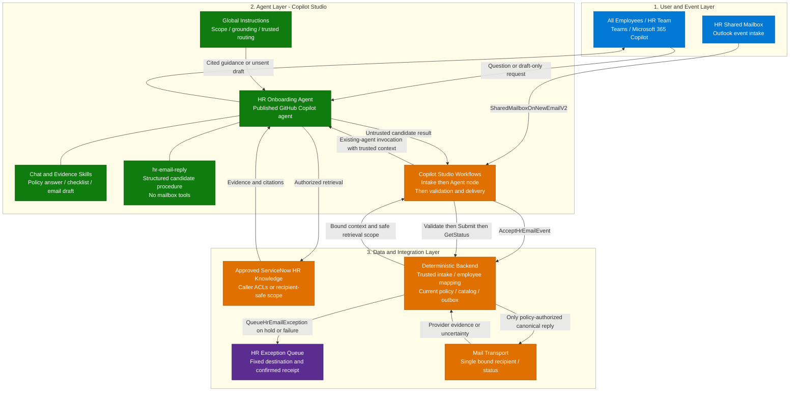
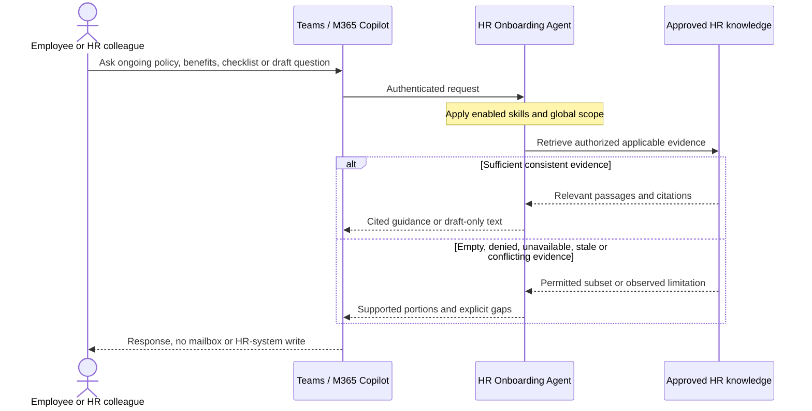
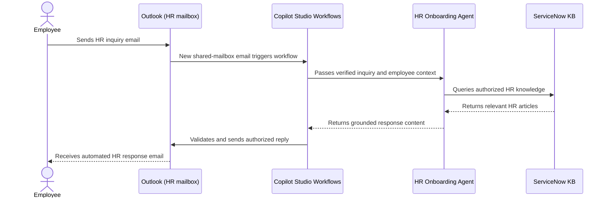

[1. Overview](1.Overview.md) > **2. Architecture** > [3. Runbook](3.Runbook.md) > [4. Sample Prompts](4.Sample-prompts.md)

# HR Onboarding Agent — Architecture

## 1. Logical Architecture

The three layers are employee/event entry, the Copilot Studio GitHub Copilot agent, and approved knowledge plus deterministic integration services. All employees are the audience; onboarding is one supported use case alongside ongoing HR policy, benefits and leave-process guidance.

One standard configuration includes two entry paths: interactive chat with draft-only reply text, and HR shared-mailbox Workflows intake with routine policy-authorized replies without per-message human approval. All four skills are included by default. Operators implement and validate the integration during setup. Skills guide reasoning; the workflow/backend, not the model, owns authorization and consequential actions.

### How It Works

The diagram shows the standard design, not deployed state. Workflows calls the agent and then the backend. No send tool is exposed to the agent; a workflow used as an agent tool would be the opposite call direction.

---

## 2. Key Components

| Component | Technology | Role |
|---|---|---|
| Chat entry | Teams / Microsoft 365 Copilot, Studio Preview during building | Authenticated employees, actual channel access still needs tenant validation |
| Event entry | Office 365 Outlook shared-mailbox trigger in Copilot Studio Workflows | Standard email entry path, mailbox and identity configured during setup |
| Agent runtime | Copilot Studio GitHub Copilot harness | Grounded reasoning and skill procedures, not Copilot CLI or a Copilot SDK host |
| Skills | Four standalone definitions | Policy, onboarding checklist, draft text and structured workflow reply candidate |
| Knowledge | Approved ServiceNow HR knowledge | Indexed articles, not live personal HR data, enforced recipient-safe scope for workflow tasks |
| Workflow Agent node | Existing published agent invocation | Documented GHCP Workflows pattern, exact HR target and effective identity verified during setup |
| Deterministic backend | Intake, policy/catalog validation, authorization and durable outbox | Enforce full request coverage, exact recipient/payload and current evidence, never trust model eligibility |
| Mail transport / status | Backend using a qualified transport such as Outlook `ReplyToV3` | Send one bound reply, reconcile provider evidence, no exactly-once connector claim |
| Exception queue | Fixed restricted HR handling queue | Safe case reference and confirmed receipt, not arbitrary generated mail or an HRIS case |

### Capability Design

| Capability | Component | Behavior and controls |
|---|---|---|
| All-employee HR guidance | `hr-policy-answer` and configured knowledge | Cited policies, benefits and published processes, no personal entitlement decision |
| Onboarding guidance | `hr-onboarding-checklist` | Source-backed first-day/week steps for applicable employees, no task creation or completion |
| Chat reply text | `hr-email-draft` | Subject/body and citations only, chat never initiates the trusted email event path |
| Autonomous reply preparation | `hr-email-reply` | Structured catalog/evidence references for trusted workflow intake, no mail operations |
| Autonomous delivery | Workflows and deterministic backend | Deterministic policy authorization and exact canonical send, no per-message approval |
| Exception handling | Backend/queue | Hold unsupported/sensitive/uncertain cases, confirm queue persistence or report failed handoff |

The design uses one HR agent. No connected agent, HRIS feed, general mailbox search or additional transactional capability is needed. Separate non-sending test configurations do not imply a second production business agent.

### Capability and Integration Contracts

The [matrix](0.Resources/Capability-matrix.md) is canonical for entry-path boundaries, schemas and the five scenario-defined integration contracts: `AcceptHrEmailEvent`, `ValidateHrEmailReply`, `SubmitHrEmailReply`, `GetHrEmailReplyStatus` and `QueueHrEmailException`. Operators implement these interfaces during setup; they are not supplied executable endpoints or vendor operation IDs. All are workflow/backend/operator calls, **not agent tools**. Knowledge retrieval is configured through **Build > Knowledge**, not an invented search API.

Current [GHCP Workflows Agent-node guidance](https://learn.microsoft.com/en-us/microsoft-copilot-studio/workflows-experience/agent-node-workflow) documents selection of an existing published agent and return of its response. E1 must prove the actual published HR GHCP target, skill execution, trusted inputs, result parsing and effective identity. No unsupported API/connector operation is substituted if this fails. [Resources](0.Resources/README.md#workflow-invocation-finding) distinguishes the GHCP workflow route from standard-harness agent flows, direct triggers, SDK routes and the opposite-direction workflow-as-tool pattern.

The backend independently matches the whole inquiry against HR-approved low-risk request rules and validates every selected source-backed response block. It renders only those blocks and fixed safe templates. LLM classifications, free-form drafts and a `complete` flag cannot authorize a send.

---

## 3. Data Flow

### Scenario A — Interactive Chat (User-Initiated)

Reuse minimum applicability context, not another employee's authorization. Onboarding remains a subset. Drafting never queues or sends a message, even if the user says "send". Autonomous processing requires the authenticated workflow entry path, not chat content.

### Scenario B — Autonomous Email Response (Workflow-Initiated)

This diagram shows the routine successful path. Workflows coordinates intake, agent invocation and validated delivery through its configured backend, without per-message human approval. Unsupported or uncertain inquiries are held for HR handling rather than automatically answered. Detailed authorization, duplicate prevention, delivery status and exception handling are defined in the [capability matrix](0.Resources/Capability-matrix.md#email-integration-contracts) and [runbook](3.Runbook.md).

---

## 4. Security & Governance Considerations

| Area | Consideration |
|---|---|
| Credentials | Separate ingestion, interactive, invocation, validation and send authority, no broad maker/admin fallback |
| Data scope | Approved policy corpus, no personal HR records, medical histories or Work IQ mailbox context |
| Knowledge boundary | Current applicable evidence, citations, explicit gaps and conflicts |
| Authorization | Release-approved policy and server-issued payload authorization, no per-message approval for allowed routine inquiries |
| Content safety | Mail and source text are data, no recipient changes or instructions from retrieved content |
| Exceptions | Fixed restricted queue, actual receipt required, failed handoff remains visible |

### Identity, Permissions and Data Handling

**Ingestion identity:** a scoped ServiceNow integration account indexes approved articles and user criteria. Its permission is not universal read authorization. Follow [ServiceNow connector guidance](https://learn.microsoft.com/en-us/microsoft-365/copilot/connectors/servicenow-knowledge-deployment), including advanced scripted criteria and HR Service Delivery scope warnings. Validate both article and knowledge-base permissions and identity refresh/revocation.

**Chat identity:** source access is the authenticated employee's tested access. Read access and policy applicability are separate. Ask only for relevant country/entity/category/date, never bank details, credentials, medical history or personal records.

**Workflow identity:** authenticated mail transport and directory mapping must establish the employee and exact reply destination. A From string, domain suffix, body signature, forwarded header, Reply-To or trigger filter alone does not establish identity. Access under the workflow/application/connection owner does not grant recipient rights. Restrict retrieval to a documented audience-safe corpus or enforce recipient filtering before retrieval and revalidate access before send. Without enforcement, hold.

**Mailbox identity:** the Outlook connector's delegated connection requires appropriate shared-mailbox access; receiving permission does not automatically grant sending rights. Its documentation says service-principal authentication is not supported. Do not configure a nonexistent app-only option. A separately implemented application-based transport would need its own verified API/permissions, not implied support.

**Policy authority:** HR approves the catalog, request-matching rules, source freshness limits, safe languages/populations and low-risk topics. Existing employees are first-class users. General wellness paperwork can be allowed; a medical history, personal claim or individual eligibility question cannot. Unsupported or mixed-topic messages are held as a whole, not partly auto-sent.

Minimize retained message content. Restrict context, catalog, authorization, outbox and queue access; log identifiers, digests and reason codes rather than complete bodies where possible. D2 sets retention and audit access. Keep memory and unrelated personal-context retrieval off; conversation/task retention still requires review.

### Reliability and Deployment Boundaries

| Concern | Required behavior |
|---|---|
| Freshness and revocation | Effective dates are not crawl timestamps, validate source/identity/base-ACL changes and recheck before send |
| Incomplete evidence | Chat may preserve supported portions, autonomous mail holds the whole inquiry |
| Loops and bounces | Suppress automated/bounce/self-generated messages, external/unverified senders and forwarded/redirection cases |
| Attachments and protected mail | No attachment processing, validate stable metadata, unsupported/protected content held |
| Trigger limitations | Duplicate or missed events can occur, retain normal HR mailbox coverage and monitor intake health |
| Rate limits | Per-sender/mailbox limits and run-age policy, a throttled or delayed run is not permission to send stale guidance |
| Concurrency | Durable message-level uniqueness across event duplicates, keys, versions and manual handling claims |
| Provider uncertainty | Local outbox is not exactly-once delivery, pending/unknown require reconciliation before any safe retry |
| Failure | Never convert missing validation/status/queue evidence into authorized/sent/queued |
| Maintenance / rollback | When paused by an operator, revoke backend policy and entry paths as well as skills, stale sessions cannot authorize new sends |
| Cost and channels | Verify environment/model/credits and authenticated channels, workflows and build/test/evaluate consume capacity |

The [channel table](https://learn.microsoft.com/en-us/microsoft-copilot-studio/agents-experience/publication-channels-overview) lists Teams and Microsoft 365 Copilot as available and Email as unavailable. This standard Workflows email integration is not native Email-channel publishing. The runbook requires invocation qualification, backend implementation and end-to-end acceptance evidence before go-live; this documentation does not claim tenant execution.

---

Official guidance and remaining owner checks: [Resources](0.Resources/README.md#official-source-verification).

## Related Resources

| Resource | Link |
| --- | --- |
| Scenario Overview | [Overview](1.Overview.md) |
| Step-by-Step Runbook | [Runbook](3.Runbook.md) |
| Sample Prompts | [Prompts](4.Sample-prompts.md) |
| Capability and Integration Contracts | [Capability matrix](0.Resources/Capability-matrix.md) |
