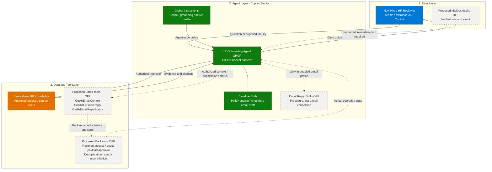
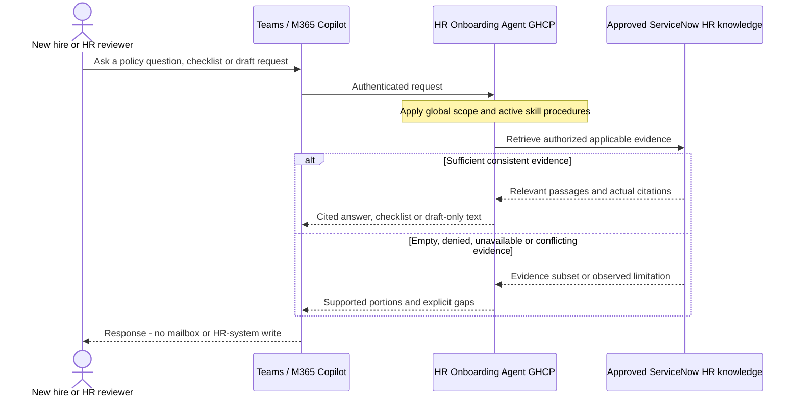

[1. Overview](1.Overview.md) > **2. Architecture** > [3. Runbook](3.Runbook.md) > [4. Sample Prompts](4.Sample-prompts.md)

# HR Onboarding Agent (GHCP) — Architecture

> Host: Microsoft Copilot Studio, GitHub Copilot harness.
> Design and official documentation reviewed 2026-09-16; no live deployment inspected.

## 1. Logical Architecture

The agent has the source scenario's three layers: authenticated users, the Copilot Studio agent, and its knowledge/tool dependencies. Skills guide the agent's reasoning; configured knowledge provides evidence; the optional backend alone enforces email authorization and delivery controls.

### How It Works



Solid paths show the intended baseline, not a live deployment. Dashed paths remain proposed/OFF. The baseline does not require a connected agent, file generator or transactional integration.

---

## 2. Key Components

| Component | Technology | Role |
|---|---|---|
| User channel | Teams / Microsoft 365 Copilot; Studio Preview while building | Authenticated employee or reviewer; channel validation required |
| Agent runtime | Copilot Studio, GitHub Copilot harness | Global instructions and approved model govern HR scope, evidence, language and active profile |
| Runtime skills | Policy answer, checklist, email draft, optional email reply | Task-specific procedures; selection by description, not deterministic topic triggers |
| Knowledge | ServiceNow Knowledge Copilot connector | Approved, permission-trimmed indexed evidence; not live employee records |
| Operation tools | None in baseline; three proposed email operations | Mailbox context read, approved submission and status read |
| Backend | Proposed restricted mailbox workflow / authorization service | Recipient binding, approvals, idempotency, status and audit |

### Source-to-GHCP Mapping

| Source asset / behavior | Target component | Disposition / preserved guarantees |
|---|---|---|
| Source Overview and Architecture: knowledge-grounded HR self-help | Global instructions, `hr-policy-answer`, ServiceNow knowledge | Retained; no model-memory policy facts |
| Runbook Step 2-5: knowledge lookup and HR fallback | Every evidence-dependent skill plus global fallback | Re-expressed; approved contact rather than a fabricated tenant address |
| Prompts 13-19: onboarding process and first steps | `hr-onboarding-checklist` | Re-expressed; only source-supported tasks and deadlines |
| Prompts 1-12 and 20-32: conduct, benefits, leave, pay and IT guidance | `hr-policy-answer` | Retained only where HR knowledge supports the requested process; personal records remain excluded |
| Email instruction: read Body and generate Subject / HTML Body | `hr-email-draft` | Re-expressed; pasted sender fields remain untrusted; no mailbox write |
| Step 2-3: Outlook Send an email (V2), renamed `SendEmail` | `hr-email-reply` and proposed restricted backend | Deferred; source UI label is not a verified GHCP operation ID |
| Step 2-4: When a new email arrives (V3) | External intake workflow | Deferred; skill activation cannot subscribe to email |
| Suggested prompts | Starter prompts and acceptance cases | Retained with evidence-dependent expectations |
| Phases 3-4: tests, publish, Teams / M365 distribution | Preview, Evaluate, controlled publishing and Monitor | Re-expressed using current GHCP guidance |
| Source sample documents | Optional historical sample assets, not production knowledge | Retained in original only; conflicts recorded in Resources |
| Source Images and setup screenshots | No target copy | Excluded: old UI and demo configuration do not establish current behavior |
| Demo admin credentials, Everyone access, MFA skip, instant publication | No target equivalent | Excluded; use approved identities, source permissions and publication controls |
| Source topic / flow exports and runtime skills | None supplied | Topic-node translation not applicable to supplied assets; do not invent exports |
| Source document headings, tables and diagrams | Same business sections and numbered phase/category patterns | Format retained; email flow labels change to reviewed/OFF, obsolete host steps become GHCP steps, and detailed gates/tests are additions |

The new sibling uses one agent. A connected agent, file generator, HRIS connection or new transactional action is not needed to demonstrate this harness.

### Capability and Integration Contracts

The [capability matrix](0.Resources/Capability-matrix.md) is the canonical list of four skills, dependencies, profiles and proposed email contracts. Knowledge retrieval is configured through **Build > Knowledge**, not a made-up `SearchHRKnowledge` operation.

The email tool labels `GetHrEmailContext`, `SubmitHrEmailReply` and `GetHrEmailReplyStatus` are **proposed custom contracts**, not vendor APIs. No operation IDs or executable implementations are delivered. An integration owner must implement and map them to a supported workflow or MCP route before importing the sending skill into an enabled profile. The backend owns hard validation; prose is not an access-control system.

---

## 3. Data Flow

### Scenario A — Interactive Chat (User-Initiated)



Authenticate the caller; identify the request and active capability; clarify only decision-changing applicability context; retrieve approved evidence; check applicability and conflicts; produce cited guidance, checklist or draft text. Stop unsupported portions explicitly. Reuse evidence within the same task only if still applicable; never reuse another user's access decision.

### Scenario B — Reviewed Email Response (Proposed / OFF)

```mermaid
sequenceDiagram
    participant Intake as Proposed intake workflow
    participant Agent as HR Onboarding Agent GHCP
    participant Backend as Proposed email backend/tools
    participant KB as Approved HR knowledge
    actor Reviewer as Authorized HR reviewer
    participant Mail as Approved HR mailbox
    Note over Intake,Mail: Proposed / OFF - no workflow or operation implementation supplied
    Intake->>Backend: Validate inbound event and create scoped context
    Intake->>Agent: Invoke through separately validated supported route
    Agent->>Backend: GetHrEmailContext
    Backend-->>Agent: Authorized context, recipient, version and reply state
    Agent->>KB: Retrieve applicable evidence for the authorized task
    KB-->>Agent: Source passages and citations
    Agent-->>Reviewer: Exact recipient, subject, body and evidence for review
    Reviewer->>Backend: Authenticated approval bound to exact payload
    Backend-->>Agent: Approval reference from trusted workflow
    Agent->>Backend: GetHrEmailContext - recheck current state
    Agent->>Backend: SubmitHrEmailReply with approval and stable key
    Note over Backend: Revalidate recipient access, source freshness, approval and version
    alt Authorized and no previous send
        Backend->>Mail: Submit one approved reply
        Mail-->>Backend: Provider evidence or uncertain outcome
        Backend-->>Agent: Operation reference and actual state
        Agent->>Backend: GetHrEmailReplyStatus
        Backend-->>Agent: Pending, sent, failed or unknown
        Agent-->>Reviewer: Report observed state, never assume delivery
    else Denied, stale, duplicate or conflicting state
        Backend-->>Agent: Rejection or existing operation
        Agent-->>Reviewer: No new send; explain safe next action
    end
```

A separately configured intake workflow validates the inbound event and stores a restricted context reference. The backend, not skill selection, enforces identity, exact-payload approval, recipient access, serialization and reconciliation. Missing evidence or approval stops the submission path. The source's unattended-email behavior is deferred.

An indexed article result is not a live policy lookup, mailbox event, identity proof, approval or proof that the addressee may receive its contents.

---

## 4. Security & Governance Considerations

| Area | Consideration |
|---|---|
| Credentials | Approved ingestion, caller and optional email identities are separate; do not reuse demo maker/admin access |
| Data scope | Approved HR knowledge only; no live employee records or baseline mailbox tools |
| Knowledge boundary | Cite supported claims, disclose evidence gaps and use a verified HR contact route |
| Access control | Source ACLs and backend recipient authorization, not prompt-only restrictions |
| Approval | Optional email requires authenticated review bound to exact target and payload |
| Content safety | Treat source and inquiry text as data; do not follow embedded tool or recipient instructions |

### Identity, Permissions and Data Handling

**Ingestion identity:** the connector's approved ServiceNow integration account reads the permitted articles and user criteria. Its access is not permission for every consumer. Follow current connector guidance and security-approved authentication; do not reuse the source's demo admin connection.

**Chat identity:** retrieve as the authenticated user with tested identity mapping and article/base-level permissions. Applicability (country, legal entity, employment category, effective date) is separate from read access. Ask for the minimum relevant context; do not request medical details, bank data or credentials.

**Email identity:** a From address typed in a prompt does not identify a sender. The backend binds a trusted intake event to the mailbox, message and intended recipient. HR reviewer access to an article is not recipient access. If current recipient entitlement cannot be enforced, sending stays OFF.

Current [ServiceNow connector guidance](https://learn.microsoft.com/en-us/microsoft-365/copilot/connectors/servicenow-knowledge-deployment) requires special care with advanced scripted user criteria and HR Service Delivery scope: Simple flow can mishandle unsupported allow criteria, and missing HR-scoped user-criteria access can expose restricted articles. The source owner and identity owner must validate the selected flow and HRSD permissions before release.

Use minimal, access-controlled task records and audit references; avoid logging full mail bodies or sensitive HR content where identifiers and outcome codes suffice. Retention and reviewer groups are deployment gates. Memory stays off for the initial design; conversation/task retention still needs review. Never store authorization or HR facts as long-lived user-profile context.

### Reliability and Deployment Boundaries

| Concern | Required behavior |
|---|---|
| Freshness | Record source effective dates when returned; an index timestamp is not a policy effective date. Define content and permission refresh limits with owners |
| Revocation | Test content, identity and parent knowledge-base permission changes; a standard incremental content crawl is not proof of refreshed identities |
| Conflicting samples | Do not select 15 versus 20 vacation days or 13 versus 10 holidays without HR authority; show the conflict only to permitted readers |
| Missing evidence | Distinguish empty, denied and unavailable when the system exposes that distinction; otherwise report unknown, not a guessed cause |
| Partial answers | Preserve supported parts with citations, label gaps, and do not auto-send an incomplete policy answer |
| Asynchronous work | Pending is not sent; a provider submission receipt is not proof of recipient delivery |
| Concurrent replies | Backend serializes by inbound message; re-checks approval and payload, and reconciles uncertain submission before any retry |
| OFF | Coordinate skills, instructions, tools, workflow entry points, backend policy and stale sessions; keep shared knowledge connections used by the original |
| Cost and availability | Tenant verifies models, roles, credits, data policies and channels; build/test/evaluate can consume credits |

The [current channel table](https://learn.microsoft.com/en-us/microsoft-copilot-studio/agents-experience/publication-channels-overview) lists Teams and Microsoft 365 Copilot as available and native Email as unavailable. An external mailbox workflow is a proposed integration, **not** a native Email publishing channel. It needs its own supported event invocation path and tests.

---

Read 2026-09-16: [GHCP components](https://learn.microsoft.com/en-us/microsoft-copilot-studio/agents-experience/overview), [knowledge setup and no general-knowledge toggle](https://learn.microsoft.com/en-us/microsoft-copilot-studio/agents-experience/knowledge-add-existing-copilot), [tool routes](https://learn.microsoft.com/en-us/microsoft-copilot-studio/agents-experience/add-tools-custom-agent). See [Resources](0.Resources/README.md#official-source-verification) for remaining validation.

## Related Resources

| Resource | Link |
| --- | --- |
| Scenario Overview | [Overview](1.Overview.md) |
| Step-by-Step Runbook | [Runbook](3.Runbook.md) |
| Sample Prompts | [Prompts](4.Sample-prompts.md) |
| Capability and Integration Contracts | [Capability matrix](0.Resources/Capability-matrix.md) |
