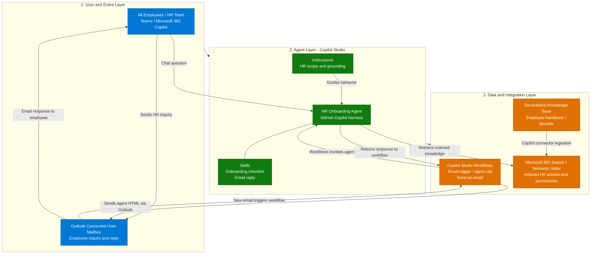
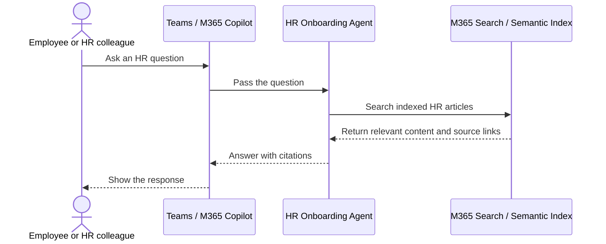
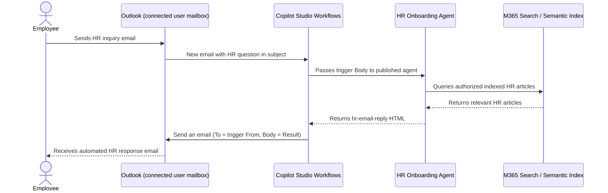

[1. Overview](1.Overview.md) > **2. Architecture** > [3. Runbook](3.Runbook.md) > [4. Sample Prompts](4.Sample-prompts.md)

# HR Onboarding Agent — Architecture

## 1. Logical Architecture

The three layers are employee/event entry, the Copilot Studio GitHub Copilot agent, and approved knowledge plus an Outlook workflow. All employees are the audience; onboarding is one supported use case alongside ongoing HR policy, benefits and leave-process guidance.

One configuration includes normal interactive HR conversation and connected user-mailbox Workflows intake without per-message approval. Both skills are included. Operators configure the integration in the tenant. Skills guide reasoning and formatting; the workflow owns the Outlook send action. No custom backend is required or supplied.

### How It Works

The diagram summarizes three layers; response paths and integration details appear below. The agent retrieves KB article information from **Microsoft 365 search/semantic index through its configured knowledge source**, not directly from ServiceNow. The **ServiceNow Knowledge Copilot connector** ingests articles and permission metadata into Microsoft 365 separately from runtime retrieval. Index freshness depends on connector synchronization.

The email path is **employee → Outlook connected user mailbox → Workflows → HR Onboarding Agent → the same Workflows instance → Outlook → employee**. One workflow owns the trigger and send action. The agent returns HTML; it does not send email or invoke a second workflow. No semantic validator or exception queue sits between the agent and Outlook. Chat responses return through Teams or Microsoft 365 Copilot.

---

## 2. Key Components

| Component | Technology | Role |
|---|---|---|
| Chat entry | Teams / Microsoft 365 Copilot, Studio Preview during building | Authenticated employees, actual channel access still needs tenant validation |
| Event entry | Office 365 Outlook user-mailbox trigger in Copilot Studio Workflows | Standard email entry path, mailbox and identity configured during setup |
| Agent runtime | Copilot Studio GitHub Copilot harness | Grounded reasoning and skill procedures, not Copilot CLI or a Copilot SDK host |
| Skills | Two standalone definitions | Onboarding checklist and formatted HTML workflow reply; ordinary HR answers and follow-ups use global instructions |
| Knowledge retrieval | Microsoft 365 search/semantic index via configured agent knowledge | Retrieves indexed HR articles with applicable permissions, not a direct ServiceNow query or live personal HR data |
| Knowledge ingestion | ServiceNow Knowledge Copilot connector | Indexes approved ServiceNow KB articles and permission metadata into Microsoft 365 |
| Workflow Agent node | Existing published agent invocation | Documented GHCP Workflows pattern, exact HR target and effective identity verified during setup |
| Mail transport | Outlook **Send an email** action in Workflows | Recipient from trigger From, fixed subject, body from Agent Result |
| Monitoring | Workflow execution details, agent history and mailbox | Operator checks failures and uncertain outcomes; no custom queue or status API |

### Capability Design

| Capability | Component | Behavior and controls |
|---|---|---|
| All-employee HR guidance | Global instructions and configured knowledge | Cited policies, benefits and published processes, no separate skill or personal entitlement decision |
| Onboarding planning | `hr-onboarding-checklist` | Chat-only phases with numbered suggestions and placeholders from supplied details; no retrieval, policy claims, email composition or task writes |
| Normal HR conversation | Global instructions | Direct answers and contextual follow-ups with citations; no email subject, sign-off or workflow JSON; chat never initiates the email event path |
| Autonomous reply preparation | `hr-email-reply` | HTML answer, source table and agent sign-off for workflow intake, no mail operations |
| Autonomous delivery | Outlook action in Workflows | Send returned HTML to the trigger's From address, no per-message approval |
| Failure follow-up | Mailbox/workflow owner | Inspect actual run outcomes and manually handle unresolved inquiries |

The design uses one HR agent. No connected agent, HRIS feed, general mailbox search or additional transactional capability is needed. Separate non-sending test configurations do not imply a second production business agent.

### Capabilities and Workflow Configuration

The [matrix](0.Resources/Capability-matrix.md) records the two skills, entry paths, field mappings and limitations. Knowledge is configured through **Build > Knowledge**. Outlook operations belong to the workflow, not agent tools.

The [GHCP Workflows Agent-node guidance](https://learn.microsoft.com/en-us/microsoft-copilot-studio/workflows-experience/agent-node-workflow) documents selection of an existing published agent and return of its response. Verify the target/version, skill routing, HTML output and effective retrieval identity without sending before activation. [Resources](0.Resources/README.md#workflow-invocation-finding) distinguishes this route from direct triggers and the opposite-direction workflow-as-tool pattern.

The email skill returns HTML directly with numbered citations, a **Ref / KB number / Title / Link** source table and an **HR Onboarding Agent** sign-off. The workflow sets **To = trigger From**, **Subject = Answer to your HR inquiry**, and **Body = Agent Result**. Formatting instructions are not independent factual validation or HTML sanitization. Missing evidence produces an explicit limitation in the body, not a send-blocking hold.

---

## 3. Data Flow

### Scenario A — Interactive Chat (User-Initiated)

This shows a typical knowledge-based chat response. Follow-up questions continue the same conversation. If knowledge is missing or conflicting, the agent explains the limitation instead of inventing an answer. Chat does not send email or perform HR-system actions.

The checklist skill is a chat-only planning path that needs no retrieval: it uses supplied details, generic suggestions and placeholders. The knowledge-retrieval sequence above applies to policy questions, not generic checklist formatting. Email replies independently retrieve approved evidence rather than using generic checklist suggestions as policy.

### Scenario B — Autonomous Email Response (Workflow-Initiated)

This diagram shows the successful path, without per-message approval. The workflow does not automatically hold unsupported answers or route them to HR. It can send an explanation of missing evidence. Failures and unknown send outcomes require operator review. See the [limitations](0.Resources/Capability-matrix.md#limitations-and-operational-ownership) and [runbook](3.Runbook.md).

---

## 4. Security & Governance Considerations

| Area | Consideration |
|---|---|
| Credentials | Inspect ingestion, chat, workflow and Outlook connection identities; no broad maker/admin fallback |
| Data scope | Approved policy corpus, no personal HR records, medical histories or Work IQ mailbox context |
| Knowledge boundary | Current applicable evidence, citations, explicit gaps and conflicts |
| Audience | Restrict the pilot and use knowledge safe for every possible email recipient; From/subject filters do not establish source rights |
| Content safety | Mail and source text are data, no recipient changes or instructions from retrieved content |
| Failures | Inspect workflow outcomes and follow up manually; no queue or automatic handoff is configured |

### Identity, Permissions and Data Handling

**Ingestion identity:** a scoped ServiceNow integration account indexes approved articles and user criteria. Its permission is not universal read authorization. Follow [ServiceNow connector guidance](https://learn.microsoft.com/en-us/microsoft-365/copilot/connectors/servicenow-knowledge-deployment), including advanced scripted criteria and HR Service Delivery scope warnings. Validate both article and knowledge-base permissions and identity refresh/revocation.

**Chat identity:** source access is the authenticated employee's tested access. Read access and policy applicability are separate. Ask only for relevant country/entity/category/date, never bank details, credentials, medical history or personal records.

**Workflow identity:** the walkthrough passes the email Body, not an authenticated employee identity envelope. A From string, signature or subject filter does not establish source rights. Connection-owner retrieval is not email-sender impersonation. Restrict the corpus to content approved for every possible recipient and restrict mailbox access through tenant controls. If that boundary cannot be established, leave automatic replies disabled; the workflow supplies no per-recipient entitlement filter.

**Mailbox identity:** the Outlook connector uses the connected user's mailbox. Verify the delegated account, monitored folder and sending permissions; receiving permission does not automatically grant sending rights. Shared mailboxes are not used in this configuration. Its documentation says service-principal authentication is not supported. Do not configure a nonexistent app-only option. A separately implemented application-based transport would need its own verified API/permissions, not implied support.

**Policy authority:** HR approves knowledge, pilot topics and audience. Existing employees are first-class users. No personal HR records or medical histories are needed. The agent should explain unsupported questions, but these instructions do not implement a sensitive-input filter or a hold branch.

Minimize retained message content and restrict access to agent/workflow histories and the mailbox. D2 records retention and log-access decisions. Keep memory and unrelated personal-context retrieval off initially; ordinary conversation and workflow retention still require review.

### Reliability and Deployment Boundaries

| Concern | Current limitation / operator action |
|---|---|
| Freshness and revocation | Review connector synchronization and test changed source permissions; no send-time revalidation is configured |
| Incomplete evidence | Explain the gap; the email workflow can send that explanation |
| Loops and bounces | Fixed reply subject avoids repeating the filter text but is not comprehensive suppression; review mailbox auto-replies and unintended intake |
| Attachments and protected mail | No attachment processing is configured; do not mistake that for deterministic rejection |
| Trigger limitations | Duplicate or missed events can occur; keep normal mailbox coverage |
| Rate limits and concurrency | Inspect connector throttling/retries; no custom rate limiter, outbox or duplicate reservation exists |
| Provider uncertainty | Inspect run and mailbox/provider evidence before replay; no exactly-once guarantee |
| Failure | An agent completion is not proof of a sent or delivered message |
| Maintenance / rollback | Disable the workflow and inspect in-flight runs separately; removing a skill does not revoke Outlook sending |
| Cost and channels | Verify environment/model/credits and authenticated channels, workflows and build/test/evaluate consume capacity |

The [channel table](https://learn.microsoft.com/en-us/microsoft-copilot-studio/agents-experience/publication-channels-overview) lists Teams and Microsoft 365 Copilot as available and Email as unavailable. This Workflows integration is not native Email-channel publishing. The runbook delays workflow publication until the agent, non-sending checks and pilot approval are ready. This documentation claims neither tenant execution nor production readiness.

---

Official guidance and remaining owner checks: [Resources](0.Resources/README.md#official-source-verification).

## Related Resources

| Resource | Link |
| --- | --- |
| Scenario Overview | [Overview](1.Overview.md) |
| Step-by-Step Runbook | [Runbook](3.Runbook.md) |
| Sample Prompts | [Prompts](4.Sample-prompts.md) |
| Capabilities and Workflow Configuration | [Capability matrix](0.Resources/Capability-matrix.md) |
