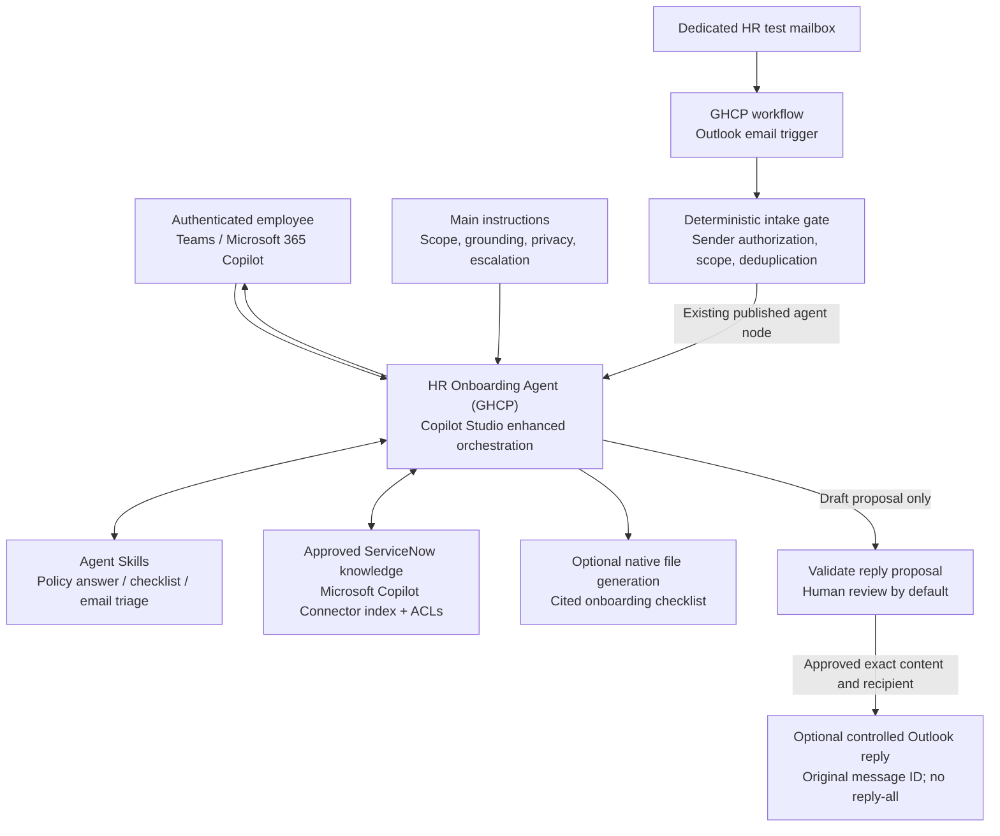

# HR Onboarding Agent (GHCP) - Architecture

## 1. Logical Architecture

The original scenario's HR questions and indexed knowledge remain. Behavior moves from one large instruction block into focused skills. **Skills are neither connector actions nor deterministic workflow nodes.**

## 2. Components and Responsibilities

| Component | Responsibility | Not its responsibility |
|---|---|---|
| Main instructions | Agent identity, global constraints, approved source and HR contact, skill-selection guidance | Credentials, access enforcement, transaction integrity |
| Skill metadata | Help the orchestrator discover the right capability | An exact routing rule or security policy |
| Skill body | Retrieval procedure, response format, edge cases, tool-use guidance | Installing tools, granting consent, guaranteeing schema compliance |
| Connected knowledge | Retrieve permitted, indexed policy evidence with citations | Live HR-record queries or instant ServiceNow updates |
| Tools | Authenticated actions exposed through connectors, MCP, or workflows | Authorization merely because a skill mentions their name |
| GHCP workflow | Email intake, published-agent invocation, deterministic validation and optional delivery | Making an email sender the retrieval identity automatically |
| Preview / Evaluate / Monitor | Inspect behavior, assess answers, and investigate execution | Replacing source ACL tests or verifying a real send without mailbox evidence |

Native file generation is an optional GHCP capability, not an installation requirement for these skills. No script execution, external MCP server, or connected specialist agent is needed for the baseline.

## 3. Interactive Data Flow

1. A signed-in employee asks a question or requests an onboarding checklist.
2. The runtime considers the main instructions and skill descriptions, then loads relevant skill instructions.
3. The agent retrieves the configured ServiceNow knowledge. The Microsoft Copilot Connector indexes source content and permissions; this is not a live ServiceNow API query.
4. The agent returns supported claims with source links, or identifies missing/conflicting evidence and refers the employee to HR.
5. A checklist is a planning artifact, not a record that tasks or acknowledgments are complete.

Keep ordinary policy Q&A, checklist creation, and email drafting distinct in descriptions. Multi-part requests can use more than one capability, but no part of the design relies on a guaranteed skill-to-skill call order.

## 4. Email Data Flow

Use **a GHCP workflow with an Outlook trigger and an existing published Agent node**. Do not reuse the original standard-harness **Overview > Add trigger** procedure. Microsoft currently lists the direct agent **Email channel as unavailable**; a workflow is a different entry point.

1. Outlook receives an inquiry in the explicitly configured mailbox. The workflow obtains message metadata from the connector, not from text inside the email.
2. Intake checks reject unapproved senders, automated replies, mailbox self-messages, and unsupported encrypted messages. Establish that any knowledge returned will be safe for the recipient.
3. The workflow claims the mailbox/message key in a durable processing store before invoking the agent. Repeated events do not create additional processing attempts.
4. An **Agent > An existing agent** node invokes the published GHCP HR agent with the question and trusted task context. Using an existing agent preserves its configured ServiceNow knowledge; do not substitute an inline agent whose documented knowledge choices differ.
5. The email skill returns a reply proposal. Validate its fields, citations, disposition, and unchanged recipient/message ID. Treat malformed output as a review case, never a send instruction.
6. In the baseline, stop at review. Optional delivery uses **Reply to email (V3)** with the original message ID; shared-mailbox replies also specify **Original Mailbox Address**.
7. Record delivery evidence. If a timeout leaves the send outcome unknown, reconcile the mailbox and run record before retrying.

The original used **Send an email (V2)**. A controlled reply operation better preserves the original thread; an unrestricted AI-filled To field is unnecessary. The Outlook connector's service-principal authentication is unsupported, so do not specify an app-only Outlook connection as a deployment step.

## 5. Identity and Data Boundaries

| Execution | Required boundary |
|---|---|
| Employee chat | Microsoft authentication; demonstrate correct allowed/denied knowledge access using non-maker test accounts |
| Workflow invocation | Verify the effective connection/retrieval identity; do not assume it is the sender |
| Autonomous reply | Limit retrieval to HR-approved content safe for every allowed recipient, or implement enforceable recipient-specific access outside the model |
| Shared mailbox | Explicit mailbox permissions and connection ownership; verify the identity used for both reading and replying |
| Review | Only authorized HR reviewers can see proposals and retained logs; approval applies to the exact recipient and content |

A maker or workflow identity might retrieve more than the employee may see. Prompt instructions such as "respect sender permissions" do not solve that problem. If the boundary cannot be demonstrated, keep the workflow at HR review or omit email automation.

For the Microsoft Copilot Connector, preserve source permissions instead of granting Everyone access. HR Service Delivery articles and scripted ServiceNow user criteria need particular attention; follow the current [ServiceNow deployment guidance](https://learn.microsoft.com/en-us/microsoft-365/copilot/connectors/servicenow-knowledge-deployment).

## 6. Operational Controls

- **Grounding:** connect only approved HR sources; remove or disable public-web capabilities where exposed. Turning web search off does not remove a model's general knowledge, so also require evidence and test unsupported questions.
- **Memory:** off by default. Do not use memory as a policy store, HR case database, or duplicate-message ledger. Turning it off does not delete previously stored memories; follow the documented deletion process if needed.
- **Approval and idempotency:** implemented in workflow/tool logic. A skill's "do not send" instruction is not sufficient if an unrestricted sending tool is still exposed to the agent.
- **Email reliability:** connector delays, duplicate events, missed events, and ambiguous sends require monitoring and reconciliation. Do not claim guaranteed instant or exactly-once delivery.
- **Content handling:** treat articles, attachments, and email bodies as untrusted data. Minimize personal content in proposals, logs, and generated files.
- **Cost:** budget Copilot Credits for authoring, testing, evaluations, agent execution, and workflows; compare measured cost and latency with the standard agent.

## Related Resources

- [Overview and harness comparison](./1.Overview.md)
- [Implementation runbook](./3.Runbook.md)
- [Acceptance cases](./4.Sample-prompts.md)
- [GHCP knowledge sources](https://learn.microsoft.com/en-us/microsoft-copilot-studio/agents-experience/knowledge-sources-overview)
- [GHCP workflow Agent node](https://learn.microsoft.com/en-us/microsoft-copilot-studio/workflows-experience/agent-node-workflow)
- [GHCP available channels](https://learn.microsoft.com/en-us/microsoft-copilot-studio/agents-experience/publication-channels-overview)
- [Office 365 Outlook connector](https://learn.microsoft.com/en-us/connectors/office365/)
- [Memory](https://learn.microsoft.com/en-us/microsoft-copilot-studio/agents-experience/memory-overview)
