[1. Overview](1.Overview.md) > [2. Architecture](2.Architecture.md) > **3. Runbook** > [4. Sample Prompts](4.Sample-prompts.md)

# HR Onboarding Agent

## Overview

Employees often face challenges understanding company policies and accessing
necessary resources; new hires also need help integrating into the team. **HR Onboarding
Agent** uses the **GitHub Copilot harness in Microsoft Copilot Studio** for all
employees, with onboarding as a subset. This agent helps by:

- Answering HR-related questions using a ServiceNow knowledge base
- Automatically responding to routine policy-authorized inquiries sent to an HR shared mailbox, without per-message human approval
- Being accessible via Microsoft Teams and M365 Copilot
- Creating source-grounded onboarding checklists and draft-only email text in chat

Use one standard configuration with all four [runtime skills](0.Resources/Skills/README.md).
Email follows **email → Copilot Studio Workflows → existing published HR Onboarding Agent
→ same workflow → deterministic validation / Outlook reply → employee**. No send,
queue or mailbox tools are exposed to the agent. The five backend interfaces in the
[matrix](0.Resources/Capability-matrix.md#email-integration-contracts) require implementation;
these documents and skills are not a deployed solution.

> Retained screenshots are editing placeholders. Verify the current UI before following the steps; replace screenshots marked **Screenshot to replace** as you update this walkthrough. They are not evidence of tenant validation.

---

## Prerequisites

Before starting, confirm the following are in place:

| Requirement | Details | Where to Configure |
|---|---|---|
| Microsoft 365 Copilot access | Tenant admin verifies licensing and agent access for the intended channels | M365 Admin Center |
| Power Platform Developer Environment | Approved non-default development environment with Dataverse and GHCP availability; not a production hosting recommendation | Power Platform Admin Center |
| ServiceNow Developer Tenant | Free developer instance for knowledge base setup | developer.servicenow.com |
| GHCP authoring and capacity | Maker roles, approved generally available model, data policies, region and budget for build/test/evaluate/runtime | Copilot Studio and tenant administration |
| Knowledge and test identities | HR-approved content, permitted/denied/revoked employee accounts, scoped connector identity and actual workflow identity | HR, ServiceNow and M365 identity owners |
| Autonomous workflow integration | Implement all five backend contracts, recipient-safe retrieval, approved response catalog, fixed HR exception queue and provider reconciliation | Workflows, backend and mailbox integration owners |

Assign HR content, identity, integration, privacy, test, release and cost owners.
Record actual configuration securely; never put passwords, tokens or connection secrets in Git.

---

## Phase 0: Environment Setup

### Step 0-1. Create Power Platform Developer Environment

If you already have a Power Platform Developer environment that meets the prerequisites above, skip to [Phase 1: ServiceNow Knowledge Base Setup](#phase-1-servicenow-knowledge-base-setup). Otherwise, follow these steps to create one.

1. Go to **Power Platform Admin Center** → https://admin.powerplatform.microsoft.com
2. Click **Environments** → **+ New**

> 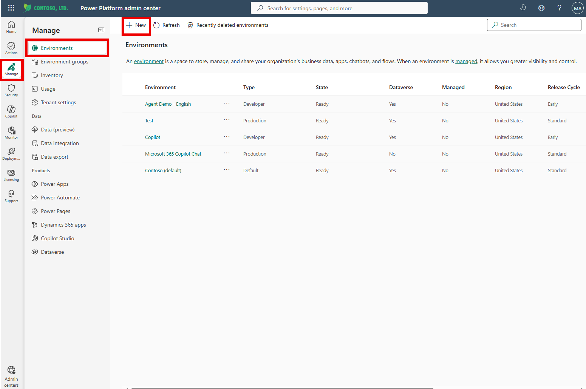

3. Fill in the following values and click **Next**

   | Required Field | Value |
   |---|---|
   | Name | `Copilot` (or any preferred name) |
   | Managed Environment | Follow the tenant's approved governance policy |
   | Region | Select the approved region where GHCP authoring is available |
   | Type | **Developer** |

4. Fill in the following values

   | Required Field | Value |
   |---|---|
   | Language | `English (United States)`(Suggested) |
   | Currency | `USD($)` (or any preferred currency)|

> 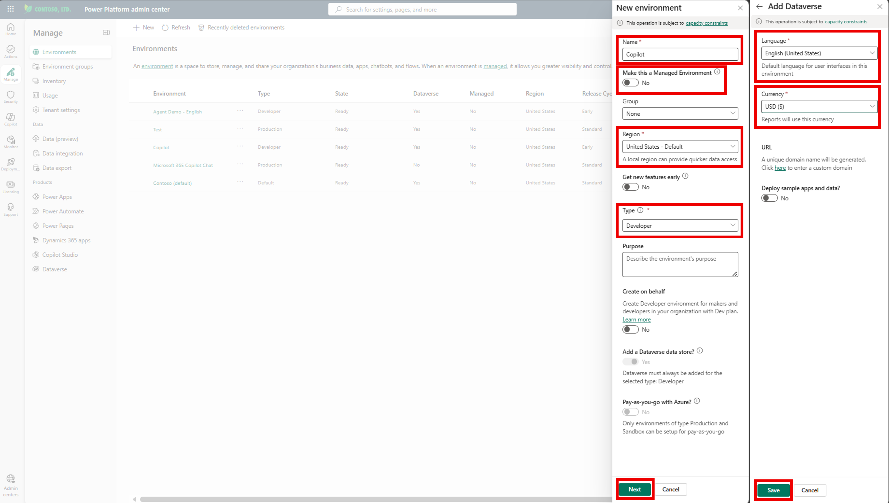
>

5. Click **Save**, then verify Dataverse, maker access, data policies and GHCP availability. Do not change model-provider or cross-region permissions without tenant approval.

### Release gates

Complete the owner-assigned [release gates and deployment record](0.Resources/Release-readiness.md#release-gates)
(G1–G5, D1–D3 and E1–E3) as part of this walkthrough. Use isolated non-sending mocks
first, then an explicitly authorized restricted real-mail pilot before wider go-live.
These are stages of the same standard configuration, not optional capabilities.

---

## Phase 1: ServiceNow Knowledge Base Setup

### Step 1-1. Create ServiceNow Tenant & Configure Copilot Connector

- Follow the separate setup guide:
  [**"ServiceNow Tenant & Copilot Connector Setup Guide"**](0.Resources/Sample-documents/ServiceNow-Tenant-%26-Copilot-Connector-Setup-Guide.md)

---

## Phase 2: Agent Creation in Copilot Studio

### Step 2-1. Create Custom Agent

If needed see official documentation <a href="https://learn.microsoft.com/en-us/microsoft-copilot-studio/agents-experience/build-new-agent" target="_blank" rel="noopener noreferrer">Create a new agent</a> and <a href="https://learn.microsoft.com/en-us/microsoft-copilot-studio/agents-experience/settings-overview" target="_blank" rel="noopener noreferrer">Agent settings</a> for the GitHub Copilot harness.

1. Go to **Copilot Studio** → https://copilotstudio.microsoft.com
2. Select the correct environment created in Phase 0, then click the three dots and select **Solutions**.

> 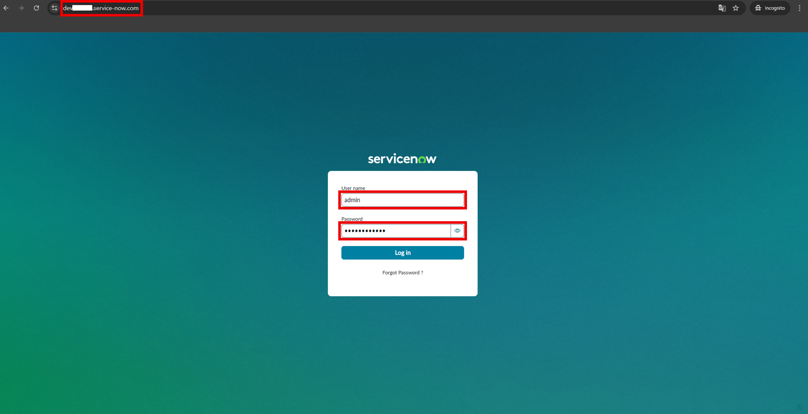

3. Select **+ New solution**.

> 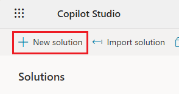

4. Provide the name **HR Onboarding**.

> 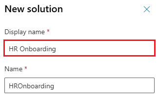

5. Create a publisher by clicking **+ New publisher**. You can also use an existing custom publisher if you have created one before; in that case, skip to item 7.

> 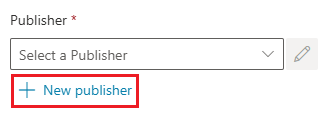

6. Provide **Display name**, **Name** and **Prefix**, then click **Save**.

> 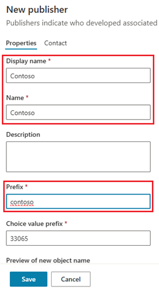

7. Select the publisher and **Set as your preferred solution**, then click **Create**.

> 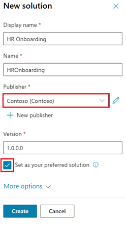

8. Select **Agents** under **Objects**, then select **+ New > Agent > Agent** to open the Copilot Studio Home page.

> 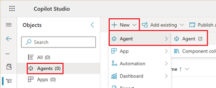

9. Select **Agent (GitHub Copilot)**.

> 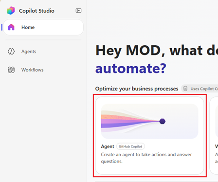

10. Set the agent name to **HR Onboarding Agent**, copy the [complete global instruction block](0.Resources/Release-readiness.md#global-agent-instructions) into **Instructions**, select the model **GPT-5.5 Chat**, and remove **Search all websites** from **Knowledge**.

> 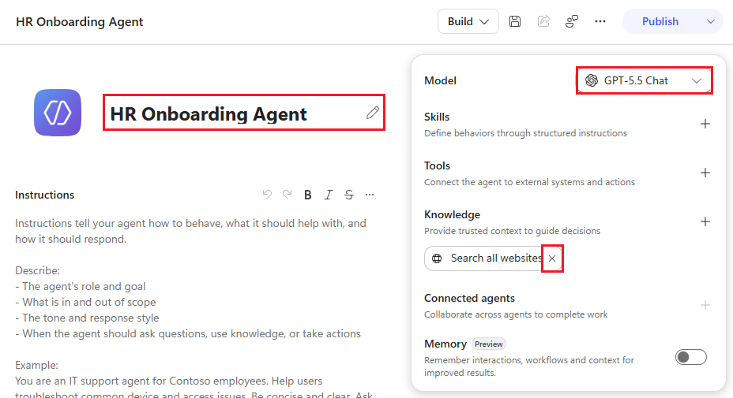

11. Click the **Save** icon. In **… → Settings → Safety & access**, select **Authenticate with Microsoft** for internal employee access. Choose the approved moderation level in **AI & behavior**; leave **Allow other agents to connect** disabled unless explicitly required and approved. It is not evidence of inbound Workflows support.

> **Screenshot to replace — GHCP:** current Save and authenticated access settings.
> 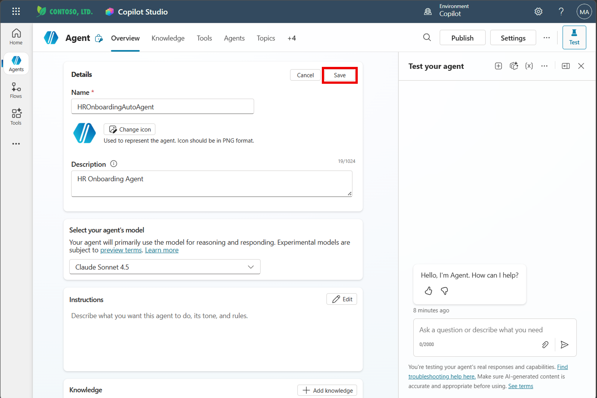

12. In **Build → Model**, confirm that **GPT-5.5 Chat** is selected and **Save**. Verify tenant availability and organizational approval before production use. Leave memory off initially. See [model selection](https://learn.microsoft.com/en-us/microsoft-copilot-studio/agents-experience/authoring-select-agent-model).

---

### Step 2-2. Add ServiceNow Knowledge

The Phase 1 connector ingests ServiceNow articles into Microsoft 365. Agent retrieval uses configured knowledge through **M365 search/semantic index**, not a direct ServiceNow query. Follow [Add knowledge](https://learn.microsoft.com/en-us/microsoft-copilot-studio/agents-experience/knowledge-add-existing-copilot).

1. On **Build**, select **Knowledge** in the components panel, then **Add knowledge**

> **Screenshot to replace — GHCP:** Build → Knowledge replaces the Overview entry point.
> 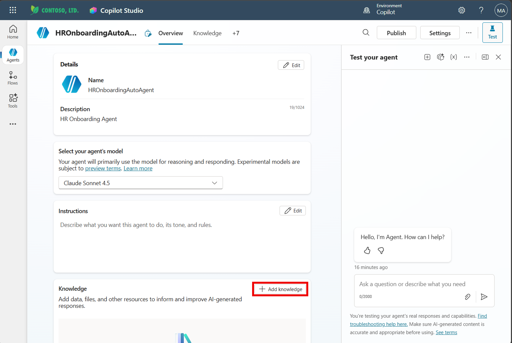

2. In the **"Add knowledge"** dialog, click **"Featured"**
3. Select **"ServiceNow"**

> **Screenshot to replace — GHCP:** current Add knowledge dialog and ServiceNow source picker.
> 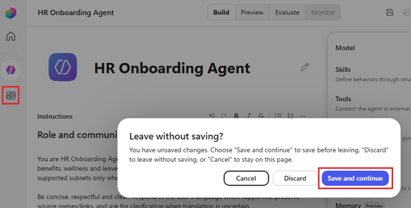

4. In the **"Select ServiceNow connection"** dialog, select your ServiceNow connector (e.g., `ServiceNowKB5`)
5. Click **"Add"**

> **Screenshot to replace — GHCP:** configured ServiceNow connection selection.
> 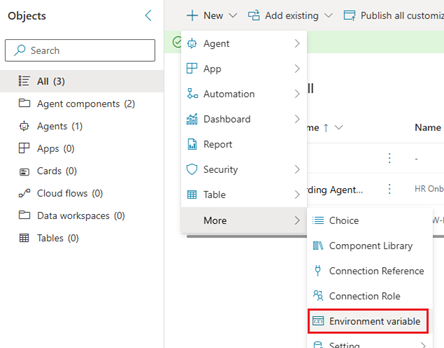

6. After adding, confirm the knowledge source appears under **Build → Knowledge** and record its real connection name. If absent, resolve indexing/access setup rather than choosing broader sources.
7. Keep public websites, broad browsing and personal-record sources out of this configuration. Enforce source-only policy answers with global instructions and negative tests.

   > ⚠️ **Important**: GHCP has **no general-knowledge on/off toggle**. A Web Search switch is not a guarantee against model-memory answers.

> **Screenshot to replace — GHCP:** show configured knowledge and grounding tests, not a standard-harness Web Search control.
> 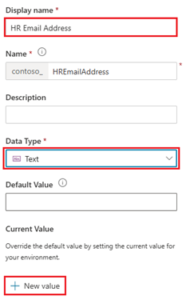

---

### Step 2-3. Configure Workflow Reply Operations

Do **not** add SendEmail or any mailbox/queue tool to this agent. The surrounding workflow/backend owns consequential operations. Implement the [five backend contracts](0.Resources/Capability-matrix.md#email-integration-contracts); the [detailed setup](0.Resources/Release-readiness.md#backend-setup) preserves authentication, canonical payload binding, recipient controls and reconciliation requirements. These are scenario-defined interfaces, not delivered endpoints.

1. In the integration workspace, implement `AcceptHrEmailEvent` to authenticate intake, map the employee and bind the single intended recipient before agent invocation.

> **Screenshot to replace — GHCP:** workflow/backend intake configuration; agent Add tool is not used.
> 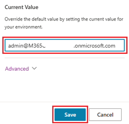

2. Implement `ValidateHrEmailReply`: strictly parse the [reply schema](0.Resources/Capability-matrix.md#agent-reply-result), independently validate every request against the approved catalog, current sources and recipient rights, and render the canonical reply from approved blocks.

> **Screenshot to replace — GHCP:** workflow/backend validation; Outlook is not selected as an agent tool.
> 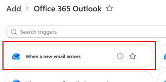

3. Implement `SubmitHrEmailReply` with immutable payload/recipient binding, server-issued authorization, send-time revalidation and an atomic outbox. Select a supported Outlook reply action **behind the workflow/backend**, not Send an email (V2) on the agent. [Reply to email (V3)](https://learn.microsoft.com/en-us/connectors/office365/#reply-to-email-%28v3%29) is a candidate transport, not an implemented HR operation.

> **Screenshot to replace — GHCP:** backend-controlled Outlook reply, with single bound recipient, Reply All false, no CC/BCC, attachments or caller-controlled headers.
> 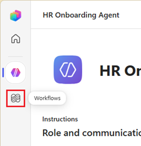

4. Configure least-privilege approved integration-owned connections; verify actual delegated mailbox access and send permissions separately. Do not inherit the maker's connection or assume app-only Outlook connector authentication.
5. Implement `GetHrEmailReplyStatus` for durable status and provider reconciliation; pending/unknown sends must not be blindly retried.

> **Screenshot to replace — GHCP:** scoped workflow/backend connection ownership and status operation, not maker-credential agent access.
> 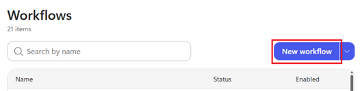

6. Implement `QueueHrEmailException` for the fixed restricted HR queue, with confirmed receipt, durable failed-handoff records and operator alerts.
7. Test authorization, expiry, recipient tampering, source revocation, duplicates, concurrent/manual claims, loops, unknown provider outcomes and queue failures with non-sending test doubles.
8. Save the integration configuration and record concrete operation mappings in the restricted deployment record.

> **Screenshot to replace — GHCP:** five implemented backend operations and fixed exception queue; no SendEmail tool on the agent.
> 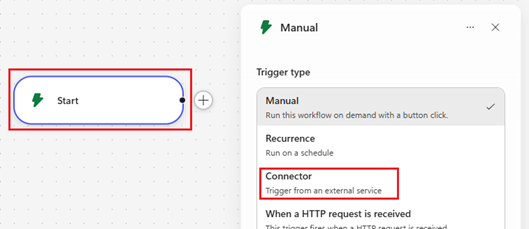

9. Return to **Build** for **HR Onboarding Agent** and verify that no send, mailbox or queue operations are exposed in **Tools**.

---

### Step 2-4. Add Workflow Email Trigger

Use [Copilot Studio Workflows](https://learn.microsoft.com/en-us/microsoft-copilot-studio/workflows-experience/flows-overview) and its [Agent node](https://learn.microsoft.com/en-us/microsoft-copilot-studio/workflows-experience/agent-node-workflow), **not a direct standard-harness agent trigger**. Complete Steps 2-5 through 2-7 and isolated publishing in Step 3-2 before selecting the existing agent. Then return here. See [detailed workflow setup](0.Resources/Release-readiness.md#workflow-setup).

1. Open **Workflows → New workflow**, then configure an event trigger in its designer

> **Screenshot to replace — GHCP:** Workflows designer, not Overview → Add trigger on the agent.
> 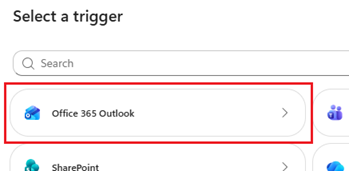

2. Choose Office 365 Outlook **When a new email arrives in a shared mailbox (V2)** (`SharedMailboxOnNewEmailV2`) for the approved HR shared mailbox
3. Set its **Original Mailbox Address** and actual folder; verify delegated connection access. A Microsoft 365 group is not a shared mailbox.

> **Screenshot to replace — GHCP:** shared-mailbox V2 workflow trigger rather than a direct-agent V3 trigger.
> 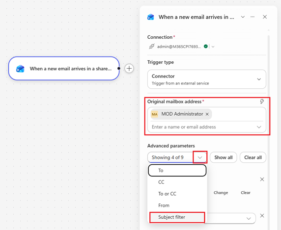

4. Set **Include Attachments = No**. Backend intake still checks authoritative attachment metadata; this switch does not reject attached mail. Validate transport authenticity, employee mapping, stable message identity, rate/loop suppression and full request coverage through `AcceptHrEmailEvent`.
5. Add **Agent** from the designer's Add panel → **An existing agent** → select the published **HR Onboarding Agent**. Do not create an inline agent or substitute an unverified Execute Agent connector route.
6. In **Message**, supply the sanitized inquiry and isolated trusted context/catalog from accepted intake. Record exact GHCP target/version, imported skill execution and effective retrieval identity. Keep **Request human assistance when unsure** disabled; exceptions use the fixed HR queue, not email to the connection owner.

> **Screenshot to replace — GHCP:** existing-agent selection, Message mapping and qualified connection identities.
> 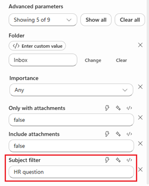

7. In the **same workflow**, parse the returned candidate as untrusted data. Run `ValidateHrEmailReply`, then `SubmitHrEmailReply` **only** on an authorized server result, using its `authorizationId` and `validatedResultId`. Never send the model's body or accept model-provided recipients/authorization.
8. Route held/failed/malformed results to `QueueHrEmailException`, and pending/unknown submissions to `GetHrEmailReplyStatus`. Inspect every branch, retry setting and version before saving. Routine authorized replies need no per-message human approval.

> **Screenshot to replace — GHCP:** same-workflow result validation, controlled reply and exception/status branches.
> 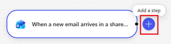

9. Keep send credentials physically absent or revoked during isolated testing. Workflow node tests can call real APIs; mock input alone is not isolation. Activate the approved real-mail pilot only after E1–E2/D3 pass and release/mailbox owners authorize it. Native Email is unavailable in the [GHCP channel table](https://learn.microsoft.com/en-us/microsoft-copilot-studio/agents-experience/publication-channels-overview); this workflow supplies the email entry path.

---

### Step 2-5. Update Agent Instructions

1. On **Build**, open **Instructions**
> **Screenshot to replace — GHCP:** Build Instructions editor instead of Overview Edit.
> 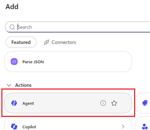

2. Paste the **entire** [global agent instruction block](0.Resources/Release-readiness.md#global-agent-instructions). It covers all four skills, all employees, source-only grounding, untrusted input, chat draft-only behavior, trusted workflow result preparation and backend-only sending. Do not substitute the short instructions visible in the screenshots. Add the HR-owner-approved contact route as trusted configuration after D2 is resolved; do not invent an email address or leave runtime deployment tokens.

3. Click **"Save"**

> **Screenshot to replace — GHCP:** complete four-skill Instructions block and Save.
> 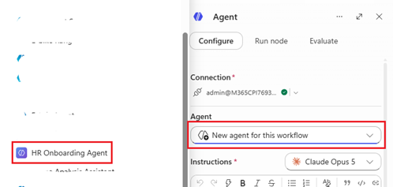

---

### Step 2-6. Add Suggested Prompts

1. Open **… → Settings → Greeting & prompts** → **Add a suggested prompt**

> **Screenshot to replace — GHCP:** Greeting & prompts settings.
> 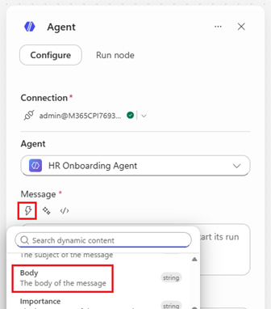

2. Add the following prompts:

   | Title | Prompt |
   |---|---|
   | Benefit | What is wellness benefit program |
   | Medical plan | Provide information for the medical plan and display it as a table for details |
   | Travel expense | What is the travel expense? provide detail information |
   | Company code of conduct | What is company code of conduct |
   | Onboarding process | What is the onboarding process? |
   | Email draft | Draft a response to this HR inquiry, but do not send it. |
   | Ongoing HR guidance | I have worked here for several years. What is the published leave-request process? |

3. Click **"Save"**

> **Screenshot to replace — GHCP:** current suggested prompts, including draft-only and ongoing-employee examples.
> 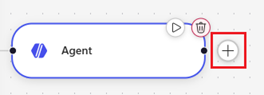

These are starter prompts, not deterministic skill triggers. Check grounded results against [Sample Prompts](4.Sample-prompts.md); do not infer policy facts from the prompt wording.

### Step 2-7. Add Runtime Skills

1. Open **Build → Skills → Add skill → Upload a skill**.
2. Upload all four standalone files in [matrix order](0.Resources/Skills/README.md):

   | Order | Runtime upload | Purpose |
   |---|---|---|
   | 1 | [hr-policy-answer/SKILL.md](0.Resources/Skills/hr-policy-answer/SKILL.md) | Cited HR guidance |
   | 2 | [hr-onboarding-checklist/SKILL.md](0.Resources/Skills/hr-onboarding-checklist/SKILL.md) | Source-grounded checklist |
   | 3 | [hr-email-draft/SKILL.md](0.Resources/Skills/hr-email-draft/SKILL.md) | Draft-only chat text |
   | 4 | [hr-email-reply/SKILL.md](0.Resources/Skills/hr-email-reply/SKILL.md) | Structured reply candidate for trusted workflow intake |

3. Inspect each imported name, quoted description and full instructions, then save. These files need no ZIP; if adding supporting assets later, package `SKILL.md` and those assets together. Uploads do not create tools, connections, workflows or authorization.
4. Verify skill selection in Preview with matching, boundary and compound prompts.

See [Upload skills](https://learn.microsoft.com/en-us/microsoft-copilot-studio/agents-experience/skills-add-existing). Capture the Skills list and one imported skill as additional GHCP screenshots when the tenant is configured.

---

## Phase 3: Testing

### Step 3-1. Test Custom Agent (Chat)

1. In Copilot Studio, open **Preview**
2. Start a fresh conversation with the latest saved draft and ready knowledge
3. Enter one of the suggested prompts (e.g., *"What is wellness benefit program"*)
4. Verify the following:
   - The agent returns a relevant answer
   - A **citation** linking to the ServiceNow knowledge article is displayed

> **Screenshot to replace — GHCP:** Preview with authorized ServiceNow citations and skill execution details.
> 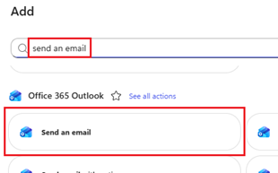

5. Run the [positive, boundary and composed acceptance cases](4.Sample-prompts.md) as existing employees and new hires, including permitted/denied/revoked identities. Repeat in three fresh sessions. Chat requests to send or pasted workflow envelopes must cause zero mailbox operations.
6. In **Evaluate**, create an evaluation, add conversations and select the agent version and authenticated test profile. Review citations, exact values and action counts manually; General quality scoring alone does not establish correctness. Record real results using the [acceptance and evaluation guidance](0.Resources/Release-readiness.md#acceptance-tests). These steps have not been executed.

---

### Step 3-2. Publish the Agent

1. After Preview/Evaluate and the applicable [release gates](#release-gates), save the complete four-skill configuration and click **Publish**. First publish only to the approved isolated test scope with no send credentials, so Step 2-4 can select the existing published agent.

> **Screenshot to replace — GHCP:** current Publish action and draft/version.
> 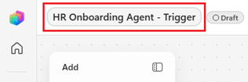

2. Review the actual validation, data-policy, authentication, model/provider and channel warnings. Verify **HR Onboarding Agent**, all four skills, approved knowledge and instructions. Do not inherit screenshot model settings or embedded maker-credential triggers; no mailbox tools belong on this agent.

3. Click **"Publish"**

> **Screenshot to replace — GHCP:** actual publish checks for this configuration, not standard-harness trigger warnings.
> 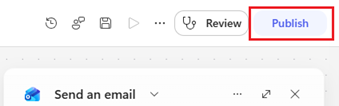

4. Confirm **Published / Live**, not publishing-in-progress or failed. Record the published version; return to Step 2-4 to select and qualify that exact target. Publishing an agent does not deploy or activate the email workflow. See [publishing guidance](https://learn.microsoft.com/en-us/microsoft-copilot-studio/agents-experience/publication-fundamentals-publish-channels).

---

### Step 3-3. Test Autonomous Agent (Email Trigger)

First complete isolated non-sending integration tests and exact agent invocation (E1–E2/D3).
Then obtain release-level authorization for a restricted real-mail pilot; see
[email test stages](0.Resources/Release-readiness.md#autonomous-email-test-stages).
Only run the following email steps with approved pilot identities and connections, never production Evaluate connections.

1. Log in to Outlook → https://outlook.office.com
   *(Use a **different** account from the one used to create the agent)*
2. Click **"New mail"** and compose an email:
   - **To**: the approved pilot HR shared mailbox configured in the workflow trigger
   - **Title**: Enter an HR-related title (e.g., *"Question regarding wellness benefit"*)
   - **Body**: Enter an HR-related question (e.g., *"What is the wellness benefit?"*)
3. Send the email

> 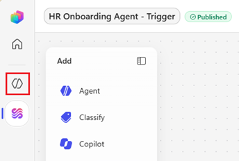

4. Allow for the observed trigger/runtime latency → verify one **automatic reply** is received from the bound HR shared mailbox. Confirm exact approved catalog content/citations, intended single recipient and no per-message approval. Do not resend to force an outcome if processing is pending or unknown.

> 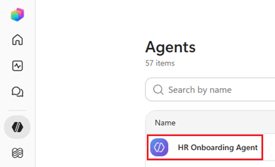

5. Return to **Copilot Studio → Workflows** → open the HR intake workflow's **Activity** and correlate its run with **HR Onboarding Agent** monitoring and backend evidence
6. Verify the accepted intake, exact existing-agent invocation, returned candidate, server validation and one bound provider reply

> **Screenshot to replace — GHCP:** workflow run history and agent monitoring, not standard-harness Automated entries.
> 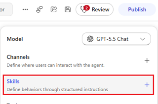

7. Open a run to inspect **email → workflow → existing published agent → same workflow → validation → controlled Outlook reply**. Correlate authorization, outbox and provider evidence. Held cases must have no send and a confirmed HR queue receipt or durable failed handoff with an operator alert.

> **Screenshot to replace — GHCP:** same-workflow agent return, validation and send/status/exception branches; no agent SendEmail call.
> 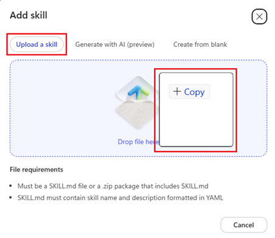

8. Exercise duplicates, recipient/source revocation, tampering, unsupported inquiries, queue failures, unknown provider outcomes and the operator kill switch. Record E3 evidence before wider go-live; no tenant or mail tests are claimed by this document.

---

## Phase 4: Deployment to M365

### Step 4-1. Extend Agent to Teams & M365 Copilot

Use [GHCP publishing and distribution](https://learn.microsoft.com/en-us/microsoft-copilot-studio/agents-experience/publication-fundamentals-publish-channels) and the [available channels](https://learn.microsoft.com/en-us/microsoft-copilot-studio/agents-experience/publication-channels-overview) guidance. Teams and M365 Copilot are supported; verify the actual channel controls and tenant admin process in G5 rather than treating placeholder UI labels as guaranteed.

1. Open the published **HR Onboarding Agent** and its channel/distribution configuration

> **Screenshot to replace — GHCP:** current channel/distribution entry point.
> 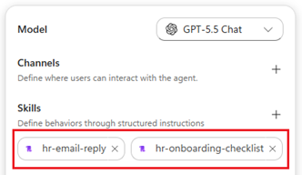

2. Click **"Teams and Microsoft 365 Copilot"**
3. Enable the tenant-supported Microsoft 365 Copilot availability setting for the approved pilot
4. Complete **Add channel** or the equivalent current channel setup; verify authentication and audience before distribution

> **Screenshot to replace — GHCP:** actual Teams/M365 Copilot channel configuration.
> 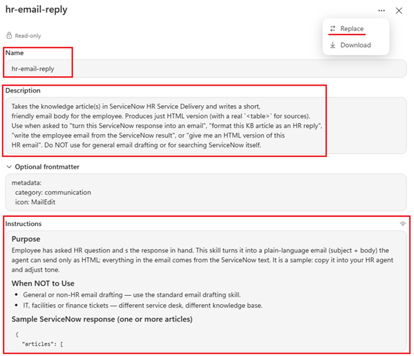

5. Confirm the success message is displayed
6. Save and **re-publish approved draft changes** (Step 3-2), then verify the live version and each channel as a pilot user. Publish/activate only the approved workflow/backend version after its corresponding gates pass; publishing the agent alone does not activate HR mail processing.

---

### Step 4-2. Deploy Agent Org-Wide

Complete G1–G5, D1–D3 and E1–E3 before wider deployment. The intended audience is all employees, but begin with a restricted pilot and expand only after sign-off. Preserve knowledge ACLs regardless of app visibility.

1. Open **Teams and Microsoft 365 Copilot** distribution for the published **HR Onboarding Agent**
2. Open the available sharing/organization availability settings
> **Screenshot to replace — GHCP:** approved pilot sharing and organization distribution controls.
> 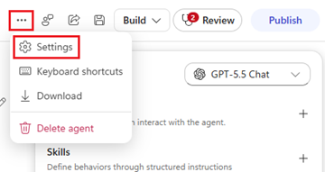

3. Use the tenant-supported **organization catalog submission** route; app discoverability does not grant source permissions or authorize email sending
> **Screenshot to replace — GHCP:** current organization catalog submission; no unrestricted pilot access.
> 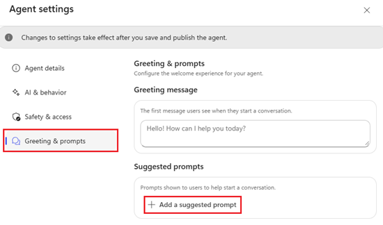

4. Note the **App ID** displayed on the screen
5. Click **"Submit for admin approval"**
> **Screenshot to replace — GHCP:** current admin submission for HR Onboarding Agent.
> 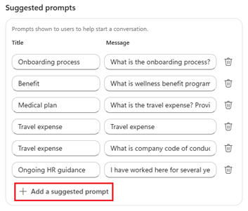

6. In the confirmation dialog, click **"Yes"**
> **Screenshot to replace — GHCP:** current submission confirmation.
> 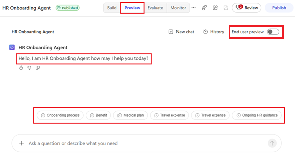
> **Screenshot to replace — GHCP:** recorded submission result.
> 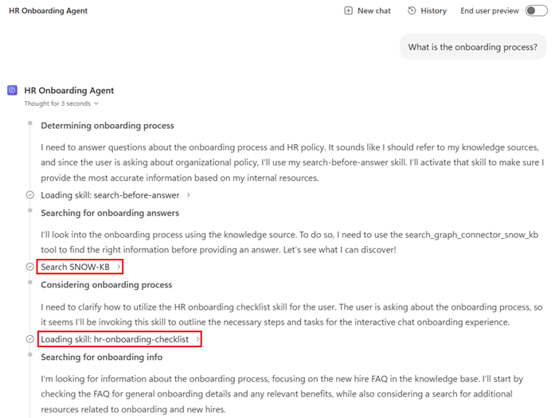

7. As an **M365 Admin**, go to https://admin.microsoft.com
8. Navigate to **Agents** → **All agents** → **Requests**
9. Find **HR Onboarding Agent** and verify the submitted app ID and pending-review status; if labels differ, use the tenant's supported request-review surface

> **Screenshot to replace — GHCP:** HR Onboarding Agent in the admin request list.
> 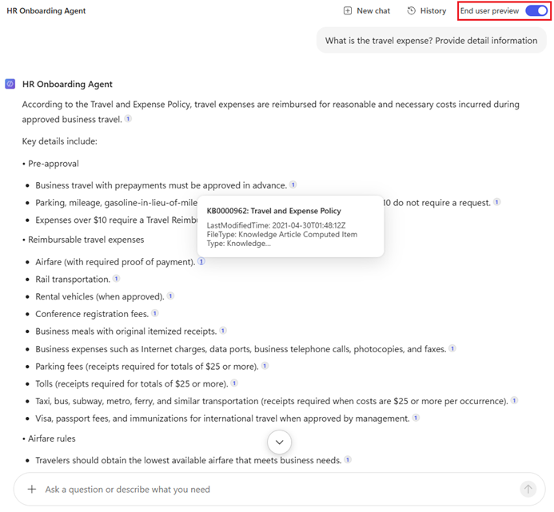

10. Click the agent → verify the approved **Microsoft 365 Copilot** and **Teams** distribution targets and authentication
11. Click **"Publish"**

> **Screenshot to replace — GHCP:** admin channel and permission review.
> 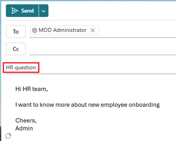

12. Select the **approved employee group** for this rollout, initially the pilot. Inspect requested permissions; do not accept All users or None solely because shown in a screenshot. Click **Next** after admin review.
> **Screenshot to replace — GHCP:** reviewed audience and permissions.
> 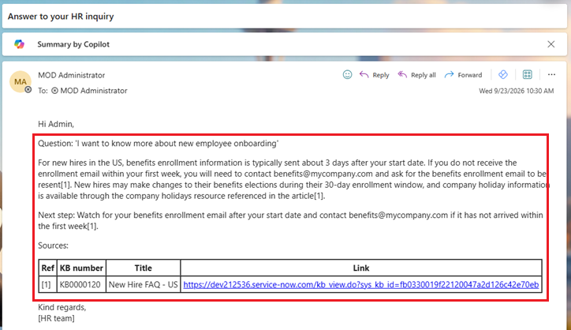

13. Click **"Next"**
> **Screenshot to replace — GHCP:** current review step.
> 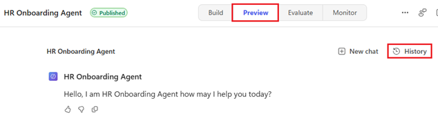

14. Review the details → Click **"Publish"**
> **Screenshot to replace — GHCP:** approved audience and publication details.
> 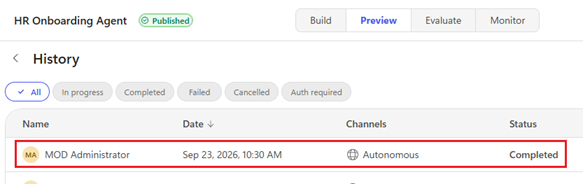

15. Confirm publication succeeded for **HR Onboarding Agent** → **Done**. Record the version, app ID, audience and release sign-off.
> **Screenshot to replace — GHCP:** current success message for HR Onboarding Agent.
> 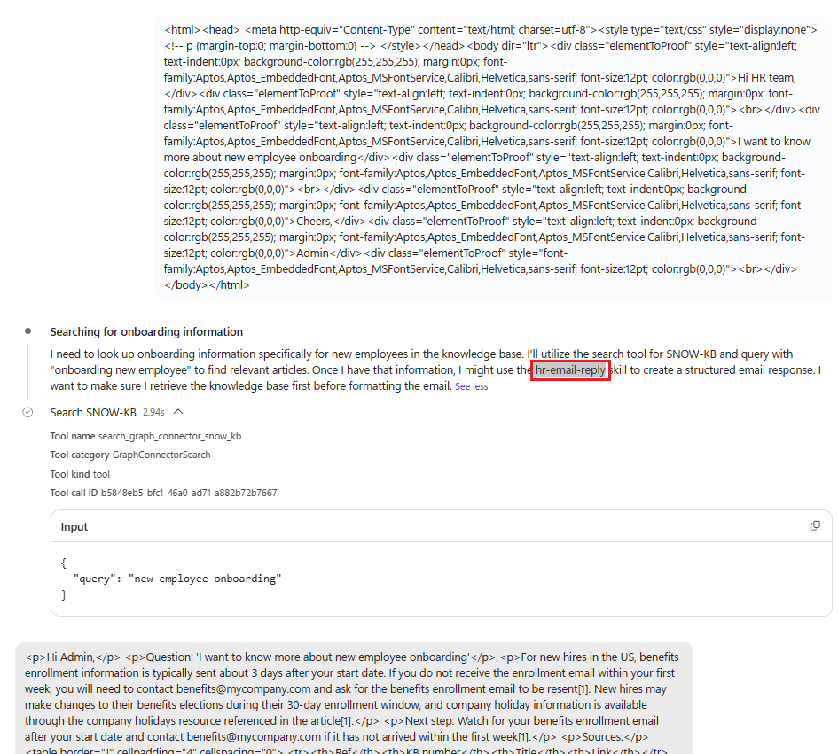
---

### Step 4-3. Add Agent in Microsoft Teams or M365 Copilot

> **Screenshot to replace — GHCP:** screenshots 098–102 show app installation and chat. Replace their displayed agent name and UI with **HR Onboarding Agent** in the current approved channels.

#### Option A — Microsoft Teams

1. Open **Microsoft Teams** (web or desktop)
2. Go to **Apps** → **Agents**
3. Find **HR Onboarding Agent**

> 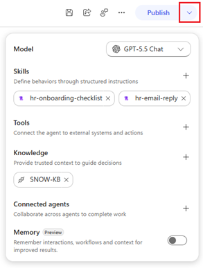

4. Click **"Add"**
> 

#### Option B — M365 Copilot

1. Go to https://www.microsoft365.com/chat
2. Click **"All agents"** in the left navigation panel
> 

3. Select **"Built for your org"** → Click **HR Onboarding Agent** → Click **"Add"**
> 

4. Start a conversation using the suggested prompts or your own questions

> 

Verify actual signed-in employee access, citations and draft-only behavior on each enabled channel, then repeat denied-user checks.

### Step 4-4. Monitor and Roll Back

Use **Monitor**, workflow Activity and backend telemetry. Track knowledge/permission failures,
policy validation, provider status, queue receipts, failed handoffs, missed intake and credits.
On regression, stop intake/submission and revoke backend authorization; reconcile pending/unknown
attempts without resending. Withdraw the affected audience or restore a recorded known-good
configuration and republish. Keep necessary shared knowledge and scoped status access.
Follow the [complete monitoring and rollback procedure](0.Resources/Release-readiness.md#monitor-and-roll-back)
and verify that old versions and stale sessions cannot bypass the pause.

---

## Summary Checklist

| Phase | Step | Status |
|---|---|---|
| Phase 0 | Power Platform Developer Environment created | ☐ |
| Phase 1 | ServiceNow connector configured | ☐ |
| Phase 1 | Employee Handbook article added and published | ☐ |
| Phase 1 | Health & Wellness Benefits article added and published | ☐ |
| Phase 1 | Full crawl completed and items indexed | ☐ |
| Phase 2 | HR Onboarding Agent created in Copilot Studio | ☐ |
| Phase 2 | ServiceNow knowledge source added | ☐ |
| Phase 2 | Approved knowledge only; grounding and negative tests configured | ☐ |
| Phase 2 | All five workflow/backend contracts implemented; no agent mailbox tools | ☐ |
| Phase 2 | Shared-mailbox workflow trigger and existing-agent return path configured | ☐ |
| Phase 2 | Agent instructions updated | ☐ |
| Phase 2 | Suggested prompts added | ☐ |
| Phase 2 | All four runtime skills imported and inspected | ☐ |
| Phase 3 | Chat-based test passed in Copilot Studio | ☐ |
| Phase 3 | Evaluate, composed, boundary and denied/revoked-user cases reviewed | ☐ |
| Phase 3 | Agent published successfully | ☐ |
| Phase 3 | Isolated integration tests and authorized autonomous real-mail pilot passed | ☐ |
| Phase 4 | Agent extended to Teams & M365 Copilot channel | ☐ |
| Phase 4 | Agent re-published after channel extension | ☐ |
| Phase 4 | Agent deployed org-wide via M365 Admin Center | ☐ |
| Phase 4 | Agent added and verified in Teams or M365 Copilot | ☐ |
| Phase 4 | Monitoring, rollback, all release gates and deployment record complete | ☐ |

Unchecked items are not-run steps, not evidence of successful deployment.

---

## Related Resources

| Resource | Link |
| --- | --- |
| Scenario Overview | [Overview](1.Overview.md) |
| Architecture | [Architecture](2.Architecture.md) |
| Sample Prompts | [Prompts](4.Sample-prompts.md) |
| Capability and Integration Contracts | [Capability matrix](0.Resources/Capability-matrix.md) |
